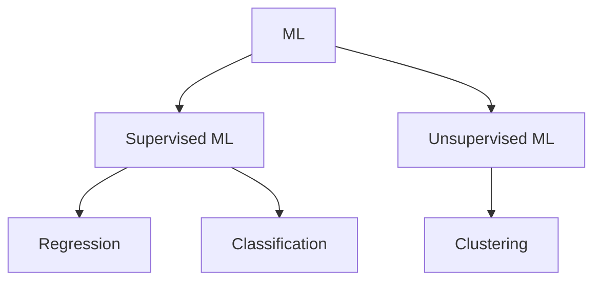

# AI-900 
<!-- 27/06/23 -->
<!-- Getting Started with AI -->
## Getting Started
| Futures | Capability |
|-|-|
Automated machine learning |	This feature enables non-experts to quickly create an effective machine learning model from data.
Azure Machine Learning designer |	A graphical interface enabling no-code development of machine learning solutions.
Data and compute management	|Cloud-based data storage and compute resources that professional data scientists can use to run data experiment code at scale.
Pipelines	| Data scientists, software engineers, and IT operations professionals can define pipelines to orchestrate model training, deployment, and management tasks.

**Anomaly Detection**
 Anomaly Detection is used to analyze data over time and identify unusual changes.

It is an tool offer in Azure. If an any changes in the input is found it intimate the authority person. Ex: race car engine RPM, temperature, etc.. are checked periodically, if there is a changes in the data it will inform the race Engineer. [more...](https://learn.microsoft.com/en-us/training/modules/get-started-ai-fundamentals/3-understand-anomaly-detection)

**Computer Vision:** Image classification, object detection, semantic segmentation, image analysis, Face detection-analysis-recognition, optical character recognition

**Computer Vision services in Microsoft Azure**
Service |	Capabilities
-|-
Computer Vision |	You can use this service to analyze images and video, and extract descriptions, tags, objects, and text.
Custom Vision |	Use this service to train custom image classification and object detection models using your own images.
Face	| The Face service enables you to build face detection and facial recognition solutions.
Form Recognizer |	Use this service to extract information from scanned forms and invoices.

**Natural Language processing in Azure**\
Language, Translator, Speech, Azure Bot

**Knowledge mining in Microsoft Azure**\
Knowledge mining is the term used to describe solutions that involve extracting information from large volumes of often unstructured data to create a searchable knowledge store.

One of these knowledge mining solutions is Azure Cognitive Search, a private, enterprise, search solution that has tools for building indexes. The indexes can then be used for internal only use, or to enable searchable content on public facing internet assets.

Azure Cognitive Search can utilize the built-in AI capabilities of Azure Cognitive Services such as image processing, content extraction, and natural language processing to perform knowledge mining of documents. The product's AI capabilities makes it possible to index previously unsearchable documents and to extract and surface insights from large amounts of data quickly.

Challenge or Risk |	Example
-|-
Bias can affect results |	A loan-approval model discriminates by gender due to bias in the data with which it was trained
Errors may cause harm |	An autonomous vehicle experiences a system failure and causes a collision
Data could be exposed |	A medical diagnostic bot is trained using sensitive patient data, which is stored insecurely
Solutions may not work for everyone |A home automation assistant provides no audio output for visually impaired users
Users must trust a complex system |	An AI-based financial tool makes investment recommendations - what are they based on?
Who's liable for AI-driven decisions? |	An innocent person is convicted of a crime based on evidence from facial recognition – who's responsible?

**Responsible AI** (6 Principles used in Microsoft)
- **Fairness:** AI systems should treat all people fairly. For example, suppose you create a machine learning model to support a loan approval application for a bank. The model should predict whether the loan should be approved or denied without bias. This bias could be based on gender, ethnicity, or other factors that result in an unfair advantage or disadvantage to specific groups of applicants.

- **Reliability and Safety:** AI systems should perform reliably and safely. For example, consider an AI-based software system for an autonomous vehicle; or a machine learning model that diagnoses patient symptoms and recommends prescriptions. Unreliability in these kinds of systems can result in substantial risk to human life.

- **Privacy and security:** AI systems should be secure and respect privacy. The machine learning models on which AI systems are based rely on large volumes of data, which may contain personal details that must be kept private. Even after the models are trained and the system is in production, privacy and security need to be considered. As the system uses new data to make predictions or take action, both the data and decisions made from the data may be subject to privacy or security concerns.
- **Inclusiveness:** AI systems should empower everyone and engage people. AI should bring benefits to all parts of society, regardless of physical ability, gender, sexual orientation, ethnicity, or other factors.
- **Transparency:** AI systems should be understandable. Users should be made fully aware of the purpose of the system, how it works, and what limitations may be expected.
- **Accountability:** People should be accountable for AI systems. Designers and developers of AI-based solutions should work within a framework of governance and organizational principles that ensure the solution meets ethical and legal standards that are clearly defined.

## Introduction to Azure OpenAI services
Capabilities of OpenAI AI models are Grenerating natural lanuage, generating code, generating images

## Azure AI Fundamentals, Visual tools for machine learning 

**Types of Machine Learning**

**Azure Machine Learning compute**\
At its core, Azure Machine Learning is a service for training and managing machine learning models, for which you need compute on which to run the training process.

Compute targets are cloud-based resources on which you can run model training and data exploration processes.

In Azure Machine Learning studio, you can manage the compute targets for your data science activities. There are four kinds of compute resource you can create:

- Compute Instances: Development workstations that data scientists can use to work with data and models.
- Compute Clusters: Scalable clusters of virtual machines for on-demand processing of experiment code.
- Inference Clusters: Deployment targets for predictive services that use your trained models.
- Attached Compute: Links to existing Azure compute resources, such as Virtual Machines or Azure Databricks clusters.

### Regression model with azure