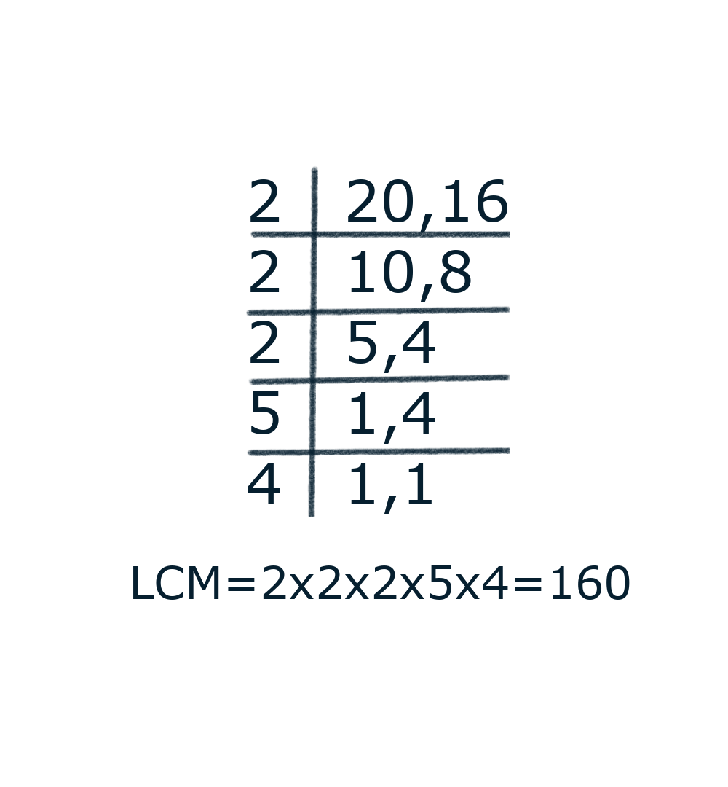
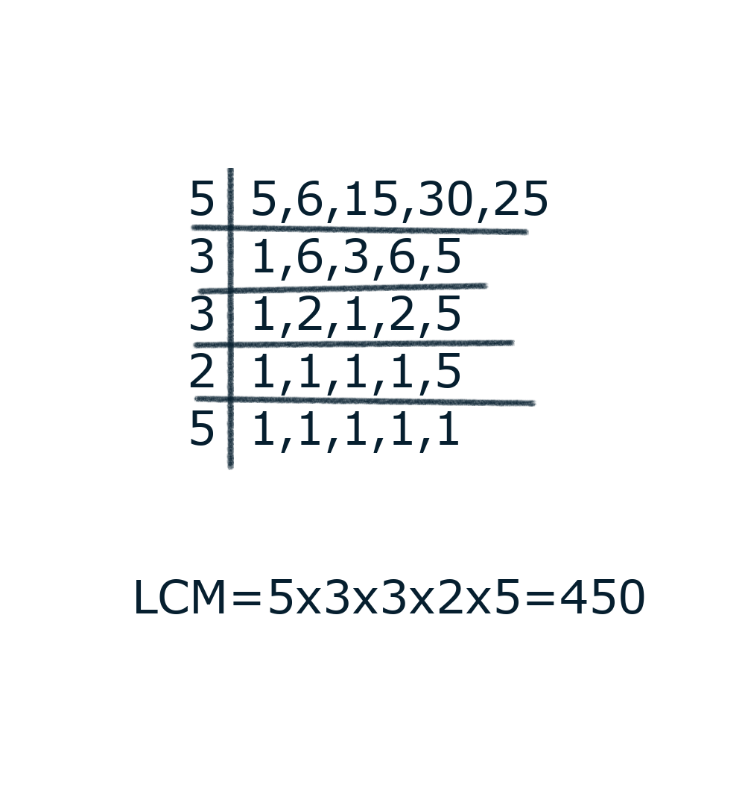
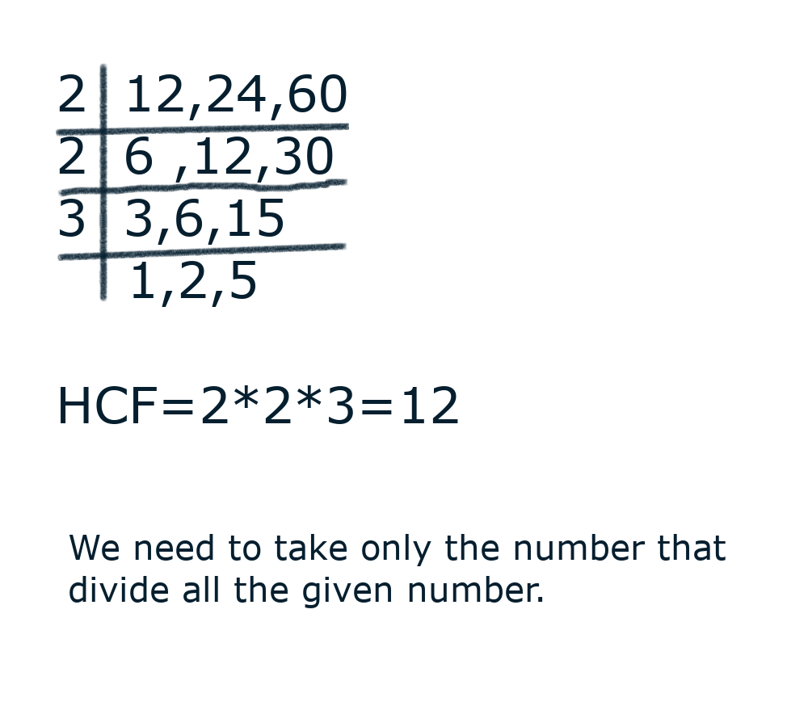
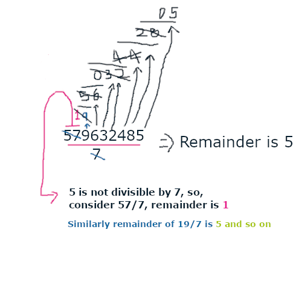
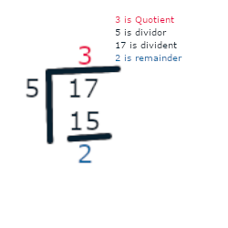

# **Aptitude**
1. Reasoning
1. Quantitative
1. Verbal

## **1. Reasoning**
### **1. Number Series**
Series of the number will be given we need to find the next number
ex: 1,23,234,? find the pattern, what will be the next number

To solve this type of question we go through below list of option
check weather,
1. Addition/subtraction of consecutive number form a patter
2. even number or odd number form the patter
3. there is pattern by dividing the number or multiplying the number
4. the power to the certain number forms the pattern
5. combination of above four forms a pattern
6. check pattern in prime number, fibonacci number
7. Random patter combination of all

### **2. Analogy and odd man out**
It is the comparison between the like features of two objects

``` 
ex: 
1. A:B::C:D (45:41::37:__)
first number 45 -> 4^2 + 5^2 = 41(second number)
therefore, 3^2 + 7^2 = 9+ 49 = 58 (answer)
```
``` 
2. CLASS:54::BDLT:___

Answer:
Convert character to number (ex: A to 1 ... z to 26)
so C-3, L-12, A-1, 2-19
    3+12+1+19+19 = 54
similarly
B-2, D-4, L-12, T-20
    2+4+12+20 = 38
```
It can be classified into:
1. knowledge based Analogy
2. Alphabet based Analogy
3. Number based Analogy

#### **1. Knowledge Based Analogy**
```
1. Ashes:Cricket:: Grand Slam: _______

(for this type of question general Knowledge is used)

Ashes is the test cricket series played between England and Australia,
Grand Slam in tennis is the achievement of winning all four major championships in a calendar year.

2. Cat:Kitten:: Horse:____
ans: Pony
```
#### **2. Alphabet Based Analogy**
```
1. WATCH:XCWGM::MUSIC:____

---
Consider below
A B C D E F G H I J K L M N O P Q R S T U V W X Y Z
---

you can see X is next to W,
C is one letter away from A,
W is two letter away from T,
G is three letter away from C,
M is four letter away from H.

In the above you can notice that there is an increase in lettery away from the given letters.

using this methodology we can find
MUSIC:NWVMH
NWVMH is the answer

2. Y:E::__:D

Y is 25th, E is 5th position in the alphabet series

5^2 = 25;

similarly,
D is 4th position in Alphabet series.

4^2 =16 
P is the 16th position in the alphabet series.
answer: P
```

#### **3. Number based analogy**
```
1. 7:729::10:___

(7 + 2)^3 =729 (this forms 729)

similarly for 10,
(10+2)^3=1728 (this forms 1728)

answer: 1728

2. 8:1000::7:____
options: a) 110, b) 111, c) 1011, d) 1111

from the above option you can understand that this is a binary system based problem.

Binary value of 8 is 1000;

similarly, binary value of 7 is 111;

so the answer is 111
```
## **2. Quantitative**
### **1. Number System**
1. simplification
2. LCM/HCF
3. Divisibility Rule
4. Remainders
5. Finding Unit Digits
#### **1. Simplification**
 Here the equation is given and ask you to solve the equation or simply the equation to find the value (ex: X);

#### **2. LCM/HCF**
**LCM** is Least Common Multiple. It is also known as the LCD(least Common divisor).
Consider we need to find LCM of 8,15
To find the LCM we need to list the multiples of 8 and 5

8-> 8, 16, 24, 32, **40**, 48, 56, 64, 72, 80,...

5-> 5, 10, 15, 20, 25, 30, 35, **40**, 50,...

You can see that the 40 is the lest number that can dived by 8 and 5.

Lets find the LCM fro 20, 16
20-> 40, 60, 80, 100, 120, 140, **160**, 180,...
16-> 16,32,48,64,80,96,112,128,144,**160**,176,...

other method for solving LCM



Sample Questions:
<details><summary>1. Five bells start tolling at the same time and they toll after 5,6,15,30,25 seconds respectively. when will they toll together again for the first time</summary><br />

LCM of the above number gives the answer. (when it will ring all at the same time)




At 450th Second all the bell will ring together.
</details>

<details><summary>2. Find the smallest number which when divided by 12,15,18,60 leaves a remainder of 5 in each case.</summary><br/>

(Here % is considered as the operator that produce the remainder of the two number ex: remainder of 6/5 is 1, which is mentioned as 6%5=1)
Given we need to find the number N, that produce
N%12=5, N%15=5, N%18=5, N%60 =5.

To do so if we find the LCM, (which all the number is divisible) that gives the remainder of 0.
so if we add LCM with 5, then we get the remainder of 5.

since, LCM(12,15,18,60)=180

so the ans will be LCM+5=185.

185%12=5, 185%15=5, 185%18=5, 185%60 =5.
</details>    
<br />

---
**HCF** (Highest common Factor) or GCD (Great Common Divisor)
suppose if two number are given, Highest number that divides the given number is known as the HCF
ex: to find HCF of 60,75
60<-- 30, 20, **15**, 12, 10, 5, 3, 2
75<-- 25, **15**, 5

60%X=0, where x= 30, 20, 15, 12, 10, 5,3,2
75%Y=0, where Y=25,15,5

you can see that 15 is the highest number, that can divide both 60 and 75.

Now we understand what is HCF,
Let see the other simple method.



#### **3. Divisibility Rule**
ex: if 853 is divisible by 2 or not? **Ans: No**

Number | Divisibility Rule | Example
:-:|-|-
2 | Last digit must be even | 14/2 is divisible , 15/2 is not
3 | if sum of digits is multiple of 3| 853/3, 8+5+3=16 (16 is divisible by 3) so 853 is divisible by 3
4 |last two digit of the number is multiple of 4 | 819764 (last two digit is 64, 64 is the multiple of 4, so 819764 is the multiple of 4)
5 | last digit must be 5 or 0| 85,90 are multiple of 5
6 | number is divisible by 2 and 3| 186 is divisible by 2 and 3, so it is multiple of 6
8 | last 3 digit is divisible by 8 | 815762 (762 is divisible of 8), so the given number is divisible of 8
9 | Sum of digit should be a divisible of 9 | 7164 is divisible by 9 because 7+1+6+4=18, which is divisible by 9
11 | difference in sum of the number at alternate place is 0 or multiple of 11 | 18425671, (1+4+5+7)-(8+2+6+1)=0. so, the given number is the multiple of 11
7 | given number is ,separated to 3 digits and there difference between them will be the multiple of 7 | <ul><li>ex1: 891765, 891-765=126, Which is divisible by 7</li><li>875`431`297`818`, (874+297)-(431818)= 77 which is a divisible of 7.</li><li>81764, 081-764=683, not divisible by 7</ul>
13 | same as 7 but the difference number should be multiple of 13 instead of 7  | 714025, 714-025=689 which is the divisible of 13
10 | The last digit of the number should be 0 | 890 which is divisible by 10.

**Divisibility rules for power of 2 & 5**
Powers of 2 |Powers of 5 | Condition 
-|-|-
2^1 = 2 | 5^1=5 | Last 1 digit should be divisible by the divisor
2^2 = 4 | 5^1=25 | Last 2 digit should be divisible by divisor 
2^3 = 8 | 5^1=125 | Last 3 digit should be divisible by divisor 
2^4 = 16 | 5^1=625 | Last 4 digit should be divisible by divisor 
... | ... | ...
and so on...

**Cutting Method (applicable for any number) For 7 it is simple**  
Consider, the below problem.


**Rules for numbers such as 6, 12, 48, 72**
<details><summary>Co-Prime Numbers</summary>
Pair of such numbers whose only common factor is 1<br/>
example:  <br/>
consider 21 and 22  <br/>
The factor of 21 are 1,3,7,21  <br/>
The factor of 22 are 1,2,11,22  <br/>
There is only one common factor of 21 and 22 which is 1.
so 21 and 22 are co-prime.  <br/>
Other-example:  <br/>
consider 21 and 27  <br/>
The factor of 21 are 1,3,7,21  <br/>
The factor of 27 are 1,3,9,27  <br/>
Here there are two common factors 1 and 3, so no common factor. so 21 and 27 or not a co-prime number<br/>
</details>

To find the divisibility of the number 6, 12, 48, 72 we need to find the co prime numbers.
for example co-prime of 6 is 2 and 3, If the given number is divisible by 2 and 3 then it also divide by 6.

similarly for 12, the co-prime are 4 and 3.
48, the co-prime are 3 and 16
72, co-prime are 8 and 9.

#### **Cyclicity of unit digit of a number**
<sub>Note: unit digit is the last digit in the number. in the number 87654`1`, 1 is the number in the unit place</sub> 
Number | condition | Example
:-:|-|-
2 | unit number of $2^1$, $2^2$, $2^3$, $2^4$ us 2,4,8,6.<ol><li>If the number is of $2^{4k+1}$ then the unit place is 2</li><li>If the number is of $2^{4k+2}$ then the unit place is 4</li><li>If the number is of $2^{4k+3}$ then the unit place is 8</li><li>If the number is of $2^{4k+4}$ then the unit place is 6</li> | $2^4$ is 16, which has the 6 as the number in unit place
3 | Similary for 3, the unit place of first four power is 3,9,7,1<ol><li>If the number is of $3^{4k+1}$ then the unit place is 3</li><li>If the number is of $3^{4k+2}$ then the unit place is 9</li><li>If the number is of $3^{4k+3}$ then the unit place is 7</li><li>If the number is of $3^{4k+4}$ then the unit place is 1</li> | $3^4$ is 81, which has the unit place of 1.
4 | <ul><li>if $4^{2k+1}$, the unit digit of the answer is 4</li><li>if $4^{2k}$, the unit digit of the answer is 6</li></ul> | $4^3$ is 6`4`, which as the 4 in the unit place. similarly $4^4$ is 25`6` with unit number of 6.
5 | $5^n$ always has the unit place of 5. | $5^2$ is 2`5`, 5 is the unit place
6 | $6^n$ always has the unit place of 6. | $6^2^ is 3`6`, 6 is the unit place
7 | unit place of $7^1,7^2,7^3,7^4$ is7,9,3,1 respectively and this pattern forms repetatively. use the below condition<br/><ol><li>If the number is $7^{4K+1}$ then unit place is 7</li><li>If the number is $7^{4K+2}$ then unit place is 9</li><li>If the number is $7^{4K+3}$ then unit place is 3</li><li>If the number is $7^{4K+4}$ then unit place is 1</li></ol> | <ul><li> $7^3$ is 343, unit place is 3</li><li>$7^4$ is 2401, unit place has 1</li></ul>
8 | similarly for 8, <ol><li>$8^{4k+1}$ unit place will be 8</li><li>$8^{4k+2}$ unit place will be 4</li><li>$8^{4k+3}$ unit place will be 2</li><li>$8^{4k+4}$ unit place will be 6</li></ol> | $8^2$ will be 64, 4 is in unit place
9 | for 9, if the number $9^{2K+1}$, the unit place will be 9, else if $9^(2k+2), the unit place will be 1. | ex: $9^2$ will be 81, the unit place will be 1.


#### **Remainder**
if we divide 17/5, 2 will be the remainder


from the above example we can say $17=5*3+2$  
since, Dividend = Divisor*Quotient + Remainder

**Addition Property of Remainder**   
<mark>
Remainder ($\frac{A+B}{D}$)=Remainder($\frac{A}{D}$)+Remainder($\frac{B}{D}$)
</mark>  
If the sum of remainder is greater than or equal to D, then again the remainder is take for the sum.
ex:  
Assume remainder of 17, 16, 41 divided by 3 will be 2, 1, 2 respectively.
therefore,  
Remainder ($\frac{17+16+41}{3}$)=Remainder($\frac{17}{3}$)+Remainder($\frac{16}{3}$)+Remainder($\frac{41}{3}$)
$  
=2+1+2         
=5
$ 
The sum is 5 which is greater than D(here D>=3). 
$Remainder(\frac{5}{3})$ is 2.
so, 2 is the answer.

**Multiplication Property of Remainder**  
<mark>
Remainder($\frac{A*B}{D}$)=Remainder($\frac{A}D$)\*Remainder($\frac{B}D$), similarly if the answer is greater than or equal to D, Then again remainder should be taken
</mark>   
ex:  
Remainder($\frac{137*151*163}{5}$)=Remainder($\frac{137}{5}$)+Remainder($\frac{151}{5}$)+Remainder($\frac{163}{5}$) 
= 2*1*3
= 6
which is greater than D (D=5)
so the remainder of(6/5)=1
so the answer will be 1.

#### **Negative Remainder**
Normal remainder is 17 = 5\*3 + 2;  
Negative Remainder is 17 = 5\*4 - 3;  
We can continue the above as,  
17=5\*2+7;
17=5\*5-8;
if we continue the remainder could get increase for normal remainder, and decrease for Negative remainder by D(here, D=5);
=remainder&plusmn;kD, Where k=1,2,3...   

#### **Finding unit digit**
We need to find the unit digit of the given expression.\

1. **123+468+983+729+643+249
To find the unit digit of the above number**\
     simply we need to add last number, 3+8+3+9+3+9=25, so the answer will be **5**.

2. **Find the unit digit of 686\*1043\*129**\
    Multiply only last number, $6*3*9$=72, so the answer is **2**

3. **Find the unit digit of $2^{65}$**\
    Consider $2^x$, where x=1,2,3,4,5,6,7,8,....etc and the unit digit will be 2,4,8,6,2,4,8,6...etc. You can clearly see that 2,4,8,6 is repeated of the powers. we can use this pattern to find the unit digit. 
    [more info](#cyclicity-of-unit-digit-of-a-number)

    if we divide 65 by 4 (because 2,4,8,6 is this 4 number repeating again) _remainder_ will be 1, we know that unit digit of $2^1$ will be 2, so the answer is **2**

4. **Find the unit digit of $22^{78}$.**\
    You can consider only the $2^{78}$ instead of $22^{78}$. follow the same step for the problem $2^{65}$, the answer will be **4**

5. **Find the unit digit of $3^{45}+27^{52}$**\
    you need to 
    [check this](#cyclicity-of-unit-digit-of-a-number) and you can easily find unit digit of $3^{45},2^{52}$, (here $2^{52}$ is considered instead of $22^{52}$ because we only need unit digit.) is 3 and 1, if we add $3+1$ the answer will be **4**.

### **Percentage**
If we express the number per hundred is known as percentage\
ex: 25% is 25/100 which is 1/4
1. [Basic](#basic-of-percentage)
2. [Percentage Increase and Percentage Decrease](#percentage-increase-and-percentage-decrease)
3. [Calculating percentage using fraction](#calculating-percentage-using-fraction)
4. [Successive percentage change](#successive-percentage-change)
5. [Increase and Decrease by the same percentage](#increase-and-Decrease-by-the-same-percentage)

#### **Basic-of-percentage**
1. **Shyam obtained 325 marks out of 400. calculate his percentage?**\
    $\frac{325}{400}*100$\
    The answer is 81.25%
    
2. **A student scored 65% marks. Total marks were 500. How much did he/she scores?**\
    $\frac{65}{100}*500$=**325** (he scored 325 mark).

3. **The Heigh of Amithabh 2 years ago was 110cm. Now his Heights is 120cm. Find the percentage is 120cm. Find the percentage change in his height**
    - Change in height is 120-110=10cm,
    - Percentage of change is height can be calculated by change in height divided by previous height and then the answer is multiplied by 100.
    - $\frac{10}{110}*100$ = **9.09%**

4. **Salary of Raja is 9000 per month and rani is 10000 per month**
- **What percentage is the salary of Rani to that of raja?**
    - The percentage of rani salary divided by raja salary is the answer
    - $\frac{10000}{9000}*100$=111.11% (Rani salary 111.11% of the Raja salary)
- **What percent is the salary of raja to that of rani?**
    - The percentage of raja salary divide by the rani salary.
    - $\frac{9000}{10000}*100$=90% (Raja salary is the 90% of the salary of Rani)

5. **Ashwin got an increase of 25 percent on his salary. By what percentage should his salary be decreased to obtain the previous salary?**
    - consider 100% is the previous salary and (100+25)% is the new salary.
    - $\frac{25}{100+25}*100$=**20%**
    - If we decrease 20% from his new salary we got the old salary,
    - Note: some people think if we reduce 25% from his new salary we got old salary (Because his new salary is increased by old salary), which is wrong **See carefully**, As the amount get increases, the percentage is also get increases.
    - you can use $\frac{X}{100+X}*100$ this formula to get the answer for this kind of question
    <details><summary>Analysis with example</summary>

    - Consider x person salary is 10,000
    - he got hike in 25% of his previous salary (The increment will be $\frac{10000}{100}*25$=2500)
    - new salary is 10000+2500=12500
    - To find the percentage reduced to get old salary, to do so we need to find the percentage of 2500(increment) in the new salary 12500
    - $\frac{2500}{12500}*100$=**20%**

    </details>

6. **Due to poor performance sndhya's salary was reduced by 20% but after few days her salary was changed to original salary. Calculate percentage change in sandhay's salary**
    - Original Salary is 100%
    - Salary after reduced 20% is (100-20)%
    - We asked to find the percentage value required to get the original salary from the salary after reduced
    - $\frac{20}{100-20}*100$=**25%**.
    - if we increase the 25% of the salary after reduced we get original salary
    <details><summary>Analysis with example</summary>

    - Consider x person salary is 10,000
    - his/her salary reduced by 20% of his previous salary (The new salary will be $\frac{10000}{100}*20$=2000)
    - new salary is 10000-2000=8000
    - To find the percentage-hike required to get old salary, to do so we need to find the percentage of 2000(increment) in the new salary 8000
    - $\frac{2000}{8000}*100$=**25%**

    </details>

#### **Percentage increase and percentage decrease**
##### Value percentage table:
Value | Percentage
-|-
1/2 | 50%
1/3 | 33.33%
1/4 | 20%
1/5 | 25%
1/6 | 16.66%
1/7 | 14.28%
1/8 | 12.5%
1/9 | 11.11%
1/10 | 10%
1/11 | 9.09%
1/12 | 8.33%

1. **Consider price of car is increased by 33.33% and the new price is 400, what is the price before**
    - **Method 1**\
        Consider old price is x.\
        x+33.33% of x = 400, which is the new price\
        if we find percentage value that can be reduced by new price, then we can get the answer from the percentage value.
        - $\frac{33.33}{100+33.33}*100=24.99$%
        - (24.99% of the 400) +x=400
        - $(\frac{24.99}{100}*400)+x=400$
        - $x=300$, The original price is 300
    - **Medthod 2(Easy)** 
        - from the [value percentage table](#value-percentage-table), the percentage of value **1/3** is 33.33%   
        - x will be the old price.
        - x+33.33% of x = 400, which is the new price
        - $(x+x*\frac{1}{3})=400$, 
        - $x=400*\frac{3}{4}$
        - **x= 300**, which is the original price.

2. **A price of car is reduced by 33.33% and the new price is 300, what will be the original price**    
    from the [value percentage table](#value-percentage-table), the percentage of value **1/3** is 33.33%   
    - x will be the old price.
    - x-33.33% of x = 300, which is the new price
    - $(x-x*\frac{1}{3})=300$, 
    - $x=300*\frac{3}{2}$
    - **x= 450**, which is the original price.
3. **A car price is increased by 40% and the price is 280, what will be the original price**
    - x will be the old price
    - x+(40% of x)=280
    - x+$\frac{40}{100}$*x=280
    - x($\frac{100+40}{100})=280$
    - **x=200**, which is the original price

4. **A car price is reduced by 60% and the price is 140, what will be the original price**
    - x will be the old price
    - x-(60% of x)=140
    - x-$\frac{60}{100}$*x=140
    - x*$(\frac{100-60}{100})=140$
    - **x=350**, which is the original price
5. **A price of the car is increase by 33.33% in the first month and 16.66% in the second month, now the price is 500. What is the original price of the car?**
    - x is the original price, y is the amount after 1month
    - x+(33.33 % of x)+(16.66% of (*x+ 33.33% of x*))=500
    - from [this table](#value-percentage-table), we get the value of 33.33% and 16.66% is 1/3 and 1/4 respectively.
    - ($x+x*\frac{1}{3}$)=y
    - y=x*($1+\frac{1}{3}$)
    - similarly for second month,
    - $y+y*\frac{1}{6}=500$
    - $y(1+\frac{1}{6})=500)$
    - therfore y=x*($1+\frac{1}{3}$)
    - x*($1+\frac{1}{3}$)*$(1+\frac{1}{6})$=500,
    <div style="background-color:#555; color:white; padding:20px; margin:10px;">From the above, if there is a continuous increase  of percentage, then the formula will be 
    
    $x*(1+\frac{100}{p1})*(1+\frac{100}{p2})=y$
    
    where, 
    - x is original price,
    - p1 is the 1st percentage given
    - p2 is the 2nd percentage given
    - y is the price at last.
    
    </div>
6. **If a car price is increased by 50% in the 1st month and decreased by 30% in the second month, what will be the net percentage**
    <div style="background-color:#555; color:white; padding:20px; margin:10px;">

    Formula for net percentage\
    $netPercentage=p1+p2+\frac{p1*p2}{100}$\
    where p1 is the first percentage and p2 is the 2nd percentage.
        
    </div>

    as per the formula,\
    $netPercentage=50-60+\frac{50*30}{100}$\
    netPercentage=+5%
    

    if in the same question they give the final price of car is 500 find the ori````````````````````ginal price,

    500-(5% of 500) = x, x is the original value, here minus(-) is used, if the netPercentage is positive, plus(+) will be used
    x=475, where as 5% of 500 is 25.


