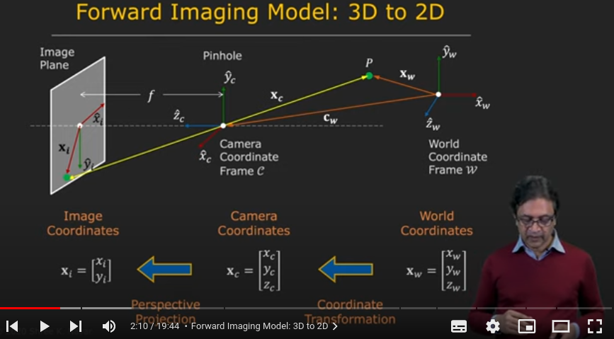
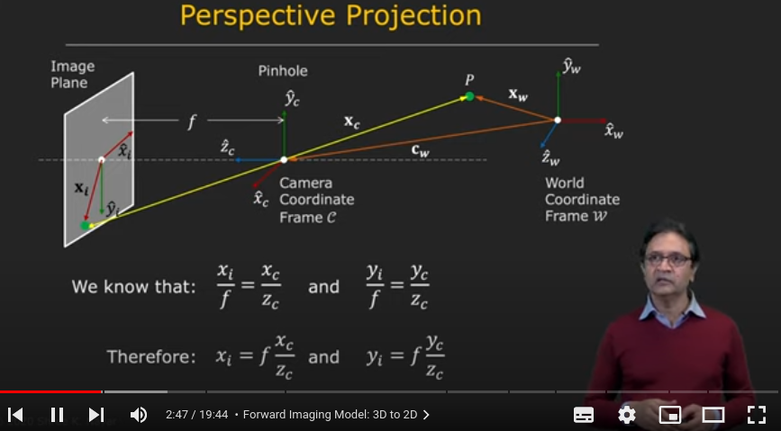
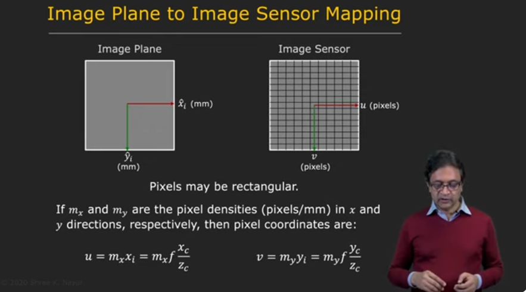
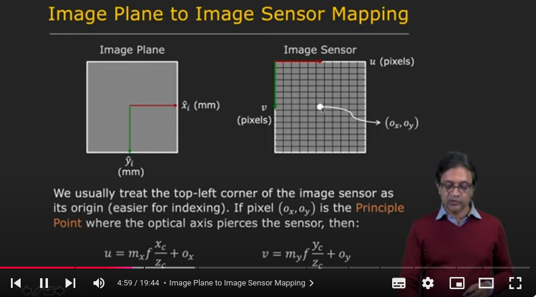
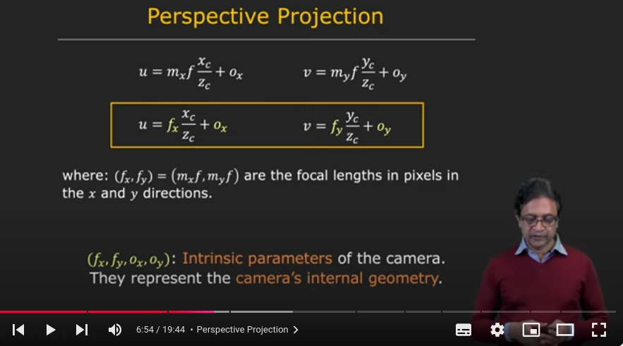
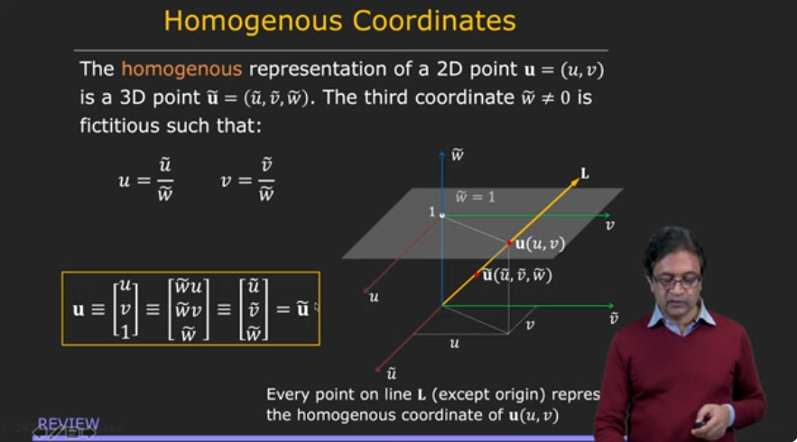

# Camera Calibration

<b>What is Camera Calibration</b>

one of the key problems in computer vision is recovering the three dimensional structure of a sene from its images.

when you want to reconstruct the secen you want the coordinate as a millimeter. But the images of the secen are measured intearms of pixels

In order to recover the 3D structure of a scene from its images, we need to know the camera's internal and external parameters.

How camera is positioned in the world coordinate is known as the external parameter.

The internal parameters of the camera refer to how the camera maps points in the world onto its image plane, such as its focal length. The external parameters refer to the position and orientation of the camera with respect to the world coordinate frame.

Camera calibration is the process of determining these internal and external parameters.

In order to calibrate the camera we need a camera model, In order to calibrate the camera, we first need a camera model, which is a mathematical model that describes how a 3D point is projected onto the image plane of the camera. 

The camera model used in this video is a linear model, which is represented by a single matrix called the projection matrix. 

With the projection matrix, we can calibrate the camera by taking a single picture of an object with known geometry.

Once we have determined the projection matrix, we can tear it apart to recover both the internal and external parameters of the camera.

The recovered internal parameters are stored in a matrix called the intrinsic matrix, and the recovered external parameters are stored in a matrix called the extrinsic matrix.

## Comprehensive Image model
### Forward Imaging Model
which takes you from  3D to 2D

ref:  
https://in.mathworks.com/help/vision/ug/camera-calibration.html

