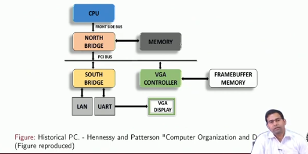

# GPU Architectures and programming - Prof soumayjit Dey
course link: https://www.youtube.com/playlist?list=PLbRMhDVUMngfj_NXI7jqMYLnhcRhRKAGq 

IIT khargpur book: https://drive.google.com/file/d/11_cmuSzpdXhdx1mvtHBGQvOwyaZ_Px0H/view 

NPTEL link: https://nptel.ac.in/courses/106105220 

## Introduction

1. Fifteen years ago, graphics on a PC were performed by a video graphics array controller.
2. VGAs evolved to more complex hardwares: accelerating Graphics functions
3. Early GPUS and their associated drivers implemented the OpenGL and DirectX models (APIS) of graphics processing
4. With the time, HW functionality evolved as programmable
5. GPU seen with the more usecase called GPGPU's

## Review of Basic COA w.r.t performance

**BASIC RISC Architecture**
1. The operation of a processor is characterized by a fetch decode execute cycle.
2. RISC CISC two different philosophies of computing hardware design. 
3. RISC/CISC-Reduced/Complex Instruction Set.
4. Computing CISC approach-complete a task with as few instructions (instrs) as possible
5. A CISC instruction: MUL addr, addry addry 
6. Equivalent RISC LOAD R2 addiy; LOAD 83 addry; MUL R1 R2 R3; STORE addy RI

**CISC vs RISC**

**Elementardy CPU Datapath**

in CISC, some instraction can execute and lower time, while other takes large time, we can't warry the clock, so we are forced to give the clock with works with give enough time form larger execution instruction also. ( to do so in the case of smaler execution instruction we are wasting the time by using the lower frequency clock)

suppose if we divide the single larger instruction into multiple we can able to increase the clock frequency. It will increase the performance

**execution cycle**
( please find the more instruction in the NPTEL provied book given in starting of this page, below overview only explained )

 

in the above image data access means memory
