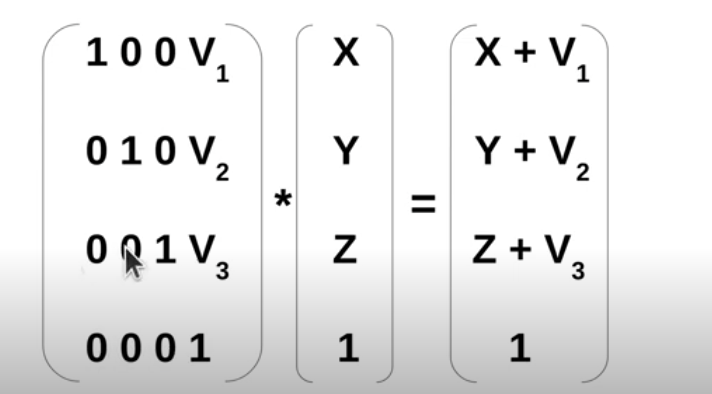
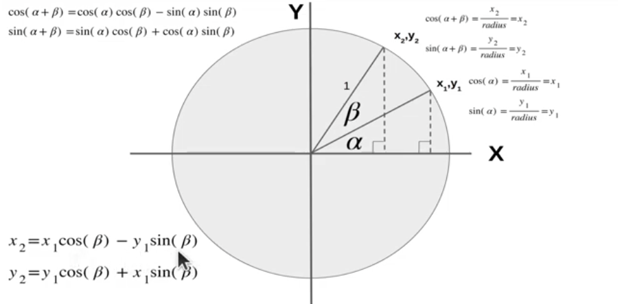
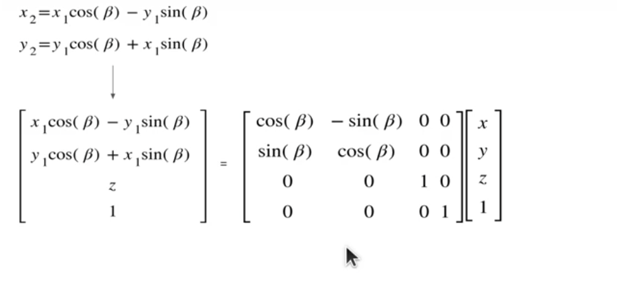
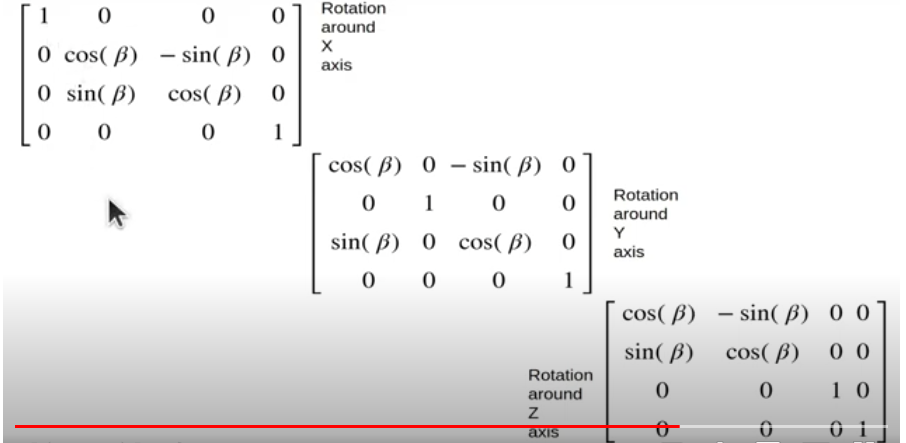
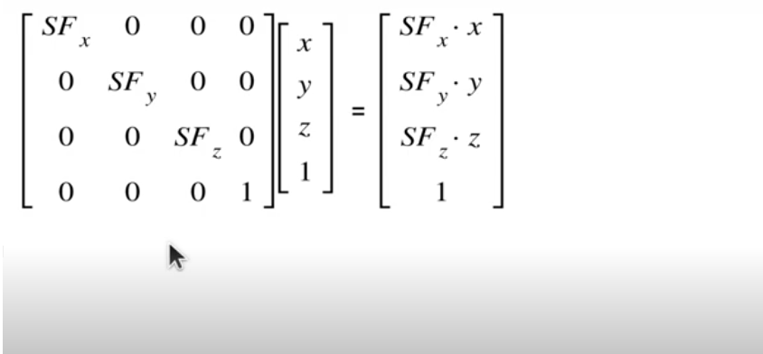
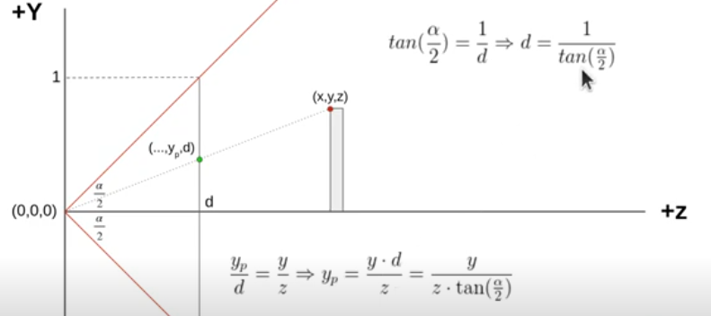
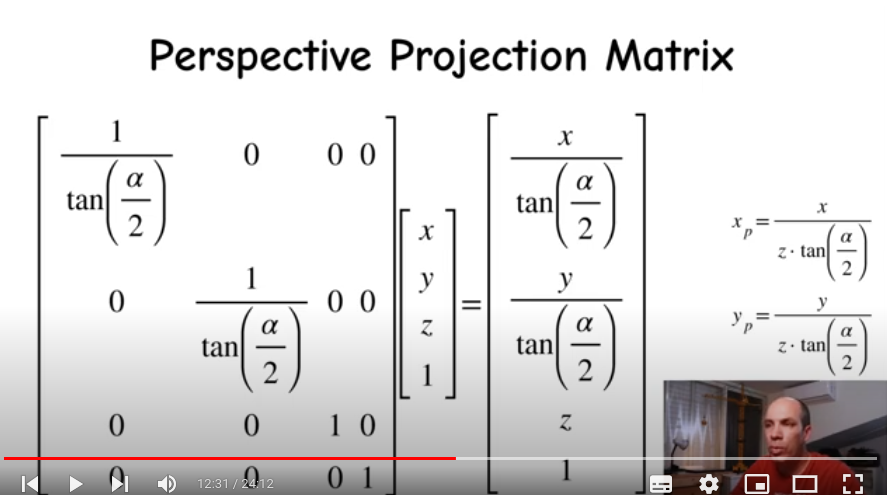
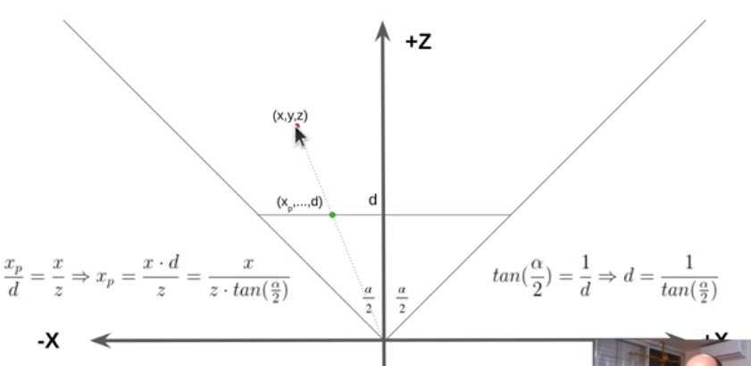

# OpenGL

https://learnopengl.com/

**Overview**  
- Related to Graphics, 3D
- It is the Specification created by khronox Labs ( later different manufacturers adapt to this spectification )
- This is all based on OpenGL 3.3
- It is State Machine: Means we change the states to draw something
- Even though it is developed in C, it is build with abstraction for objects for higher languages
- Libraries: GLUT, SDL, SFML, GLFW ( we can using any one, here we use GLFW )
- GLDA Library manages all the cumbersome work

# OpenGL Basics
1. In OpenGL everything is in 3D space, but the screen or window is a 2D array of pixels so a large part of OpenGL's work is about transforming all 3D coordinates to 2D pixels that fit on your screen. This is managed by graphics pipeline of OPENGL
2. To start drawing something we have to first give OpenGL some input vertex data
3. OpenGL only processes 3D coordinates when they're in a specific range between -1.0 and 1.0 on all 3 axes (x, y and z). All coordinates within this so called `normalized device coordinates (NDC)` range will end up visible on your screen
4. Your NDC coordinates will then be transformed to screen-space coordinates via the viewport transform using the data you provided with glViewport
**Compiling GLFW**  
https://www.glfw.org/docs/latest/compile.html 

## Shaders
There are Two main Shaders are
1. Vertex Shader, ( it takes the point and figures out where should they appear on screen )
2. Fragment shader ( figures out the color )

Other Shaders  
* Gemometry Shaders
* Compute Shaders
* Tessellation conrol and evaluation shaders

# OPENCL GPU Architecture
<--! to add -->

# General 3D/2D
## Transformation
### Translation Transformation

### Rotation Transformation

### scaling Transformation

### Combination
= Translation*( Rotation *( scaling * Position ) )

Order of dot multiplication is important

~~~Maths
Maths rules for matrix 
A(BC) = (AB)C
A*B != B*A
~~~
## Perspective Projection

### Projection matrix

we used to find the above formula in CPU, to not vasting the GPU to calculate everytime for every pixel.

**difference between VBO , VAO, EBO**
# Glossory
1. **Immediate Mode and Core-Profile**  
    Immediate Mode: fixed function pipline, it is not more flexible for the developer to control, ( it is deprecated now ) ( openGL version <= 3.2 )
    Core-Profile : New mode supported by openGL ( openGL version >= 3.3 )

    # mesa 3d has all the demo implementations including EGL, OpenGL, etc..
    