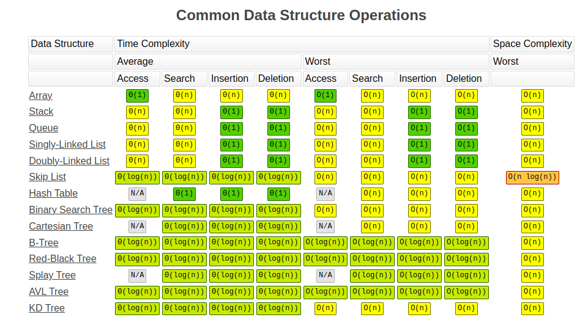
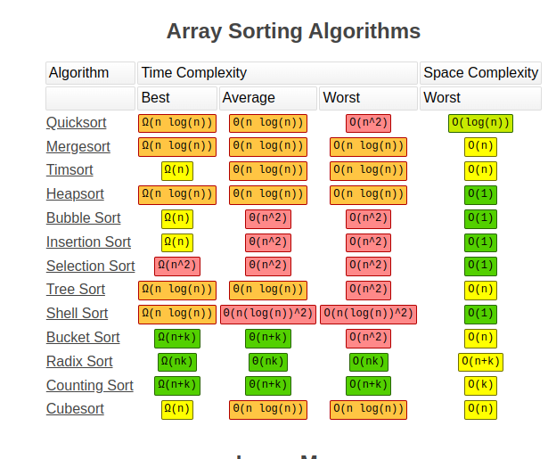

Done, Hackerank 30days Challenge ( most of all easy only )

See also:
common like shorting, searching, Binary Search Trees, traversals and other part in internet



**Priority Queue in c++**  
Add element	O(log n)
Delete element	O(log n)
Find maximum element in max heap.	O(1)
Find minimum element in min heap. O(1)
Initialize priority queue from another container. O(n)
https://www.geeksforgeeks.org/priority-queue-in-cpp-stl/
https://en.cppreference.com/w/cpp/container/priority_queue

# important links
https://www.geeksforgeeks.org/c-tricks-competitive-programming-c-11/ ( really helpfull  tips )  
https://www.bigocheatsheet.com/ ( really helpfull )

# Algorithm ( Used in Coding Competition )

# Basic
### Binary Conversion
```c
int decimal_number;
char binary_array[MAX_SIZE]; // Or int binary_array[MAX_SIZE];
int i = MAX_SIZE - 1;

// ... (Get decimal number input)

while (decimal_number > 0) {
  binary_array[i] = decimal_number % 2;
  decimal_number /= 2;
  i--;
}

// ... (Print or process binary_array)
```

### GCD
```c
int gcd(int a, int b) {
  if (b == 0) {
    return a;
  } else {
    return gcd(b, a % b);
  }
}
```

### LCM
```c
int lcm(int a, int b) {
  int gcd_val = gcd(a, b);
  return (a * b) / gcd_val;
}
```

### Cllimbing the lealder board (hackerrank)
There will be the learder board, the new player plays n games, bases on the score of the new player need to update the leader board, if the two player has the same score, they allocated the same rank, next score follows the rank + 1.
Rank is sorted in descending order, and player score always be in ascending order

(optimal solution )solution:
1. remove the duplicate ranks
2. use the binary search to find the correct position of the score. and calucalate rank pased on the index.
3. since the new player score always in ascending, the next score is always greater that or equal to previous, so start the next iteration from where you find the previous score

( my solution )
I only followed the step 3 in the above, and handled the duplicated values

### Utopian Tree  
https://www.hackerrank.com/challenges/utopian-tree/problem   
based on peried the tree height is increases
if period is even it increases by 1,
and if perirod is odd it increases as twices,

ex:
```
period: 0 1 2 3 4 5  6  7  8  9  10 11  12 ....
height: 1 2 3 6 7 14 15 30 31 62 63 126 127 ...
```

my solution ( worst ) O(n)
```rust
fn utopianTree(n: i32) -> i32 {
    let mut result:i32 = 1;
    for idx in 0..n {
        println!("{}",idx);
        if idx % 2 == 0 {
            result = result * 2;
        }
        else {
            result = result +  1;
        }
    }
    result
}
```

best solution O(n)
```c
int utopianTree(int n) {
    int ans = (1 << ((n / 2) + 1) ) - 1; // here istead finding the value for the 2^(n/2), they found using left shift operation for reducing the loop and instructions
    if(n % 2 == 1) ans*=2;
    // or simple as 
    // return ((1 << ((n / 2) + 1) ) - 1) << n%2;
    return ans;
}
```
### giving chocolate to the prisonor, sitting them in the round table, last chocolate is the tastey chololate
https://www.hackerrank.com/challenges/save-the-prisoner/copy-from/420489484?isFullScreen=true  
n = nu of prisonors  
m = chocolate counts
s = chair start number  

return: chair number who get the last chocolate
( not completed )

Founded test cases are

```c
8
7 19 2
3 7 3
1 1 1 // only 1 prisonor, start with 1 ( special case )
5 5 2 // twisting the above case
7 8 7
7 9 7 // checking for rouding the chair if count execeed the nu of chair
7 20 7 // similar to above case max diff check
5 10 3
```

I tried a = (m%n) + s - 1; if a=0{return 1}; wrong solution
Answer
```
a = (m + s -1 )%n
if a == 0
  return n
```
# Medium

# Hard

# ALGORITHM

## GREEDY
In computer science, a greedy algorithm is an algorithm that finds a solution to problems in the shortest time possible. It picks the path that seems optimal at the moment without regard for the overall optimization of the solution that would be formed.

https://www.freecodecamp.org/news/greedy-algorithms/

## TREE

# LeetCode 150 Interview questions

**1. merge the two sorted array and the resulted array should be sorted**  
I try to run the make the algorithm O(M+N);
Note: size of array1 is (M + N); where M is the valid element in array1, and N is the array two lenght. 
size of array1 is given as (M+N) beacause we to return this array. ( this become advantage )
By iterating from the last element of the two arrays, i place the element hight in the last position of the size of the array1. By repeating the process i get a sorted array.

```c++
class Solution {
 public:
    void merge(vector<int>& nums1, int m, vector<int>& nums2, int n) {
        int i = m - 1, j = n - 1, k = m + n - 1;
        while (i >= 0 && j >= 0) {
            if (nums1[i] > nums2[j]) {
                nums1[k--] = nums1[i--];
            } else {
                nums1[k--] = nums2[j--];
            }
        }
        
        while (j >= 0) {
            nums1[k--] = nums2[j--];
        }
    }
};
```

**2. Remove element in an array in in-place**
https://leetcode.com/problems/remove-element/?envType=study-plan-v2&envId=top-interview-150

in this solution iterate from the 0, if found the number in the array equal to the val, then i look from last to replace the number which is not equal to val.

time complexity: O(N)
```c++
class Solution {
public:
    int removeElement(vector<int>& nums, int val) {
        int nu_of_nonequal_val = 0;
        int nums_size          = nums.size();
        int idx = 0;
        for( idx = 0; idx <= nums_size - 1; idx++) {
            if(nums[idx] == val) {
                int  rep_idx = nums_size - 1;;
                for(; rep_idx > idx; rep_idx--) {
                    if(nums[rep_idx] != val) {
                        nums[idx] += nums[rep_idx];
                        nums[rep_idx] = nums[idx] - nums[rep_idx];
                        nums[idx] -= nums[rep_idx];
                        nu_of_nonequal_val++;
                        break;
                    }
                }
                if(nums[idx] == val)
                    break;
            }
            else {
                nu_of_nonequal_val++;
            }
        }
        return idx;
    }
};
```
**3.Duplicate element in the non-descending order array, need to remove the duplicate elements in the inplace and return the unique element size**
```c++
class Solution {
public:
    int removeDuplicates(vector<int>& nums) {
        int uniqNumCn    = 1;
        int uniqPointIdx = uniqNumCn + 1;
        if(nums[0] == nums[nums.size() - 1])
            return 1;
        // iterate through the array from 2nd position, check if current element is <= to prev element. if so find the uniq num that is greater that prev element and update the founded uniq element to the current element and update the pointIdx to the founded uniq element index so that next time we can iterate from that point)
        for(; uniqNumCn < nums.size(); uniqNumCn++) {
            if(nums[uniqNumCn] <= nums[uniqNumCn - 1] ) {
                char updated = 0;
                while(uniqPointIdx < nums.size())
                {
                    if(nums[uniqPointIdx] > nums[uniqNumCn - 1]) {
                        nums[uniqNumCn] = nums[uniqPointIdx];
                        uniqPointIdx++;
                        updated = 1;
                        break;
                    }
                    uniqPointIdx++;
                }
                if(uniqPointIdx == nums.size()) {
                    if(updated == 1) 
                        uniqNumCn++;
                    break;
                }
            }
        }
        return uniqNumCn;
    }
};
```

**4. Remove duplicate elements II (Hard)**
https://leetcode.com/problems/remove-duplicates-from-sorted-array-ii/submissions/1548147003/?envType=study-plan-v2&envId=top-interview-150 
In this question only duplicate count of two number is allowed. 

The below one is the interesting solution, where the check the idx and k-2 values. if there is a lot of duplicates like 1,1,1,1,1,2. k will be in 2nd position and idx will go to the 5th index, untill ifcondition fails, after that point need to put 2 in the 2nd position, and it continues.
```c++
class Solution {
public:
    int removeDuplicates(vector<int>& nums) {
        int uniqNumCn    = 2;
        if(nums.size() < 2)
            return 1;
        for(int idx = 2; idx < nums.size(); idx++) {
            if(nums[uniqNumCn - 2] != nums[idx]) {
                nums[uniqNumCn] = nums[idx];
                uniqNumCn++;
            }
        }
        return uniqNumCn;
    }
};
```

other method by tracking the pair, here order matter (taken more time to solve)
```c++
class Solution {
public:
    int removeDuplicates(vector<int>& nums) {
        int count = 1, pair = 1;
        for (int i = 1; i < nums.size(); i++) {
            if (nums[i] == nums[i - 1])
                pair++;
            else
                pair = 1;
            if (pair <= 2) {
                nums[count++] = nums[i];
            }
        }
        return count;

    }
};
```

**5. Find Majority Element k (k always > n/2)**
https://leetcode.com/problems/majority-element/submissions/1549117551/?envType=study-plan-v2&envId=top-interview-150


O(N) space and time complexity using map to track the count and return the max frequency of the number
```c++
class Solution {
public:
    int majorityElement(vector<int>& nums) {
        unordered_map<int, int> cn_map;
        int max = 0, max_nu = 0;
        for( int i = 0; i < nums.size(); i++)
        {
            cn_map[nums[i]] += 1;
            if( max < cn_map[nums[i]]) {
                max = cn_map[nums[i]];
                max_nu = nums[i];
            }
        }
        return max_nu;
    }
};
```

code for O(N) time and O(1) space complexity ( found in solution ). ( this solution only works for the case duplicate number count greate than the arraySize/2).

since the max duplicate count is always greater than arraySize/2, we can +1 or -1 the max_count, atlast we have the max number in variable max. NOTE: max_cn in this case may be wrong.
```c++
class Solution {
public:
    int majorityElement(vector<int>& nums) {

        // found this solution is only working for the repeaded number should greater n/2
        int max_cn = 0;
        int max    = 0;
        for( int i = 0; i < nums.size(); i++)
        {
            if(max_cn == 0)
                max = nums[i];
            
            max_cn += (max == nums[i])?1:-1;
        }
        return max;
    }
};
```

**(similar to above question) In this question k is alway > n/3**
https://leetcode.com/problems/majority-element-ii/description/

need to solve in the O(1) space and O(N) time complexity.

need understand the algorithm


**6. Rotate Array**  
https://leetcode.com/problems/rotate-array/submissions/1550856555/?envType=study-plan-v2&envId=top-interview-150
trying in O(N) time and O(1) space complexity

```c++
//(has bug)
//(not completed)
// it produce wrong out put for array.size() is even
// need to confirm for other test cases also
class Solution {
public:
    void rotate(vector<int>& nums, int k) {
        int temp = nums[0];
        int pos = 0;
        for(int idx = 0; idx < nums.size(); idx++)
        {
            pos = ( pos + k ) % nums.size();
            // replacing the var
            temp += nums[pos];
            nums[pos] = temp - nums[pos];
            temp = temp - nums[pos];
        }
    }
};
```

the below case solve execept the array size and k is even, and array_size / k is not equal to zero.
```c++
//(has bug)
class Solution {
public:
    void rotate(vector<int>& nums, int k) {
        int temp = nums[0];
        int pos = 0;
        for(int idx = 0; idx < nums.size(); idx++)
        {
            pos = ( pos + k ) % nums.size();
            // replacing the var
            temp += nums[pos];
            nums[pos] = temp - nums[pos];
            temp = temp - nums[pos];
            if( nums.size() % 2 == 0 && (idx -1) % (nums.size()/k) == 0 ) {
                pos = ( pos + 1 ) % nums.size();
                temp = nums[pos];
            }
        }
        cout<<temp<<" "<<pos<<endl;
    }
};
```
The below updated part solves the above issue also, but the full solution works only if k < array size. 

The above issue also solved by k = k % nums.size();
```c++
//(has bug)
//...
            if( nums.size() % 2 == 0 && (idx+1) % (nums.size()/k) == 0 ) {
                pos = ( pos + 1 ) % nums.size();
                temp = nums[pos];
            }
//...
```
// Different thinking solution  
Reverse the entire array:  
Example: ( [1,2,3,4,5,6,7] ) → ( [7,6,5,4,3,2,1] )  
Reverse the first ( k ) elements:  
Example: ( [7,6,5,4,3,2,1] ) → ( [5,6,7,4,3,2,1] )  
Reverse the last ( n-k ) elements:  
Example: ( [5,6,7,4,3,2,1] ) → ( [5,6,7,1,2,3,4] )

```c++
// code for above solution
#include<vector>
#include<algorithm>
using namespace std;
class Solution{
public:
    void rotate(vector<int>&nums,int k){
        int n=nums.size();
        k%=n;
        reverse(nums.begin(),nums.end());
        reverse(nums.begin(),nums.begin()+k);
        reverse(nums.begin()+k,nums.end());
    }
};
```

// Other great solution
```c++
class Solution {
public:
    void rotate(vector<int>& nums, int k) {
        int n = nums.size();
        k = k % n;
        if (k == 0) return;

        int count = 0;
        for (int start = 0; count < n; start++) {
            int current = start;
            int prev = nums[start];
            do {
                int next = (current + k) % n;
                int temp = nums[next];
                nums[next] = prev;
                prev = temp;
                current = next;
                count++;
            } while (current != start);
        }
    }
};
```

**7. Best time to Buy and sell stock**  
https://leetcode.com/problems/best-time-to-buy-and-sell-stock/description/?envType=study-plan-v2&envId=top-interview-150

prices in an array will be given on the days, need to find the max profit

Input: prices = [7,1,5,3,6,4]
Output: 5
Explanation: Buy on day 2 (price = 1) and sell on day 5 (price = 6), profit = 6-1 = 5.
Note that buying on day 2 and selling on day 1 is not allowed because you must buy before you sell.


```c++
class Solution {
public:
    int maxProfit(vector<int>& prices) {
        int min_price = prices[0];
        int profit = 0;
        for(int idx = 0; idx < prices.size(); idx++) {
            if(prices[idx] < min_price)
                min_price = prices[idx];
            int current_profit = prices[idx] - min_price;
            if(current_profit > profit)
                profit = current_profit;
        }
        return profit;   
    }
}; 
```

**8. Buy and sell stock - II**  
https://leetcode.com/problems/best-time-to-buy-and-sell-stock-ii

Input: prices = [7,1,5,3,6,4]  
Output: 7  
Explanation: Buy on day 2 (price = 1) and sell on day 3 (price = 5), profit = 5-1 = 4.
Then buy on day 4 (price = 3) and sell on day 5 (price = 6), profit = 6-3 = 3.
Total profit is 4 + 3 = 7.

```c++
class Solution {
public:
    int maxProfit(vector<int>& prices) {
        int min_price = prices[0];
        int max_price = prices[0];
        int profit = 0;
        for( int idx = 1; idx < prices.size(); idx++)
        {
            if(prices[idx] < min_price) {
                min_price = prices[idx];
                max_price = prices[idx];
            }
            if(prices[idx] > max_price){
                max_price = prices[idx];
                profit += (max_price - min_price);
                min_price = max_price;
            }
        }
        return profit;
    }
};
```

**9. Jump Game**
https://leetcode.com/problems/jump-game/description/?envType=study-plan-v2&envId=top-interview-150

You are given an integer array nums. You are initially positioned at the array's first index, and each element in the array represents your maximum jump length at that position.

Return true if you can reach the last index, or false otherwise

completed solution passed all testcases but worst time complexity, can be reduced
```c++
class Solution {
public:
    bool canJump(vector<int>& nums) {
        bool b_canJump = false;
        for(int idx = 0; idx < nums.size(); ) {
            if (nums[idx] >= nums.size() - idx - 1) {
                b_canJump = true;
                break;
            }
            else {
                if (nums[idx] == 0)
                    break;
                int temp = nums[idx];
                idx++;
                int max_idx = idx;
                bool start = 0;
                while (temp) {
                    if(start == 0 || nums[idx] >= nums[max_idx]){
                        if(idx + nums[idx] >= nums.size() - idx - 1 || nums[idx+nums[idx]] != 0) {
                            max_idx = idx;
                            start = 1;
                        }
                    }
                    idx++;
                    temp--;
                }
                idx = max_idx;
            }
        }
        return b_canJump;
    }
};
```
time taken test case: [4,2,0,0,1,1,4,4,4,0,4,0]


*below is my next correct solution*

loop from last element. if 0 is found, check any of the element can jump zero's index. if jump continue on, else return false.
```c++
class Solution {
public:
    bool canJump(vector<int>& nums) {
        bool b_canJump = true;
        if(nums.size() <= 1)
            return 1;
        if(nums[0] == 0)
            return 0;
        for (int idx = nums.size() - 1; idx > 0; idx--) {
            if (nums[idx] == 0) {
                int zero_idx = idx;
                idx--;
                while(idx >= 0) {
                    if(nums[idx] > (zero_idx - idx) || (nums[idx] > (zero_idx - idx - 1) && zero_idx == nums.size() - 1)) {
                        break;
                    }
                    idx--;
                    if(idx < 0) {
                        b_canJump = false;
                    }
                }
            }
        }
        return b_canJump;
    }
};
```

other best solution from solutions:

need to set the goal from last. reaching the goal is based on the previous element, if it is non-zero, then using that previous element we can reach the goal. so set the prev element for the goal.
```c++
class Solution {
public:
    bool canJump(vector<int>& nums) {
        int goal = nums.size() - 1;
        for (int i = nums.size() - 1; i >= 0; i--) {
            if (i + nums[i] >= goal) {
                goal = i;
            }
        }
        return goal == 0;
    }
};
```

**10.Jump Game II (find min step to reach the end)**
https://leetcode.com/problems/jump-game-ii/
Input: nums = [2,3,1,1,4]  
Output: 2  
Explanation: The minimum number of jumps to reach the last index is 2. Jump 1 step from index 0 to 1, then 3 steps to the last index.  

My wrong solution, which is taken from the previous one and counted the steps
```c++
class Solution {
public:
    int jump(vector<int>& nums) {
        bool b_canJump = false;
        int steps = 1;
        if(nums.size() <= 1)
            return 0;
        for(int idx = 0; idx < nums.size(); ) {
            if (nums[idx] >= nums.size() - idx - 1) {
                b_canJump = true;
                break;
            }
            else {
                if (nums[idx] == 0)
                    break;
                int temp = nums[idx];
                idx++;
                int max_idx = idx;
                bool start = 0;
                while (temp) {
                    if(start == 0 || nums[idx] >= nums[max_idx]){
                        if(idx + nums[idx] >= nums.size() - idx - 1 || nums[idx+nums[idx]] != 0) {
                            max_idx = idx;
                            start = 1;
                        }
                    }
                    idx++;
                    temp--;
                }
                steps++;
                idx = max_idx;
            }
        }
        return steps;
    }
};
```

failed test case: [ 10, 9, 8, 7, 6, 5, 4, 3, 2, 1, 1, 0]


correct solution and best effienent.

find the maxJump which is the currentEnd here.

in the intermediate find the max_step_sz,

if max_jump is reached, increase the jump and update max_jump to the max_Step_size
https://leetcode.com/problems/jump-game-ii/solutions/6329832/most-optimal-solution-beats-100-c-java-python-javascript/?envType=study-plan-v2&envId=top-interview-150
```c++
class Solution {
public:
    int jump(vector<int>& nums) {
        int step = 0, max_step_sz = 0, currentEnd = 0;
        for( int i = 0; i < nums.size() - 1; i++) {
            max_step_sz = max(i+nums[i], max_step_sz);
            if(i == currentEnd)
            {
                currentEnd = max_step_sz;
                step++;
            }
        }
        return step;
    }
};
```

**11. h-index**

interesting method.

citation means our research paper is referred in how many other research papers... ( like that )

*h-index*  
key point: number of citation greater than n researcher paper should equl to citation

According to the [definition of h-index on Wikipedia](https://en.wikipedia.org/wiki/H-index): The h-index is defined as the maximum value of h such that the given researcher has published at least h papers that have each been cited at least h times.

my solution

```c++
#include <algorithm>
class Solution {
public:
    int hIndex(vector<int>& citations) {
        sort(citations.begin(), citations.end(), greater<int>());
        int hIndex = 0;
        for( int i = 0; i < citations.size(); i++ ) {
            if(citations[i] >= i + 1)
                hIndex++;
            else 
                break;
        }
        return hIndex;
    }
};
```

other solution with O(N) time and O(N) space complexity

```c++
class Solution {
public:
    int hIndex(vector<int>& citations) {
        int papers = citations.size();
        vector<int> citationBuckets(papers + 1, 0);

        for (int citation : citations) {
            citationBuckets[min(citation, papers)]++;
        }

        int cumulativePapers = 0;
        for (int hIndex = papers; hIndex >= 0; hIndex--) {
            cumulativePapers += citationBuckets[hIndex];
            if (cumulativePapers >= hIndex) {
                return hIndex;
            }
        }
        return 0;        
    }
};
```

**13. Product of Array Except Self**
https://leetcode.com/problems/product-of-array-except-self/description/?envType=study-plan-v2&envId=top-interview-150

Given an integer array nums, return an array answer such that answer[i] is equal to the product of all the elements of nums except nums[i].

The product of any prefix or suffix of nums is guaranteed to fit in a 32-bit integer.

You must write an algorithm that runs in O(n) time and without using the division operation.

Example 1:

Input: nums = [1,2,3,4]
Output: [24,12,8,6]
Example 2:

Input: nums = [-1,1,0,-3,3]
Output: [0,0,9,0,0]


```c++
//my solution ~O(N) or O(2N) time complexity
// ~O(1) space complexity
class Solution {
public:
    vector<int> productExceptSelf(vector<int>& nums) {
        int mul = 1;
        char nuZero = 0;
        for(int i = 0; i < nums.size(); i++) {
            if(nums[i] != 0) 
                mul = mul * nums[i];
            else
                nuZero++;
        }
        if(nuZero >= 1) {
            for(int i = 0; i < nums.size(); i++) {
                if(nums[i] != 0 || nuZero >= 2)
                    nums[i] = 0;
                else
                    nums[i] = mul;
            }
        }
        else {
            for(int i = 0; i < nums.size(); i++) {
                if(nums[i] != 0)
                    nums[i] = mul / nums[i];
                else
                    nums[i] = mul;
            }
        }
        return nums;
    }
};
```c++
other interesting solution by the way it is not the O(1) space complexity, it is O(N)

/* Idea is
input : [ 1,2,3,4 ]
find the left to right multiply
lToF : [ 1 1*1=1 1*2=2 2*3=6]
     : [ 1, 1, 2, 6]
similarly for right to left
rToL : [12*2=24, 4*3=12, 1*4=4, 1]

multiply rtoL * lToF
res : [24, 12, 8, 6]
*/
class Solution {
public:
    vector<int> productExceptSelf(vector<int>& nums) {
        int n = nums.size();
        vector<int> output(n);
        output[0] = 1;
        for(int i=1; i<n; i++){
            output[i] = output[i-1] * nums[i-1];
        }
        int right = 1;
        for(int i=n-1; i>=0; i--){
            output[i] *= right;
            right *= nums[i];
        }
        return output;
    }
};

```

**14. Gas Station**
https://leetcode.com/problems/gas-station/description/?envType=study-plan-v2&envId=top-interview-150
There are n gas stations along a circular route, where the amount of gas at the ith station is gas[i].

You have a car with an unlimited gas tank and it costs cost[i] of gas to travel from the ith station to its next (i + 1)th station. You begin the journey with an empty tank at one of the gas stations.

Given two integer arrays gas and cost, return the starting gas station's index if you can travel around the circuit once in the clockwise direction, otherwise return -1. If there exists a solution, it is guaranteed to be unique.

```c++
// best solution T: O(N), S: O(1)
class Solution {
public:
    int canCompleteCircuit(vector<int>& gas, vector<int>& cost) {
        int n = gas.size();
        int total_gas = 0;
        int current_gas = 0;
        int start_index = 0;

        for (int i = 0; i < n; ++i) {
            total_gas += gas[i] - cost[i];
            current_gas += gas[i] - cost[i];

            if (current_gas < 0) {
                start_index = i + 1;
                current_gas = 0;
            }
        }

        if (total_gas < 0) {
            return -1;
        }

        return start_index;
    }
};
```

**15. candy**
https://leetcode.com/problems/candy/description/?envType=study-plan-v2&envId=top-interview-150

There are n children standing in a line. Each child is assigned a rating value given in the integer array ratings.

You are giving candies to these children subjected to the following requirements:

Each child must have at least one candy.
Children with a higher rating get more candies than their neighbors.
Return the minimum number of candies you need to have to distribute the candies to the children.


```c++
// T: O(N), S : O(N); Greedy Approach
class Solution {
public:
    int candy(vector<int>& ratings) {
        int minNuCandy = 0;
        int n = ratings.size();
        vector<int> candies(n,1);

        for(int i = 1; i < n; i++) {
            if(ratings[i] > ratings[i-1]) 
                candies[i] = candies[i-1] + 1;
        }
        minNuCandy = candies[n-1];
        for(int i = n - 2; i >= 0; i--) {
            if(ratings[i] > ratings[i+1])
                candies[i] = max(candies[i], candies[i+1] + 1);
            minNuCandy += candies[i];
        }
        return minNuCandy;
    }
};
```

best solution need to understand ****
https://leetcode.com/problems/candy/solutions/4037646/99-20-greedy-two-one-pass/?envType=study-plan-v2&envId=top-interview-150
```c++
impl Solution {
    pub fn candy(ratings: Vec<i32>) -> i32 {
        if ratings.is_empty() {
            return 0;
        }

        let mut ret = 1;
        let mut up = 0;
        let mut down = 0;
        let mut peak = 0;

        for i in 0..ratings.len() - 1 {
            let (prev, curr) = (ratings[i], ratings[i + 1]);

            if prev < curr {
                up += 1;
                down = 0;
                peak = up;
                ret += 1 + up;
            } else if prev == curr {
                up = 0;
                down = 0;
                peak = 0;
                ret += 1;
            } else {
                up = 0;
                down += 1;
                ret += 1 + down;
                if peak >= down {
                    ret -= 1;
                }
            }
        }

        ret
    }
}
```

**16. Trapping Rain Water**
Given n non-negative integers representing an elevation map where the width of each bar is 1, compute how much water it can trap after raining.

Input: height = [0,1,0,2,1,0,1,3,2,1,2,1]
Output: 6
Explanation: The above elevation map (black section) is represented by array [0,1,0,2,1,0,1,3,2,1,2,1]. In this case, 6 units of rain water (blue section) are being trapped.

```c++ 
//my solution
//T: ~O(N); S: O(1)
// but takes more time
class Solution {
public:
    int trap(vector<int>& height) {
        int bigNu = height[0]; //big Num
        int wtrStrd = 0; // Water Stored
        int wtrStrdInter = 0; // water Stored in intermediated
        int tempIdx = 0;
        int idx = 0;
        int nMax = 0; // next max after the idex of the bigNu found.
        int n = height.size();
        while(idx < n) {
            wtrStrdInter = 0;
            nMax = 0;
            tempIdx = idx;
            //find the amount of water between the two wall
            while(idx < n && bigNu > height[idx]) {
                if(nMax < height[idx])
                    nMax = height[idx];
                wtrStrdInter += bigNu - height[idx];
                idx++;
            }
            // add the intermediate amount of water if the height of wall >= to the previous found bigged wall
            if(idx < n && height[idx] >= bigNu) {
                wtrStrd += wtrStrdInter;
                bigNu = height[idx];
                idx++;
            }
            else { // update the next biggest wall close as the bigNu and iterate once again.
                idx = tempIdx;
                bigNu = nMax;
            }
        }
        return wtrStrd;
    }
};
```

Other Solution: simple ( need to understand )
```c++
// two pointer shortented approach
class Solution {
public:
    //total water is trapped into the bars
    int trap(vector<int>& h) {
        int l=0,r=h.size()-1,lmax=INT_MIN,rmax=INT_MIN,ans=0;
        while(l<r){
            lmax=max(lmax,h[l]);
            rmax=max(rmax,h[r]);
            ans+=(lmax<rmax)?lmax-h[l++]:rmax-h[r--];
        }
        return ans;
    }
};
```

```c++
//Two Pointer Approach
class Solution {
public:
    int trap(vector<int>& height) {
        int n = height.size();
        if (n == 0) return 0;
        
        vector<int> left(n);
        vector<int> right(n);
        
        // Fill left array
        left[0] = height[0];
        for (int i = 1; i < n; i++) {
            left[i] = max(left[i - 1], height[i]);
        }
        
        // Fill right array
        right[n - 1] = height[n - 1];
        for (int i = n - 2; i >= 0; i--) {
            right[i] = max(right[i + 1], height[i]);
        }
        
        // Calculate trapped water
        int trappedWater = 0;
        for (int i = 0; i < n; i++) {
            trappedWater += min(left[i], right[i]) - height[i];
        }
        
        return trappedWater;
    }
};
```

Need to update the other best solution

**17. Roman to Integer Conversion**

```c++
//MY code T: O(N); S: O(1)
class Solution {
public:
    int romanToInt(string s) {
        unordered_map<char,int> romDec; //inserting to the hash map takes time
        romDec['I'] = 1;
        romDec['V'] = 5;
        romDec['X'] = 10;
        romDec['L'] = 50;
        romDec['C'] = 100;
        romDec['D'] = 500;
        romDec['M'] = 1000;

        int intOut = 0;
        int prevDig = 0;
        int n = s.size();
        for(int i = n - 1; i >= 0; i--) {
            if(prevDig <= romDec[s[i]]) {
                intOut += romDec[s[i]];
                prevDig = romDec[s[i]];
            }
            else {
                intOut -= romDec[s[i]];
                prevDig = 0;
            }
        }
        return intOut;
    }
};
```

```c++
Best solution is to use switch 
class Solution {
public:
    int char2num(char a) {
        switch (a) {
            case 'I': return 1;
            case 'V': return 5;
            case 'X': return 10;
            case 'L': return 50;
            case 'C': return 100;
            case 'D': return 500;
            case 'M': return 1000;
            default: return 0;
        }
    }
    int romanToInt(string s) {

        int intOut = 0;
        int prevDig = 0;
        int n = s.size();
        for(int i = n - 1; i >= 0; i--) {
            int currDig = char2num(s[i]);
            if(prevDig <= currDig) {
                intOut += currDig;
                prevDig = currDig;
            }
            else {
                intOut -= currDig;
                prevDig = 0;
            }
        }
        return intOut;
    }
};
```
**18. Integer to Roman Converter**
```c++
// T:O(LOG(N)); S : O(1)
class Solution {
public:
    string num2char(int a) {
        switch (a) {
            case 1: return "I";
            case 5: return "V";
            case 10: return "X";
            case 50: return "L";
            case 100: return "C";
            case 500: return "D";
            case 1000: return "M";
        }
        return "0";
    }
    string intToRoman(int num) {
        string roman;
        int numL = 0;
        int digMul = 1;
        int temp = num;
        while(temp) {
            temp = temp / 10;
            digMul = digMul * 10;
            numL++;
        }
        while(num) {
            digMul = digMul / 10;
            int dig = num / digMul;
            num = num - (dig * digMul);
            if(dig == 9 || dig == 4) {
                roman.append(num2char(digMul));
                roman.append(num2char(dig * digMul + digMul));
            }
            else {
                temp = dig * digMul;
                while(temp) {
                    if(dig  == 5 || dig == 10) {
                        roman.append(num2char(dig * digMul));
                        temp = temp - (dig * digMul);
                    }
                    else if( dig < 5) {
                        roman.append(num2char(digMul));
                        temp = temp - digMul;
                    }
                    else {
                        roman.append(num2char(5 * digMul));
                        temp = temp - (5 * digMul);
                    }
                    dig = temp / digMul;
                }
            }
        }
        return roman;
    }
};
```


interesting T: O(1) approach
```c++
class Solution {
public:
    string intToRoman(int num) {
        string res = "";

        // Arrays storing Roman numeral representations for ones, tens, hundreds, and thousands
        string ones[] = {"", "I", "II", "III", "IV", "V", "VI", "VII", "VIII", "IX"};
        string tens[] = {"", "X", "XX", "XXX", "XL", "L", "LX", "LXX", "LXXX", "XC"};
        string hundreds[] = {"", "C", "CC", "CCC", "CD", "D", "DC", "DCC", "DCCC", "CM"};
        string thousands[] = {"", "M", "MM", "MMM"}; // Removed invalid "NM", "N" since Roman numerals go up to 3999

        // Extract and convert thousands place
        res += thousands[num / 1000];
        // Extract and convert hundreds place
        res += hundreds[(num % 1000) / 100];
        // Extract and convert tens place
        res += tens[(num % 100) / 10];
        // Extract and convert ones place
        res += ones[num % 10];

        return res;
    }
};
```

other methods
```c++
class Solution {
public:
    string intToRoman(int num) {
        string output;
        while(num > 0){
            if(num >= 1000){
                output += 'M';
                num -= 1000;
            }
            else if(num >= 900){
                output += "CM";
                num -= 900;
            }
            else if(num >= 500){
                output += 'D';
                num -= 500;
            }
            else if(num >= 400){
                output += "CD";
                num -= 400;
            }
            else if(num >= 100){
                output += 'C';
                num -= 100;
            }
            else if(num >= 90){
                output += "XC";
                num -= 90;
            }
            else if(num >= 50){
                output += 'L';
                num -= 50;
            }
            else if(num >= 40){
                output += "XL";
                num -= 40;
            }
            else if(num >= 10){
                output += 'X';
                num -= 10;
            }
            else if(num >= 9){
                output += "IX";
                num -= 9;
            }
            else if(num >= 5){
                output += 'V';
                num -= 5;
            }
            else if(num >= 4){
                output += "IV";
                num -= 4;
            }
            else if(num >= 1){
                output += 'I';
                num -= 1;
            }
        }
        return output;
    }
};
```
**19. Length of Last Word**
```c++
// T: O(N); S: O(1)
class Solution {
public:
    int lengthOfLastWord(string s) {
        int sLen = s.size();
        int lWLen = 0;
        for(int i = sLen - 1; i >= 0; i--){
            if(s[i] != ' ') {
                lWLen++;
            }
            else if (s[i] == ' ' && lWLen != 0)
                break;
        }
        return lWLen;
    }
};
```

// generenal best memory optimization code
```c++
#pragma GCC optimize("O3", "unroll-loops")
class Solution {
public:
    int lengthOfLastWord(string s) 
    {
        int pos = s.size()-1,len=0;
        while (pos >= 0)
        {
            if (s[pos] != ' ') ++len;
            else if (len > 0) break;
            --pos;
        }
        return len;
    }
};

auto init = []()
{ 
    ios::sync_with_stdio(0);
    cin.tie(0);
    cout.tie(0);
    return 'c';
}();

```

**20. Longest common prefix**
Example 1:

Input: strs = ["flower","flow","flight"]   
Output: "fl"

```c++
// my solution T:O(N); S:O(1)
class Solution {
public:
    string longestCommonPrefix(vector<string>& strs) {
        string outStr = "";
        for(int letter = 0; letter < strs[0].size(); letter++) {
            char curletter = strs[0][letter];
            unsigned char count = 0;
            for(int word = 0; word < strs.size(); word++) {
                if(letter < strs[word].size() && strs[word][letter] == curletter)
                    count++;
                else
                    break;
            }
            if(count < strs.size())
                break;
            else
                outStr = outStr + curletter;
        }
        return outStr;
    }
};
```

**21. Replace the word**

```c++
// my solution T:O(N), S:O(N), 35ms.
class Solution {
public: 
    string reverseWords(string s) {
        int sentLen = s.size();
        string wrd = "";
        string revSent = "";

        for (int i = sentLen - 1; i >= -1; i--) {  
            if (i == -1 || s[i] == ' ') {
                if (wrd.size() >= 1) {
                    for(int wi = wrd.size() - 1; wi >= 0; wi--) 
                        revSent = revSent + char(wrd[wi]);
                    while( i >= 0 && s[i] == ' ')
                        i--;
                    i++;
                    if(i > 0)
                        revSent = revSent + ' ';
                    wrd.clear();
                }
            }
            else
                wrd = wrd + char(s[i]);
        }
        return revSent;
    }
};
```

0ms solution
```c++
class Solution {
public:
    string reverseWords(string s) {
        int i = s.size()-1;
        int j = s.size()-1;
        string ans = "";
        while(j>=0){
            if(s[j] == ' ' && i == j){
                j--;
                i--;
            }else if(s[j]!=' '){
                j--;
                if(j<0){
                    ans+=s.substr(j+1,i-j);
                }
            }
            else{
                ans+=s.substr(j+1,i-j);
                ans+=" ";
                j--;
                i = j;
            }
        }
        if(ans[ans.size()-1] == ' ')return ans.substr(0,ans.size()-1);
        return ans;
    }
};
```
other interestin S:O(1), algo (other best algo)

```c++
// Reverse the whole sentence (can be done in O(1) by replacing 0 from n-1 (i from n - i- 1))
// Then Reverse the word from starting O(1) it also same
// t
class Solution {
public:
    string reverseWords(string s) {
        reverse(s.begin(),s.end());
        int n=s.size();
        int left=0;
        int right=0;
        int i=0;
        while(i<n){
            while(i<n && s[i]==' ')i++;
            if(i==n)break; // to stop index going out of bounds
            while(i<n && s[i]!=' '){
                s[right++]=s[i++];
            }
            reverse(s.begin()+left,s.begin()+right);
            s[right++]=' ';
            left=right;
            i++;
        }
        s.resize(right-1);
        return s;
    }
};
```

**22. Zigzag conversion**
The string "PAYPALISHIRING" is written in a zigzag pattern on a given number of rows like this: (you may want to display this pattern in a fixed font for better legibility)

P   A   H   N   
A P L S I I G  
Y   I   R  
And then read line by line: "PAHNAPLSIIGYIR"  

Example 2:

Input: s = "PAYPALISHIRING", numRows = 4  
Output: "PINALSIGYAHRPI"  
Explanation:  
P     I    N  
A   L S  I G  
Y A   H R  
P     I  

```c++
// nearly T:O(N) S:(1);
// if you see the example first and lasting smeems similer in termns or patterns ( not character )
class Solution {
public:
    string convert(string s, int numRows) {
        int next_down = 0;
        int next_up = 0;
        string out = "";
        next_down = (numRows - 1) * 2;
        if(s.size() == 1 || numRows == 1)
            return s;
        for(int i = 0; i < s.size(); i += next_down)
            out = out + s[i];
        for(int curRow = 1; curRow < numRows - 1; curRow++) {
            //find the next_down and next up interval for the curROw in zigzag
            next_down = (numRows - curRow - 1) * 2;
            next_up   = curRow * 2;
            int i = curRow;
            bool in = 0;
            while(i < s.size()) {
                out = out + s[i];
                if(in == 0) {
                    i += next_down;
                    in = 1;
                }
                else {
                    i += next_up;
                    in = 0;
                }
            }
        }
        next_up = (numRows - 1) * 2;
        for(int i = numRows - 1; i < s.size(); i += next_up)
            out = out + s[i];
        return out;
    }
};
```
other solution:
```c++


class Solution {
public:

    string convert(string s, int numRows) {
    
    if(numRows <= 1) return s;

    vector<string>v(numRows, ""); 

    int j = 0, dir = -1;

    for(int i = 0; i < s.length(); i++)
    {

        if(j == numRows - 1 || j == 0) dir *= (-1); 
		 
        v[j] += s[i];

        if(dir == 1) j++;

        else j--;
    }

    string res;

    for(auto &it : v) res += it; 

    return res;

    }
};
```

**23. Find the index of the First occurrence in astring**
Input: haystack = "sadbutsad", needle = "sad"  
Output: 0  
Explanation: "sad" occurs at index 0 and 6.  The first   occurrence is at index 0, so we return 0.  

```c++
//my solution T:O(N); S:O(1);
class Solution {
public:
    int strStr(string haystack, string needle) {

        int nIdx = 0;
        int prevH_idx = 0;
        int hS = haystack.size();
        int nS = needle.size();
        for(int i = 0; i < hS; i++) {
            if(haystack[i] == needle[nIdx]) {
                if(nIdx == 0)
                    prevH_idx = i;
                nIdx++;
                if(nIdx >= nS)
                    break;
            }
            else {
                i = prevH_idx;
                prevH_idx++;
                nIdx = 0;
            }
        }
        if( nIdx == nS)
            return prevH_idx;
        else
            return -1;
    }
};
```

**24. Text justification (Hard)**
completed in 1h 37min.  
https://leetcode.com/problems/text-justification/description/?envType=study-plan-v2&envId=top-interview-150

```
example:
Input: words = ["This", "is", "an", "example", "of", "text", "justification."], maxWidth = 16
Output:
[
   "This    is    an",
   "example  of text",
   "justification.  "
]
```

```c++
//my algo T:O(N); S:O(N) S is doubt sinse it is not an inplace
class Solution {
public:
    vector<string> fullJustify(vector<string>& words, int maxWidth) {
        /*psuedo code
        var lN = 0;
        var wrdCn = 0
        var wrdIdx = 0;
        vector<string> justifiedText;
        while(w in words):
            if lN + w.size() >= mW and !islastWord(w):
                lN--;
                justifiedTex.push(findJustiyforNwords(words, wrdIdx - wrdCn, wrdCn, mW, lN));
                wrdCn = 0
                lN = 0;
                wrdIdx += Wrdcn
            else
                lN += w.size() + 1
                wrdCn++
        while(word from words[wrdIdx])
            append all wrd with one space in justified Text
        str findJustifyforNWords(words, int start, int cn, int max, lN)
        {
            str out;
            if(cn == 1)
                out = words[start]
                while(out.size() != max)
                    out += ' '
            else
                diff = (max - lN)/(cn - 1);
                rem = (max - lN) % (cn-1);
                for i -> cn:
                    out.append(words[i]);
                    out += ' '
                    temp = diff
                    while(temp)
                        out += ' '
                    if(rem)
                        out += ' '
                        rem--
        }
        */
        int outlineNu = 0; // this is named wrongly (it counts letters)
        int wrdCnt = 0;
        int wrdIdx = 0;
        int outHeight = 0;
        vector<string> justTex;
        int wlen = words.size();
        for(int i = 0; i < wlen; i++) {
            if(outlineNu -1 + words[i].size() >= maxWidth) {
                outlineNu--;
                if(wrdCnt == 1) {
                    justTex.push_back("");
                    justTex[outHeight].append(words[wrdIdx]);
                    while(justTex[outHeight].size() != maxWidth) {
                        justTex[outHeight] += ' ';
                    }
                    outlineNu = 0;
                    wrdCnt = 0;
                    wrdIdx++;
                    i--;
                }
                else {
                    int diff = (maxWidth - outlineNu) / (wrdCnt - 1);
                    int rem = (maxWidth - outlineNu) % (wrdCnt - 1);
                    justTex.push_back("");
                    while(wrdIdx < i ) {
                        justTex[outHeight].append(words[wrdIdx]);
                        if(wrdIdx != ( i - 1)) {
                            justTex[outHeight] += ' ';
                            int temp = diff;
                            while(temp) {
                                justTex[outHeight] += ' ';
                                temp--;
                            }
                            if(rem) {
                                    justTex[outHeight] += ' ';
                                    rem--;
                            }
                        }
                        wrdIdx++;
                    }
                    outlineNu = words[i].size() + 1;
                    wrdCnt = 1;
                }
                outHeight++;
            }
            else {
                outlineNu += words[i].size() + 1;
                wrdCnt++;
            }
        }
        // for last line (as normal line with single space)
        justTex.push_back("");
        for(int i = wrdIdx; wrdIdx < wlen; wrdIdx++) {
            justTex[outHeight].append(words[wrdIdx]); 
            if(justTex[outHeight].size() < maxWidth)
                justTex[outHeight] += ' ';
        }
        while(justTex[outHeight].size() < maxWidth)
            justTex[outHeight] += ' ';
        outHeight++;
        return justTex;
    }
};
```
```c++
// other interesting solution simple
class Solution {
public:
    std::vector<std::string> fullJustify(std::vector<std::string>& words, int maxWidth) {
        std::vector<std::string> res;
        std::vector<std::string> cur;
        int num_of_letters = 0;

        for (std::string word : words) {
            if (word.size() + cur.size() + num_of_letters > maxWidth) {
                for (int i = 0; i < maxWidth - num_of_letters; i++) {
                    cur[i % (cur.size() - 1 ? cur.size() - 1 : 1)] += ' ';
                }
                res.push_back("");
                for (std::string s : cur) res.back() += s;
                cur.clear();
                num_of_letters = 0;
            }
            cur.push_back(word);
            num_of_letters += word.size();
        }

        std::string last_line = "";
        for (std::string s : cur) last_line += s + ' ';
        last_line = last_line.substr(0, last_line.size()-1);  // remove trailing space
        while (last_line.size() < maxWidth) last_line += ' ';
        res.push_back(last_line);

        return res;
    }
};
```
**TwoPointer: 1. valid palindrome**
https://leetcode.com/problems/valid-palindrome/description/?envType=study-plan-v2&envId=top-interview-150
```c++
class Solution {
public:
    bool isChar(char *ch) {
        if(!((*ch >= 'a' && *ch <= 'z') || (*ch >= 'A' && *ch <= 'Z') || (*ch >= '0' && *ch <= '9')))
            return false;
        if(*ch >='A' && *ch <= 'Z')
            *ch += 'a' - 'A';
        return true;
    }
    bool isPalindrome(string s) {
        int start = 0;
        int end = s.size() - 1;
        int updatedChar = 0;
        //if(s == ".a")
        //    return true; // i hardcoded this because i dont understand why for "0P" it is false in other case
        while(start < end) {
            while(start < end && !isChar(&s[start])) 
                start++;
            while(end > start && !isChar(&s[end])) 
                end--;
            
            if(s[start] != s[end])
                return false;
            start++;
            end--;
            updatedChar++;
        }
        return true;
    }
};
```
**LinkedList: 1. Finding the linked list cycle**
https://leetcode.com/problems/linked-list-cycle/description

```c++
// my solution not great
// T: O(N); S:O(1)

bool hasCycle(ListNode *head) {
        unordered_map<ListNode*, int> hashmap;
        if(head == NULL)
            return false;
        while(1) {
            hashmap[head]++;
            if(hashmap[head] >= 2)
                return true;
            head = head->next;
            if( head == NULL )
                break;
        }
        return false;
    }
```

```c++
//best solution
// T: O(N) ; S : O(1)
        bool hasCycle(ListNode *head) {
        if(head==NULL){
            return false;
        }
        ListNode* slow = head;
        ListNode* fast = head;
        while(fast!=NULL && fast->next != NULL){
            // suppose if loop is present , it may goes to multiple time, the full list. It proven that worked;
            fast=  fast->next->next;
            slow = slow-> next;
            cout<<fast->val<<" "<<slow->val<<endl;
            // Input: [ 1, 2, 3, ,4, 5, 6], 6 is connect to 3, to form a circular linked list
            /* output Debug:
                f s : fast, slow
                3 2
                5 3
                3 4
                5 5
            */
            if(fast==slow){
                return true ;
            }
        }
        return false;
    }
```
**Heap: 1) Kth Largest element in an array**
```c++
class Solution {
public:
    int findKthLargest(vector<int>& nums, int k) {
        /*
            initialize the priority queue with min-heap;
            push the frist k elements of nums;
            Now the k element will arraged in a ascending order;
            iterate from k+1th item check it that item is > min-heap[0], if so pop the first element and push the item;
            Note min-heap alway insert element in the position that that satisfy the ascending order property.
            T:O(N*log(k)), S:O(N)
        */
        priority_queue<int, vector<int>, greater<int>> minHeap(nums.begin(), nums.begin() + k);
        for(int num = k; num < nums.size(); num++ ) {
            if(nums[num] > minHeap.top()) {
                minHeap.pop();
                minHeap.push(nums[num]);
            }
        }
        return minHeap.top();
    }
};
```


using quick select

```c++
// T:O(N) in Average
// T:O(N^2) in Worst
// S:O(N)
class Solution {
public:
    int findKthLargest(vector<int>& nums, int k) {
        int targetIdx = nums.size() - k;
        return quickSelect(nums, 0, nums.size() - 1, targetIdx);
    }
    
    int quickSelect(vector<int>& nums, int left, int right, int targetIdx) {
        if (left == right) {
            return nums[left];
        }

        int pivot = nums[left];
        int low = left;
        int high = right;

        while (low <= high) {
            while (low <= high && nums[low] < pivot) {
                low++;
            }
            while (low <= high && nums[high] > pivot) {
                high--;
            }
            if (low <= high) {
                swap(nums[low], nums[high]);
                low++;
                high--;
            }
        }

        if (targetIdx <= high) {
            return quickSelect(nums, left, high, targetIdx);
        } else if (targetIdx >= low) {
            return quickSelect(nums, low, right, targetIdx);
        } else {
            return nums[targetIdx];
        }
    }
};
```


