# Computer Architecture Essentials on ARM (Course from ARM via edx)
1. [ARM University edx Course](https://www.arm.com/resources/education/online-courses)
2. [Introduction to Computer Architecture Education kit](https://github.com/arm-university/Introduction-to-Computer-Architecture-Education-Kit?tab=readme-ov-file)

## Basic Computer Architecture?
#### Level of Abstraction
**Architecture**  
1. A set of specifications that allows developers to write software and firmware
2. These include the instruction set.
3. Instruction Set Architecture  

**Microarchitecture**  
1. The logical organization of the inner structure of the computer  

**Hardware or Implementation**  
1. The realization or the physical structure, i.e., logic design and chip packaging


**Instruction cycle**  
1. **Fetch** : fetch the instruction from memory
2. **Decode**: Decode the instruction
3. **Execute**: Execute the instruction

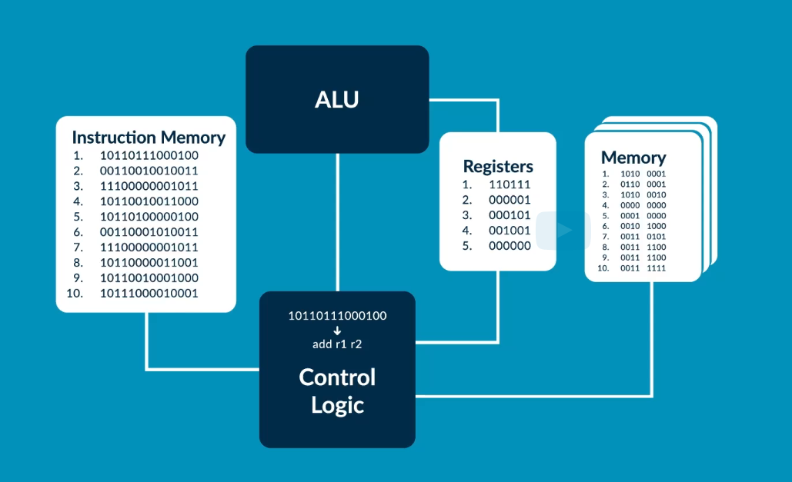

ALU Means Arithmetic and logic Unit

Modern Microprocessor has nearly 1000 to 100billion transistor, which is operated on logic one and zero

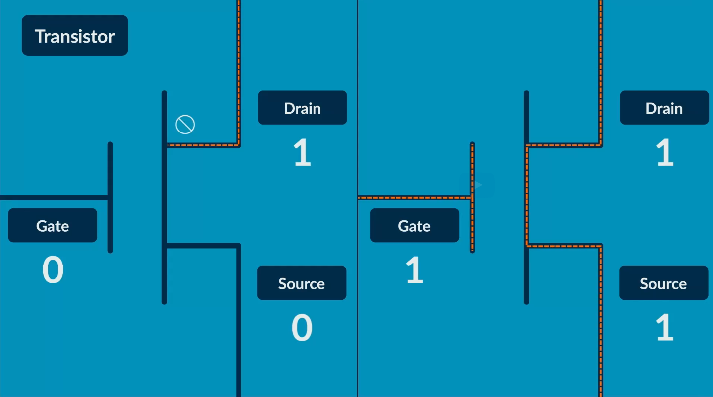

The transistor are used to Make Latch(single bit memory), Multiplexer, HalfAdder, etc...
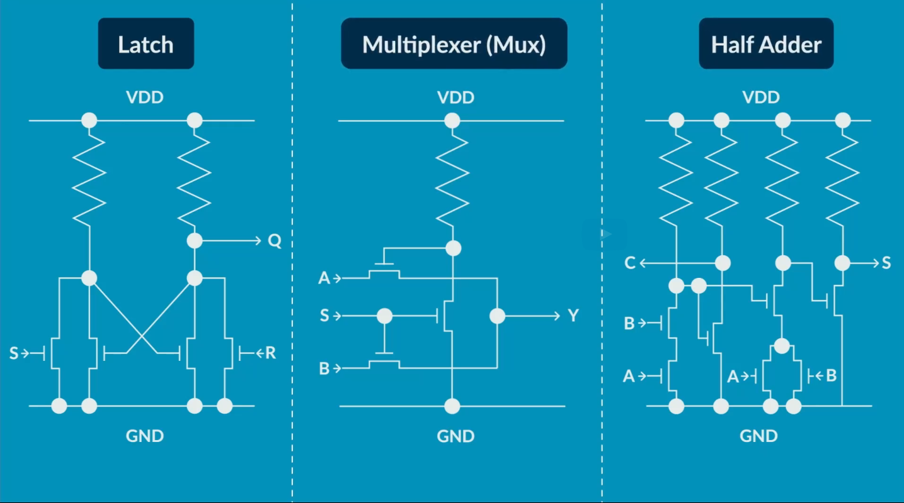
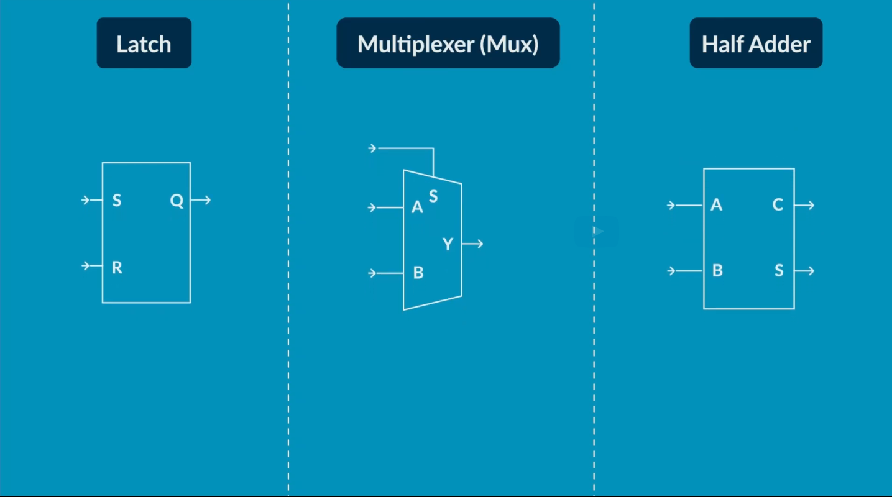


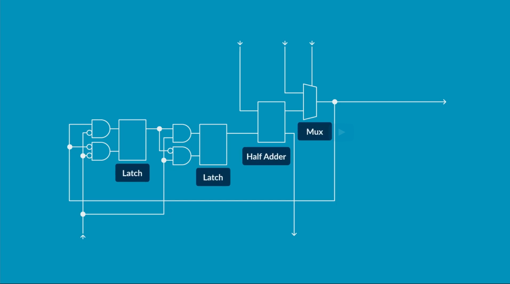

In order to synchronise all the blocks we use the `clock signal` to the processor. We measure it using the Hz.
The maximum speed of the clock signal is determined by the longest, and therefore slowest,
path in the circuit between 2 clocked flip-flops.
This is referred to as the "Critical Path."
The signal must have time to propagate all the way along the critical path
before the clock cycle completes.


#### Microprocessor Components
1. **ALU**:  A microprocessor needs to do many types of arithmetic. For this, we build an "Arithmetic Logic Unit" or "ALU." This circuit receives 2 numbers as input, as well as an indication of what operation to perform, for example, addition or subtraction. 
2. **Memory**: In addition to logic, a microprocessor needs memory. Memory is organized as arrays of memory cells that are able to store many "Words" of data.A specific word, commonly 32 bits in length, can be accessed by specifying its "Address." Each address is a number that indicates the location in the memory that should be read or written.
Memory cells range from hundreds of bits to millions of bits in size,
but larger ones are slower to access, as signals and their long internal wires take longer to propagate. For that reason, almost all microprocessors include at least two types for storing data:
    1. `Data Memory` : Big Slow Memory (In reality, the "Data Memory" may be implemented using many different sizes of memory,)
    2. `Register File`: Small and Fast Memory
    3. Apart from the above we need a memory to store the Instruction
3. **Program Counter**: A way to keep track of which instruction we will fetch next
4. **Instruction Decoder**: Since instructions are encoded in binary, we also have "Instruction Decode Logic", that converts that binary to the various signals needed to control the microprocessor.

#### How do you tell a Microprocessor what to do?

**Instructions**  

```ASM
ADD X1, X2, X3
```

```
ADD - Mnemonic
X1  - Output
X2, X3 - Operands
```
We use the assembler to encode the instruction in binary.


**ARM Instruction Set A64**

The A64 instruction set is used when executing in the AArch64 Execution state. It is a fixed-length 32-bit instruction set. The 64 in the name refers to the use of this instruction by the AArch64 Execution state. It does not refer to the size of the instructions in memory.

The A32 and T32 instruction sets are also referred to as Arm and Thumb, respectively. These instruction sets are used when executing in the AArch32 Execution state.

[A64 Instruction Set Link](https://developer.arm.com/documentation/102374/latest/)

##### Instructions

**Arithmetic Instructions**
```ASM
ADD X1, X2, X3           ; x1 = x2 + x3
MUL X0, X0, X4           ; x0 = x0 * x4
NEG X30, X20             ; x30 = -x20
AND X2, X1, X2           ; x2 = x1 & x2
ADD X5, X19, #4          ; x5 = x19 + 4
```
**Branch Instructions**  

Normally the microprocessor executes instructions in sequential order but branches change that, and explicitly tell the microprocessor the address of the instruction to run next.
This is done by giving the address of the next instruction in the instruction memory.

Always occur branches ex.: `B, BR, BL` and some branches are conditional branches ex.:`BNE`

```ASM
B   #1024                ; Branch to 1024
BNE #4                   ; Branch to 4 if "not equal" in CMP compare instruction
BEQ #7                   ; Branch to 7 if "equal" in CMP compare instruction
BLT #5                   ; Branch to 5 if "less than" in compare instruction
BR  X15                  ; Branch to X15
BL  #78                  ; Function call branch to 78
                         ;   (copies return addrss to X30)
```
The conditional instructions are preceded by the comparision instruction to calculate the condition ex.: 
```ASM
CMP X5, #6               ; compare x5 to 6`
BNE #4                   ; if the above is not ture branch to 4
```

**Load and Store Instruction**

1. Loads and stores are the instructions for accessing the data memory.
Loads copy values from memory to the register file. Stores do the opposite.  
2. In both cases, the instruction needs to know the address in the data memory
and the location in the register file to copy between.
3. For data memory, loads and stores read an address from a base register.

```ASM 
LDR X3,  [X4,X5]         ; Set X3 tp value of data memory addressed by value of X4 to X5
STR X17, [X5, #6]        ; Set data memory addressed by X5 + 6 to value of X17
```

**Example program to do GCD**   
Euclid's greatest common division algorithm in ARM A64 instrcution set

| ADDR | Instruction       | Description |
| ---- | -------------     |  ----------- |
| 0:   | CMP   X1, X2      | ; Compare X1 And X2 register inputs |
| 1:   | BEQ   #7          | ; If the above comparision is true got to address 7 |
| 2:   | BLT   #5          | ; Branch less than in the previous comparision of x1 and x2 |
| 3:   | SUB   X1, X1, X2  | ; x1 = x1 - x2 |
| 4:   | B     #0          | ; Branch to address 0 |
| 5:   | SUB   X2, X2, X1  | ; x2 = x2 - x1 |
| 6:   | B     #0          | ; Branch to address 0 |


##### **Registers in AArch64 General Purpose Register**  
Most A64 instructions operate on registers. The architecture provides 31 general purpose registers.
Each register can be used as a 64-bit X register (X0..X30), or as a 32-bit W register (W0..W30).
These are two separate ways of looking at the same register. For example, W0 is the bottom 32 bits of X0, and W1 is the bottom 32 bits of X1

```ASM
ADD W0, W1, W2     ; 32 bit addition
ADD X0, X1, X2     ; 64 bit addition
```

When a W register is written, as seen in the example above, the top 32 bits of the 64-bit register are zeroed.

There is a separate set of 32 registers used for floating point and vector operations. These registers are 128-bit, but like the general-purpose registers, can be accessed in several ways. Bx is 8 bits, Hx is 16 bits and so on (Sx is 32 bit, Dx is 64 bit) to Qx which is 128 bits.

```ASM
FADD S0, S1, S2      ; Floating point addition of 32 bit
FADD D0, D1, D2      ; Floating point addition of 64 bit
```
These registers can also be referred to as V registers. When the V form is used, the register is treated as being a vector. This means that it is treated as though it contains multiple independent values, instead of a single value. This example performs vector floating point addition:
```ASM
FADD V0.2D, V1.2D, V2.2D
```
This example performs vector integer addition:
```ASM
ADD V0.2D, V1.2D, V2.2D
```

## Pipelining
GK: **Pointer Authentication feature in ARM**: What this feature is trying to do is protect against a form of attack called ROP and JOP. These are Return Orientated and Jump Orientated Programming, and it's where an attacker tries to subvert things like the call stack to run legitimate code, but in ways that weren't expected by the programmer or the compiler.
PAC or Pointer Authentication tries to defend against this kind of attack by using part of an address to provide an encrypted signature. So we can check the signature and the address match and if they don't, we can spot an attack in progress. So why is this a trade-off? Well, because to add security, we want that signature to be as big as possible.
The bigger the signature, the more bits we use for that, the stronger cryptographically that signature is. The trade-off is: the more bits we use for the signature, the fewer bits we have available for other things, such as the address. So you can have a big signature with a small address, but if you want the address to get bigger, then you get a smaller signature, and that's then cryptographically weaker.
So the trade-off we have to make when designing a technology like that is: What's the right amount of bits for the signature? What's the strength of cryptography we need from that signature in order to get the design goal,


### The Processor Performance Equation

 let's find out how long a program takes to execute.  
```
Time taken per instruction = (Average clock cycles per instruction) x (Clock period)
```

```
Time taken per program = (Number of instructions in program) x (Average clock cycles per instruction) x (Clock period)
```

**From the above equation we can reduce the program time by:**  
1. Either Reduces the number of instructions (ex: loading the two values at the same time could reduce the instructions) (The downside to this approach, is that adding more instructions will require extra circuitry in the processor and therefore we likely increase the clock period. f the extra instructions are rarely used this could even mean an overall decrease in performance. We see this theme often in computer architecture trade-offs that we have to carefully balance.)
2. Either using the faster transistors (perhaps constructed from a more recent fabrication technology. This would reduce the clock period but may increase costs.)

The rest of this module focuses on an optimization to reduce the clock period called pipelining. This is the most important optimization we use when designing processors.

It uses a similar concept to an assembly line in a factory where work can start on the next item before the previous one finishes.

**Let's take a closer look.** Imagine that each instruction has to go through four circuits in a processor.  If we attempt to do all of these in one clock cycle this means our clock period is the latency of all four circuits added together. If we were to pipeline this, we would add a pipeline register in the middle. This divides the circuit into two sections called stages. Notice that although each instruction takes a similar amount of time to travel down the whole pipeline, the pipeline design can execute nearly twice as many instructions per second. The throughput has doubled. This is because we can set the clock period much shorter. It's now the maximum latency of the two stages. We can pipeline into many stages and this allows for much faster execution of programs. Unfortunately, though, pipelining a real microprocessor design is not quite as simple because the processor has various feedback signals and loops in the circuit.

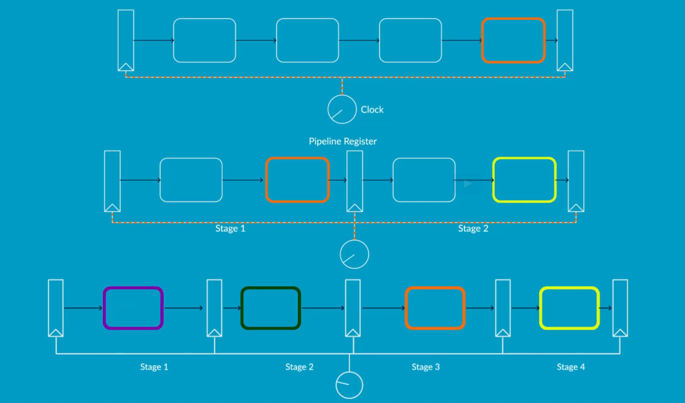

<sub>*In the above image you can see that the 1st circuit has the single stages, and only one block is executing at a time, so the clock period should be high. Since, it need to go 4block in the single clock cycle  
*In the send circuit, you can see the block are divided using the pipeline registers. in this case the stage 1 and stage 2 run on the same clock period concurrently, clock period also reduces to half, because now it need to run two block.   
*Similar to the above, but here we have 4 pipeline register. So, the clock period will reduced by 4 times.</sub>

### Pipelining a Microprocessor

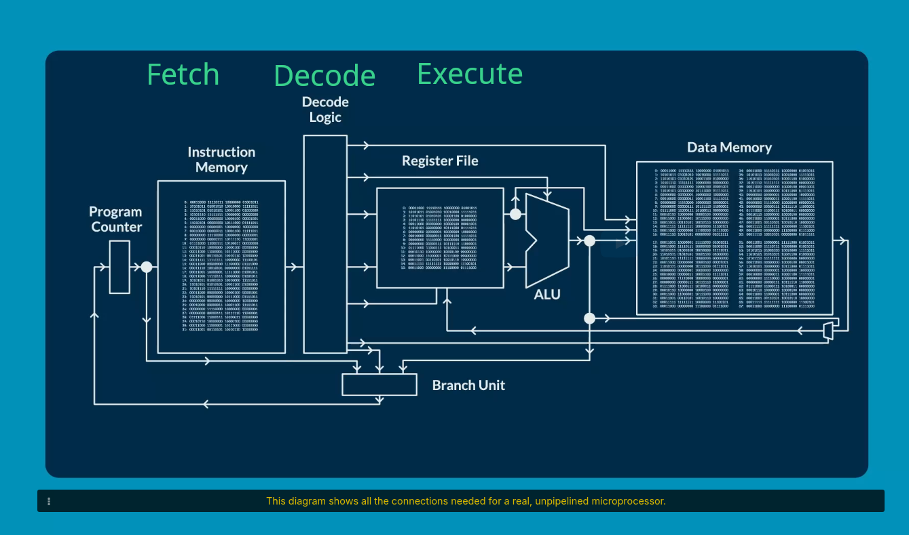
This diagram shows all the connections needed for a real, unpipelined microprocessor.

1. Each clock cycle, the processor starts by fetching an instruction from the instruction memory.
2. Once the instruction reaches the decode logic, it is decoded to produce the control signals necessary to execute it.
3. The exact control signals vary depending on the type of instruction. For example, arithmetic instructions access the register file and interact with the ALU.
Ultimately, no matter how the instruction was executed, the last step of each clock cycle is to update the program counter. This is done by the branch unit. For non-branch instructions, this just means incrementing the program counter. However, for branch instructions, the branch unit has to do some calculations.

4. When we apply our pipeline optimization to this design,
we face some challenges. The design has several loops because instructions have dependencies.How can we break these cycles?
5. The key observation is that not every instruction is the same. In real programs, branch instructions usually make up less than 20 percent of the program. For non-branches, the branch unit doesn't actually need to wait for the ALU before calculating the result.
6. Let's look at how we can use this fact to pipeline the processor.

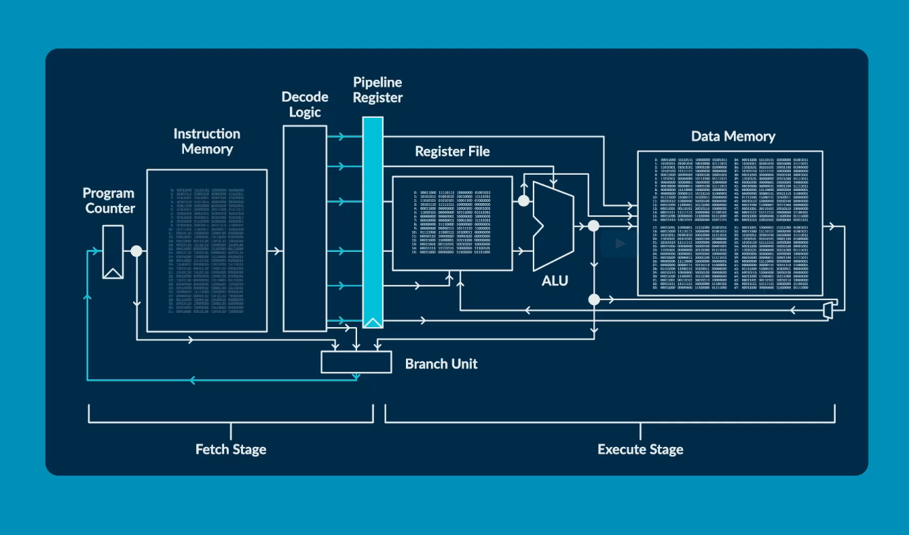

Once the first instruction reaches the pipeline register,
we're ready to begin fetching the next instruction.
The first instruction can be in the execute stage whilst the second instruction is being fetched.Once the first instruction is finished, the second instruction
is ready to enter the execute stage and a new
third instruction enters the fetch stage.

What about the branches though?
Let's imagine this next fourth instruction is a branch.
The fetch stage works normally until the branch unit,
but the branch unit cannot proceed.
Consequently, the pipeline stalls.
The fetch stage spends a cycle waiting whilst the execute stage executes the branch.
Finally, once the ALU is done, the branch unit can proceed
and the next instruction, can be fetched.
Overall, this means that the processor wasted one cycle stalling
due to the branch.
Since only 20 percent of instructions are branches, this means that
each instruction would require on average 1.2 cycles.
The same idea of stalling the pipeline can be used to create even longer pipeline designs.

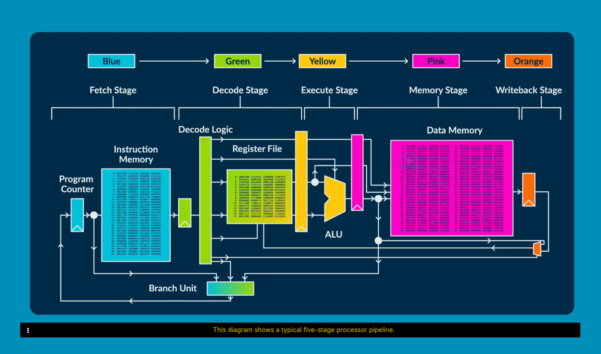

This diagram shows a typical five-stage processor pipeline.
In the next video, we'll look at how we can manage or prevent some of the stalls in a design like this.

### The limits of Instruction level Parallelism
We've seen that instruction-level parallelism can be used on superscalar processors,
to run them faster than would be possible on a scalar processor.
But how much of a speedup is this in practice?
Ultimately, this depends on how much instruction-level parallelism is possible in a typical program.
How might we measure this?
We can do this initially without considering any constraints
that will be imposed by the processor it will run on.
Let's consider the instructions executed by the program.
Let's assume that we can predict all the branches in the program perfectly.
Then we can ignore branch instructions,
as they don't need to flow down our pipeline.
Now let's imagine we can execute any instruction as soon as the data it needs is ready.
That is, we are only restricted by the presence of true data dependencies.
Note that some dependencies are carried through writes and reads to memory.
Rather than considering program order,
we can now just look at the order the dependencies impose on instructions.
This is referred to as "data-flow analysis."
Assuming each instruction takes exactly one cycle to execute,
the fastest possible execution time of the whole program in cycles is given by the longest path in the data-flow graph.
The instruction-level parallelism of this program is the number of instructions divided by this duration,
as this gives the average number of instructions we would need
to be able to execute each cycle to achieve this duration.
In real programs, this can be anywhere from around five, to hundreds or even thousands.
An active area of research and innovation for computer architects
is to imagine processor designs that can expose and exploit as much of this parallelism as possible.
One insight architects have had is that superscaler processors need to have a fast supply of instructions
to be able to analyze dependencies effectively.
This often means that the front end of our processor pipeline is much wider than the rest of the pipeline,
so that it can "run ahead" and see what behavior the program will have next.
Fast and accurate branch prediction is vital,
as we often have to predict multiple branches ahead accurately, to achieve good performance.
Another key insight is that we don't have to wait to execute the instructions in program order.
If all the dependencies of an instruction are satisfied,
the instruction can proceed down the pipeline even if previous instructions are yet to execute.
This can reduce program execution time by taking advantage of more instruction-level parallelism.
In practice though, this creates extra complications,
as we will see in the next module.

## Out of Order Execution
### Register Renaming
As we saw in the last module, instruction level parallelism can be used to improve program execution time
in our microprocessor designs.
To enable this, the compiler creates an optimized instruction schedule
when the program is converted into machine code.
Unfortunately, the compiler cannot know precisely what will happen at run-time,
so this design is constrained by the order of instructions in the program.
The compiler won't know what the program's input data will be,
whether branches will be mispredicted, or whether memory accesses hit or miss in our data cache.
In contrast, a superscalar processor with "out-of-order" execution can produce an instruction schedule at run-time,
only constrained by true data dependencies and its hardware limits.
This schedule is produced on demand and so can even change each time the code runs.
To do this, we introduce an "issue window" or "issue queue" after the Decode stage.
This holds instructions until they can be executed,
not necessarily in the order they arrived in.
Within this window, instructions can be issued whenever their dependencies are available,
and when a functional unit is available to process it.
To be able to detect when an instruction is ready to be issued,
we must know whether the instruction's dependencies are ready when it enters the issue window.
We must then update this status as new results are produced.
To implement this, the names of result registers of executed instructions are broadcast to the issue window.
The instructions waiting there compare the register names to the registers they require.
However, this scheme has a problem:
A register will be written multiple times in the program,
and since the instructions are executed out-of-order,
the register name alone is not sufficient to record dependencies.
It also means that instructions would have to wait
until all previous reads of a register had finished before executing.
These are called "false dependencies."
These problems can be resolved by "renaming" register names at run-time
so that each "in-flight" instruction writes to a unique destination register.
We use a "physical register file" that is large enough to ensure we don't run out.
We keep a "register mapping table" to store the mapping
between architectural, compiler-assigned registers, and physical registers.
Register reads to the same architectural register are renamed consistently,
so that dependencies can be tracked correctly with physical register names.
Physical registers are reused only when they are no longer used
by any instruction currently in-flight
or any entry in the register mapping table.
The other big issue with out-of-order execution is memory dependencies.
Load and store instructions can have memory dependencies
because they access the same memory location.
To detect this, we need to compare the computed memory addresses
that the instructions access.
We thus split memory operations into two steps: address calculator and memory access.
We issue their address calculation step as soon as the dependencies are available.
Then, the memory access step is placed in a special load-store queue
to be sent to our data cache as soon as possible.
We carefully ensure that operations that access the same address are kept properly ordered,
but independent accesses can be reordered if beneficial.
No access can occur until the addresses of all previous accesses are known.
Since memory writes are irreversible,
store instructions must also wait until we are certain that they will execute.

### Speculative Execution
In the previous video, we outlined the concepts of out-of-order execution, and register renaming.
The issue window will be filled with instructions fetched along the path
that our branch predictor believes the program will take.
While we hope our branch predictor will be correct in most cases,
it will sometimes be wrong.
How do we handle such cases?
A simple approach is to start by recording the original program order of the instructions,
and then to monitor their progress.
We call the structure that stores the instructions the "reorder buffer."
As each instruction executes and produces a result,
we can mark it as done.
When the oldest instruction has completed,
we can remove it from the end of the reorder buffer,
and the instruction is said to have "committed."
This stream of committed instructions represents how our program would be executed
on a simple in-order pipeline or by an unpipelined processor.
It usefully also provides a point at which we can process exceptions.
For example, if the program divides by zero or attempts to access memory that does not exist.
We also check branch instructions as they complete in order.
If they have been mispredicted, we flush the reorder buffer, our instruction window
and any currently executing instructions and start fetching down the correct path.
To preserve correctness, we must also restore our registers
and the register map table to the values they had when we mispredicted the branch.
This can be done with the aid of a second register map table,
updated only when instructions commit in program order.
This can simply be copied to the map table used by our renaming hardware to "rewind time" for the processor.
All the register values we need will be present,
as we don't recycle registers before we know they will not be needed again.
In reality, handling branches in this way is too slow.
Processors instead take many copies of the register map tables
and can handle branches as soon as they are resolved,
and we discover they have been mispredicted.
They can also selectively neutralize the in-flight instructions in the datapath
that are on the wrong path,
rather than flushing all of these instructions away.

### An out of order superscaler pipeline
We can now bring everything together
and look at what a typical pipeline for an out-of-order superscalar processor might look like.
The Fetch stage is aided by an accurate branch predictor as we met in Module 3.
It will fetch a group of instructions on every clock cycle.
This group of instructions will be requested from the instruction cache,
and will be from consecutive memory locations.
Branches may reduce the number of useful instructions that can, in practice, be fetched in on each cycle.
The Decode stage decodes multiple instructions in parallel.
At this point,
modern high-performance processors may also split complex instructions into simpler operations or "macro-ops."
In some cases, there may also be opportunities to combine simple instructions into a single operation.
The next step on an instruction's journey is renaming to receive a unique destination register.
As we saw in the last video, this increases opportunities for out-of-order execution.
Remember, there are several times more physical registers in our processor
than those available to the compiler.
Instructions are placed in the reorder buffer,
and are also "dispatched" to the Issue stage.
They will wait in the window as necessary,
and are ready to be issued once all their operands are available.
In the most complex of today's superscalar processors,
there may be hundreds of instructions buffered in the issue window at the same time.
Instructions finally commit in program order.
At this point, any physical registers that are no longer needed can be added back to the pool of free registers.
These are then assigned during the register renaming step.
Once an instruction is issued,
it reads its operands from the physical register file.
The Execute stage consists of many functional units operating in parallel.
These may each support different operations and take different numbers of cycles to execute.
A network of forwarding paths is also provided
to ensure we can execute any dependent instruction on the next clock cycle after the generation of the result.
This requires being able to quickly communicate—or "forward"—
a result from the output of any functional unit, to the input of any other.
Some instructions will need access to memory.
After computing their addresses,
they are placed in the processor's load-store queues.
"Stores" are sent to memory in program order,
but "loads" can often be sent out of order,
and ahead of other older stores or loads that are not yet ready to be issued to memory.
The memory system reduces the average memory access time
by providing numerous levels of cache memory.
After generating results, we write them back to the register file.
This overview is representative of the fastest modern microprocessors found today
in laptops, smartphones and servers.
Whilst much extra innovation goes into real designs,
they generally follow the ideas discussed in the course.

## The Limits of Superscaler Processors
One question computer architects always ask themselves is:
"how much can we scale up our design?"
Let's take a look at some further potential optimizations to our out-of-order superscalar processor.
We could try to make it wider.
For example, by doubling the number of parallel instructions,
we can fetch, decode and execute more instructions per cycle.
Would this double our performance?
Sadly, no, things are not that simple!
In practice, some components quickly become very complex,
and performance gains may be hard to extract.
For example, today's largest machines fetch at most ten instructions per cycle from their instruction caches.
Fetching more instructions than this offers minimal performance gain,
despite a large hardware cost.
If we increase the number of registers, the size of our issue window,
the size of our load-store queues, or perhaps use a larger and more accurate branch predictor,
our processor's performance will only improve slightly
despite a significant increase in the size of these structures.
After a point, the increase in performance is no longer worth the cost of the extra transistors.
It's also possible that performance might reduce overall
as we may need to lower our clock frequency as the structures get larger.
Finally, we could introduce more pipeline stages,
but we know this doesn't necessarily lead to higher performance,
as mispredictions may become more costly.
The combination of these issues means that extracting performance using instruction-level parallelism alone
becomes more expensive as more performance is sought.
This graph shows how the energy cost of executing an instruction grows quickly as we try to build higher performance processors.
Let's look at some example designs.
Suppose we have a core, which requires a certain area.
If we double its area, its performance improves,
although there is a small rise in energy per instruction.
If we quadruple its area instead, its performance has now doubled compared to our original core,
while energy has increased by 50 percent.
Going further, if we increase our processor's area by a factor of 10,
performance is only 2 point 5 times our original core,
but energy per instruction is now 3 times higher.
Its performance does not improve as fast as the cost of running it!
Of course, engineers are clever and determined,
and are constantly developing new techniques to bypass many of these issues.
This means the performance of processors—even ones running a single thread or program—
still improves by around 10 to 25 percent each year.
Nevertheless, ultimately we often need more performance than can be provided by instruction-level parallelism alone.
A modern solution is to employ multiple processor cores on the same chip—called a "multicore" processor.
This changes the task for programmers;
they may need to redesign their programs to take advantage of such parallelism,
but if they can, it can give vast performance benefits.
As we've learned throughout the course, every decision involves trade-offs and compromise.
We are faced with a fascinating but often highly-constrained design problem.
We've seen how performance bottlenecks, that at first seem impassable, can be overcome with innovative designs.
What might the future hold for microprocessors?
Can you think of ideas?
What would you design?
=======

### Pipeline Hazards
<sub>basic only explained here, for more detail.
<a herf="https://www.geeksforgeeks.org/computer-organization-architecture/computer-organization-and-architecture-pipelining-set-2-dependencies-and-data-hazard/">GeeksforGeeks page</a>,
<a herf="https://github.com/arm-university/Introduction-to-Computer-Architecture-Education-Kit/tree/main/Computer-Architecture-Lectures-Armv8-A/contents/Module03_Pipelining">ARM Detailed PPT</a>
</sub>

- Pipelining allows new instructions to start while others are still in the pipeline, i.e., the execution of instructions is overlapped.
- There may be cases where an instruction must wait and not move forward in the pipeline to ensure correctness. These cases are known as pipeline hazards:
  - Structural hazard – arise from resource conflicts
  - Data hazard – arise from the need to ensure we always respect inter-instruction data dependencies 
  - Control hazard – are caused by instructions that change the PC, i.e., branches and jumps (details in next module)

#### Structural Hazards
- Instructions may need to stall in order to wait for access to a shared resource, e.g.:
  - A functional unit that is not pipelined
  - A register file read port or register file write port
  - A memory 
- Why permit any structural hazards?
  - Designing for the worst-case may reduce the average (common) case performance, i.e., the added complexity may reduce our CPI but increase our clock period. 
  - Adding support for the worst-case may be too costly (e.g., in terms of power and area). We may have strict budgets or may want to use these limited resources elsewhere.

#### Data Hazards
- A data hazard is created whenever the parallel execution of instructions makes it possible for a dependency to be violated.

  - Read After Write (RAW) hazards – produced by true data dependencies, i.e., j attempts to read a source register before i writes to it.
  - Write After Write (WAW) hazards – produced by output dependencies, i.e., j tries to write to a destination register before it is written by i.
  - Write After Read (WAR) hazards – produced by anti-dependencies, i.e., j tries to write to a destination before it is read by i.

#### Control Hazard
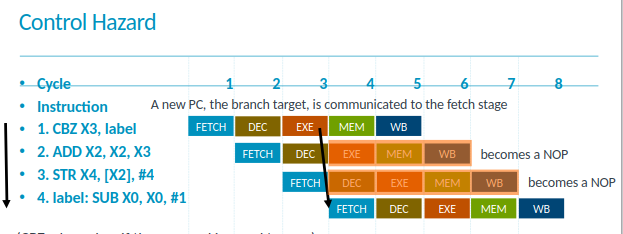

(CBZ – branches if the operand is equal to zero)  
If the branch is evaluated in the execute stage, and it is taken, we must convert the two instructions that follow it into NOPs (we waste two cycles).


### The Limits of Pipelining
In the previous videos, we explored how pipelining
could improve performance by reducing our clock period
and by overlapping the execution of different instructions.
We also saw that it was sometimes necessary to stall our pipeline
to ensure that instructions were executed correctly.
- Ideally, our average cycles per instruction, or CPI, will remain at 1.0.
If we must stall, however, this will increase.
- For example, if 20 percent of our instructions were loads
and each of these caused one stall cycle, our CPI would be 1.2.
- If a further 20 percent of instructions were branches,
and each of these caused two stall cycles, our CPI would be 1.6.
- The longer we make our pipeline, the more stall cycles there will be,
and eventually the cost of stalls may outweigh the benefit of the faster clock period.
- For example, let's imagine we added a stage to our five-stage pipeline from the previous video.
Now the number of stalls after a branch instruction increases to three, hurting our CPI.
On the other hand, our clock period would improve.
So whether or not this helps speed program execution
would depend on the exact details.
It may eventually become more difficult to reduce our clock period
by adding further pipelining stages.
This is because it becomes harder to perfectly balance the logic between stages
and because of the constant delays associated with clocking and our pipeline registers.
To mitigate these issues, we will need to invest in more transistors
and our design will require more area and power.
The deeper our pipeline gets, the greater the investment
we need to make in terms of area and power for the same incremental improvement.
Commercial processes today have anywhere from `two to twenty pipeline stages`.
The faster, more expensive and power-hungry processors
tend to have longer pipelines than the smaller, cheaper processes in embedded devices.
As with many techniques in computer architecture,
eventually it becomes more profitable to invest our time and resources
in an alternative way of improving performance.
In later modules, we'll explore how we can reduce the CPI, even in heavily pipelined processes.


## Handling Branches

In a simple pipeline, it will be necessary to stall the pipeline
whenever we encounter a branch instruction.
This is because we must wait until our branch is executed
before we can be sure which instruction to fetch next.
As a recap, branches are instructions that change which instruction in the program will be executed next.
There are two types of branches: `conditional branches` and `unconditional branches`.
Unconditional branches always change which instruction executes next,
whereas conditional ones may or may not,
depending on the computations in the program.
In real programs, between approximately one fifth and one quarter of all instructions are branches,
and the majority of these are conditional.
Executing a branch involves calculating the new address to load into our program counter.
This is the branch's "target address."
However, conditional branches have an extra task:
we must first determine whether the branch is taken.
If the branch is not taken, we can effectively ignore the branch
and fetch the next instruction as normal.
Recall the processor performance equation from an earlier video.
Since we have to wait for branches to complete before fetching the next instruction, we generate stall cycles.
These increase the average number of "cycles per instruction,"
which reduces our microprocessor's performance.
The longer our pipeline gets, the longer it is
before each branch is resolved, and the more costly branches become.
Can you think of a way to avoid some of this stalling?

- One idea is to evaluate branches earlier in the pipeline,
for example in the Decode stage instead of in the Execute stage.
This can indeed help to reduce the number of stalls,
but we may still need to stall if the branch depends on other instructions that haven't been executed yet.
- Another idea is to continue fetching instructions in program order,
effectively assuming that each branch is not taken.
The number of stalls in the pipeline for a not-taken branch is zero in this design.
On the other hand, if the branch is in fact taken,
the subsequent instructions that we fetched will be incorrect.
So, we must remove all instructions that have been
fetched on this incorrect path from our pipeline.
This is called "flushing" the pipeline.
Unfortunately, in real programs, branches are taken much more than not taken.
Could we then simply assume instead that all branches will be taken?
Sadly not, no,
because then we would also need to know the specific "target address" immediately,
in order to know which instruction to fetch next.
It may at first seem impossible to know this before the instruction is decoded.
However, computer architects have found a way to do exactly this.

### Dynamic branch prediction
The idea of predicting the behavior of the branch instruction before it has even been fetched.

Reference:  
[1] https://www.cs.umd.edu/~meesh/411/CA-online/chapter/dynamic-branch-prediction/index.html
[2] https://github.com/arm-university/Introduction-to-Computer-Architecture-Education-Kit/tree/main/Computer-Architecture-Lectures-Armv8-A/contents/Module04_BranchesAndLimitsToPipelining

## Exploiting Instruction level parallelism
No tutorial in the Course, But read this ppt from arm
[link](https://github.com/arm-university/Introduction-to-Computer-Architecture-Education-Kit/tree/main/Computer-Architecture-Lectures-Armv8-A/contents/Module05_ExploitingInstructionLevelParallelism)

## Memories
No tutorial in the Course, But read this ppt from arm
[link](https://github.com/arm-university/Introduction-to-Computer-Architecture-Education-Kit/tree/main/Computer-Architecture-Lectures-Armv8-A/contents/Module06_Memory)
## Cache Memories
[ppt from arm](https://github.com/arm-university/Introduction-to-Computer-Architecture-Education-Kit/tree/main/Computer-Architecture-Lectures-Armv8-A/contents/Module07_Caches)
### Purpose of cache memories
So far, we've looked at the microprocessor's "datapath"—
meaning its execution units, registers, and control circuitry.
We have given less attention to its memory.
We usually implement memory using a different type of chip than the microprocessor,
using a technology called DRAM.
It is very dense, allowing us to store lots of data in a small area.
However, one issue with DRAM is its speed.
Since the 1980s, processor performance has increased very rapidly at roughly 55 percent per year,
so CPUs of today are many orders of magnitude faster than those of 40 years ago.
In contrast, memory performance has grown much more modestly.
Whilst memories are also much faster than they were in previous decades,
their performance has not kept pace with processors.
This leads to a processor-memory performance gap,
with it becoming more costly to access memory as time goes on.
One of the issues that makes these memories slow is their size.
We can make a memory as fast as our microprocessor, if it is very small.
However, this is the opposite of what programmers want.
Programmers can use extra memory to solve more complex problems,
or to solve existing problems faster.
This complicates microprocessor design because although we want a large memory to hold all our data,
large memories are slow and this slows down our processor.
How do we overcome this?
What if we could get the speed benefit of a small memory alongside the size benefit of a large memory?
One solution is to have a large, slow memory and a small, fast memory in our system.
For this to be useful, we need the small memory to hold the data that we use most often,
so that we often get the speed benefits of accessing it,
and only rarely have to access the slow memory.
Whilst there are different arrangements of these two memories,
the configuration that is most often used is an "on-chip cache memory."
The small memory sits inside the processor between the pipeline and the large memory.
We keep all data in the large main memory,
and put copies of often-used data in the small memory, which we call a cache.
But we are not limited to only one cache!
Our pipeline reads memory in two places:
when fetching the instructions; and when accessing the data.
It makes sense to have two caches here,
each optimized for different purposes.
The instruction cache is optimized for fast reading of instructions at Fetch.
The data cache is optimized for reading and writing data from the memory stage.
We will often put a larger "level 2" cache between these two caches and the main memory.
The L2 cache is a "medium-sized" memory:
faster and smaller than main memory, but slower and larger than the two L1 caches.
Using a hierarchy of caches reduces the bandwidth requirements to main memory
and the energy cost of moving data around.

### Patterns that caches Exploit
We previously looked at the need for a cache,
which can be used to store often-used data for fast access by the processor.
But which data is used often enough that it is worth including in the cache?
Programs are mostly made of loops.
Here's a simple one that sums values in memory.
It displays the two characteristics that we can exploit to decide what data to put into a cache.
Let's look briefly at how it works.
Each time round the loop, there are two loads and one store.
The first load is to load the data we're summing.
The other load, and the store, are to update the running sum.
Notice two things here.
First, we access the running sum over and over again;
each time round the loop.
Second, when we access part of the data in one loop iteration,
we've already accessed its predecessor in the previous iteration,
and will access its successor in the next.
Caches exploit two types of "locality" in programs in order to be effective.
* The first is `temporal locality`:
if a piece of data is accessed, it is likely that it will be accessed again in the near future.
The running sum has temporal locality.
* The second type of locality is `spatial locality`:
If a piece of data is accessed, then its close neighbors are quite likely to be accessed in the near future. By close neighbors, we mean data whose memory addresses are not far from each other.
The data accesses have spatial locality.

It turns out that most programs exhibit lots of temporal and spatial locality.
We can exploit this to determine what to put in the cache.
Exploiting temporal locality is fairly easy:
we simply see which values have been accessed and place them in the cache.
Exploiting spatial locality is also quite simple:
when a piece of data is accessed, place its neighbors in the cache.
We'll see in the next module how this is actually achieved.
We use locality to guess what values will be accessed next and store them in the cache.
If we are correct, we get the benefit of fast memory,
but if we are wrong, we must perform a slow access to main memory—
just as we would if the cache were not present.
In real programs, we see hit rates of 90 percent or more in microprocessor caches,
resulting in vast performance improvements.
However, it's worth noting that some programs have less locality,
and for those programs, caches offer little performance benefit.
### The construction of a cache
We've looked at the reasons why we build caches, but how do they actually work?
To the outside world, a cache simply takes an address as input,
and either provides the data that is stored at that location at output,
or returns a signal to say that it doesn't have it.
If the data is found, this is called a "cache hit".
If the data is not in the cache, this is called a "cache miss",
and it means we must look for the data in main memory instead.
After each miss, we update the contents of the cache.
The fundamental building block of a cache is called the "cache line".
It's a number of data bytes from consecutive addresses in main memory.
Cache lines are typically 32 or 64 bytes long,
and a cache typically has an array of hundreds to many thousands of lines.
The line captures spatial locality,
because it is larger than the data read by a single load instruction.
When a cache miss occurs,
the whole line containing that data is copied to the cache from main memory,
meaning we have nearby values for future accesses.
When a request comes in, we use some bits from that address to index the line array.
Just like in the last module on branch prediction,
this leads to the problem of aliasing again,
since selecting only some of the bits to index into the array is like a hash.
This means that many addresses map to the same line in the cache,
but we can only store one of their lines of data.
We need to note down which addresses' line is currently stored in the data array,
in what we call the "tag array".
There is one tag for each cache line.
When we access the cache,
we access the tag array with the same index to see if the data we need is present.
This design is called a "direct-mapped cache".
Direct-mapped caches work fairly well, but for some programs,
we can be unlucky with the program accessing to aliasing lines frequently.
We can do something about this by duplicating both the arrays,
so that each line of data can now be stored in one of two places in the cache.
When we access the cache, we look at both arrays
and only get a miss if neither of the tags match.
This is called a "2-way set-associative cache",
because each line has a set of two places or "ways" it could reside.
The "associativity" of this cache is therefore two.
Set-associative caches introduce a further complication:
when we want to add data, where do we put it?
In a 2-way set-associative cache, there are two choices.
How we decide which cache line to evict is called the "replacement policy".
There are many different types of replacement policy.
A simple one is just to make a pseudo-random choice from all the possible cache lines.
Another option is to keep track of when each cache line was last accessed
and to evict the one last used furthest in the past.
This is called a "least recently used policy",
and takes advantage of temporal locality.
It does, however, means storing extra information in the tags to track usage.
Many other ideas are possible too.
Now that we've seen how caches work,
let's see how they affect the performance of a processor.
Recall the processor performance equation,
where the processing time is proportional to the average cycles per instruction.
Without a data cache, if 20 percent of instructions are loads,
and main memory takes 20 cycles to access, our CPI figure must be at least 5.
However, if we provide a cache that holds the required data 80 percent of the time...
...and only takes 2 cycles to access,
our CPI reduces to 2.2, which is a significant improvement!
We can isolate the memory terms in this equation to get the average memory access time
—abbreviated to AMAT—
which allows us to compare different cache configurations more easily.
Changing the cache configuration will impact the AMAT.
There are many different cache parameters we can change,
such as the size, replacement policy, associativity,
whether we put data in the cache for stores or just for loads, and so on.
For example, reducing the size of the cache will improve the access time for a hit,
but will also increase the miss rate.
Let's say that we can halve the access time to 1 with a corresponding halving of the hit rate.
This alters the AMAT to 13, which in this case is worse for performance overall.
It's also useful to look at why an address might miss in the cache.
Broadly speaking, we can divide cache misses into three different categories.
Compulsory misses occur when we attempt to access an address that we have never seen before
and so never had the opportunity to cache it.
Capacity misses occur when there is more data being accessed than the cache could hold,
even if we had complete freedom in where to put each cache block.
Conflict misses occur in caches where there are more addresses hashing to the same index
than arrays to hold the data.
We can alter our cache configurations to lower these misses,
but as always, there are trade-offs involved.
Compulsory misses can be reduced by increasing the cache block size,
to take advantage of spatial locality.
But for a fixed cache size,
this reduces the number of different addresses or cache lines that can be stored.
A technique called "pre-fetching" can also be used to predict the addresses that will soon be accessed,
and bring their data into the cache early.
But this increases energy consumption,
and may make the cache perform worse if the predictions are not highly accurate.
Capacity misses can be reduced through increasing the size of the cache.
Although, as we saw before, this impacts the number of cycles taken to determine a hit.
Conflict misses can be reduced through increasing the number of cache blocks in each set,
with an increase in energy consumption as a side effect of this.
Now that we've seen how caches work,
let's see how they affect the performance of a processor.
Recall the processor performance equation,
where the processing time is proportional to the average cycles per instruction.
Without a data cache, if 20 percent of instructions are loads,
and main memory takes 20 cycles to access, our CPI figure must be at least 5.
However, if we provide a cache that holds the required data 80 percent of the time...
...and only takes 2 cycles to access,
our CPI reduces to 2.2, which is a significant improvement!
We can isolate the memory terms in this equation to get the average memory access time
—abbreviated to AMAT—
which allows us to compare different cache configurations more easily.
Changing the cache configuration will impact the AMAT.
There are many different cache parameters we can change,
such as the size, replacement policy, associativity,
whether we put data in the cache for stores or just for loads, and so on.
For example, reducing the size of the cache will improve the access time for a hit,
but will also increase the miss rate.
Let's say that we can halve the access time to 1 with a corresponding halving of the hit rate.
This alters the AMAT to 13, which in this case is worse for performance overall.
It's also useful to look at why an address might miss in the cache.
Broadly speaking, we can divide cache misses into three different categories.
Compulsory misses occur when we attempt to access an address that we have never seen before
and so never had the opportunity to cache it.
Capacity misses occur when there is more data being accessed than the cache could hold,
even if we had complete freedom in where to put each cache block.
Conflict misses occur in caches where there are more addresses hashing to the same index
than arrays to hold the data.
We can alter our cache configurations to lower these misses,
but as always, there are trade-offs involved.
Compulsory misses can be reduced by increasing the cache block size,
to take advantage of spatial locality.
But for a fixed cache size,
this reduces the number of different addresses or cache lines that can be stored.
A technique called "pre-fetching" can also be used to predict the addresses that will soon be accessed,
and bring their data into the cache early.
But this increases energy consumption,
and may make the cache perform worse if the predictions are not highly accurate.
Capacity misses can be reduced through increasing the size of the cache.
Although, as we saw before, this impacts the number of cycles taken to determine a hit.
Conflict misses can be reduced through increasing the number of cache blocks in each set,
with an increase in energy consumption as a side effect of this.

### Measuring Cache Performance
<sub> Read chapter 7 in the https://github.com/arm-university/Introduction-to-Computer-Architecture-Education-Kit/tree/main/Computer-Architecture-Lectures-Armv8-A/contents/Module07_Caches </sub>
Now that we've seen how caches work,
let's see how they affect the performance of a processor.
Recall the processor performance equation,
where the processing time is proportional to the average cycles per instruction.
Without a data cache, if 20 percent of instructions are loads,
and main memory takes 20 cycles to access, our CPI figure must be at least 5.
However, if we provide a cache that holds the required data 80 percent of the time...
...and only takes 2 cycles to access,
our CPI reduces to 2.2, which is a significant improvement!
We can isolate the memory terms in this equation to get the average memory access time
—abbreviated to AMAT—
which allows us to compare different cache configurations more easily.
Changing the cache configuration will impact the AMAT.
There are many different cache parameters we can change,
such as the size, replacement policy, associativity,
whether we put data in the cache for stores or just for loads, and so on.
For example, reducing the size of the cache will improve the access time for a hit,
but will also increase the miss rate.
Let's say that we can halve the access time to 1 with a corresponding halving of the hit rate.
This alters the AMAT to 13, which in this case is worse for performance overall.
It's also useful to look at why an address might miss in the cache.
Broadly speaking, we can divide cache misses into three different categories.
Compulsory misses occur when we attempt to access an address that we have never seen before
and so never had the opportunity to cache it.
Capacity misses occur when there is more data being accessed than the cache could hold,
even if we had complete freedom in where to put each cache block.
Conflict misses occur in caches where there are more addresses hashing to the same index
than arrays to hold the data.
We can alter our cache configurations to lower these misses,
but as always, there are trade-offs involved.
Compulsory misses can be reduced by increasing the cache block size,
to take advantage of spatial locality.
But for a fixed cache size,
this reduces the number of different addresses or cache lines that can be stored.
A technique called "pre-fetching" can also be used to predict the addresses that will soon be accessed,
and bring their data into the cache early.
But this increases energy consumption,
and may make the cache perform worse if the predictions are not highly accurate.
Capacity misses can be reduced through increasing the size of the cache.
Although, as we saw before, this impacts the number of cycles taken to determine a hit.
Conflict misses can be reduced through increasing the number of cache blocks in each set,
with an increase in energy consumption as a side effect of this.

## Superscalar Processors
### Instruction-Level Parallelism
In this module, we'll look at how to further improve performance
by exploiting "instruction-level parallelism."
In Module 2, we explored how pipelining can improve the performance of our processor.
This reduced our clock period,
and allowed execution of instructions to be overlapped, improving throughput.
One way to boost performance further would be to create a much deeper pipeline.
At some point, this would mean even the ALU in our Execute stage will be pipelined.
Consider the simple program shown in the slide.
Some instructions are dependent on a result from the previous instruction.
Remember in our 5-stage pipeline that these dependent instructions
could be executed in consecutive clock cycles with the aid of data forwarding.
If execution takes place over two pipeline stages within the pipeline,
we need to stall if adjacent instruction share a dependency.
This allows time for the result to be computed.
The programmer may be able to rewrite their program to get the same result with fewer stalls,
by placing an independent instruction between our pair of dependent instructions.
In this case, we can move the third and fifth instructions earlier to optimize performance.
The performance of programs that run on our "super-pipelined" processor would, to some degree,
be determined by the availability of independent instructions
that could be executed in parallel in the pipeline.
This is "instruction-level parallelism"—or ILP.
Very deep pipelines are problematic as they would require:
a very high-frequency clock to be distributed across the chip very precisely;
careful balancing of logic between many, very short, pipeline stages;
the pipelining of logic that is difficult to divide further into stages;
and the division of logic at points requiring many pipelining registers to be inserted.
A different approach to exploit ILP is to make our pipeline wider rather than deeper.
In this design, the processor will fetch, decode, and potentially execute multiple instructions each cycle.
Such a design avoids the problems of a super-pipelined processor,
although as we'll see in the next video, it does introduce some new complications.

### A Simple Super-Scalar Processor
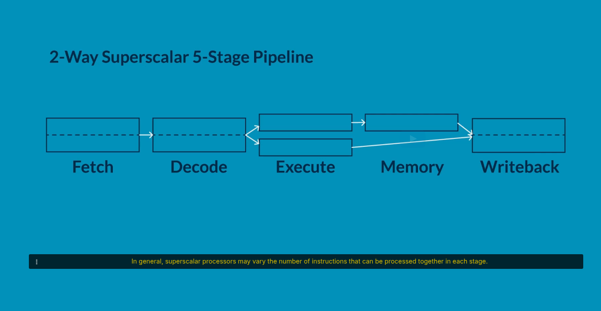
In this video, we are going to explore "superscalar" processors,
which can process multiple instructions in each pipeline stage.
In our simple 5-stage pipeline,
there is at most one instruction per pipeline stage.
At best, we can complete one instruction per cycle.
We call such a design a "scalar" processor.
In a 2-way superscalar version of this processor,
we would extend this design so it is able to fetch, decode, execute and writeback up to two instructions at a time.
In general, superscalar processors may vary the number of instructions that can be processed together in each stage.
Let's step through the design.
Our instruction cache will need to supply two instructions per cycle.
Typical superscalar processors only ever fetch adjacent instructions on a given cycle.
This can lower performance if, for example,
the first instruction fetched is a taken branch,
because then the second would not be required.
Note that now every cycle lost due to control hazards will cost us two instructions rather than one,
so accurate branch prediction matters even more in superscalar designs.
The Decode stage must now decode and read the registers for two instructions simultaneously.
Fortunately, we are able to extend the register file design
to read many register values at the same time.
The Decode stage also needs to check whether the two instructions are independent.
If so, and if the functional units they both need are available,
it can "issue" them for execution in parallel on the next clock cycle.
Otherwise, in this simple design, it will only issue the first, and keep the second back.
A simple design such as this—where two instructions are fetched, decoded and issued—
is called a "2-way" or "dual-issue" processor.
In other designs, the width may vary at different stages of the pipeline.
To support the execution of multiple instructions at the same time,
the Execute stage is expanded and contains two execution pipelines.
It's common for these to have slightly different capabilities to save area.
For example, the top pipeline can execute both ALU and memory instructions,
while the second pipeline only executes ALU instructions.
To ensure that dependent instructions can execute on consecutive clock cycles,
we must add data forwarding paths.
These data forwarding paths must allow results stored in either execution pipeline
to be forwarded to the input of either ALU.
During writeback, we need to store both results to the register file.
This means the register file must be redesigned to allow two writes per clock cycle.
Overall, these changes typically require 25 percent more logic circuitry in our processor,
compared with a scalar processor.
But we'd expect an improvement in execution time of between 25 and 30 percent for real world programs.

