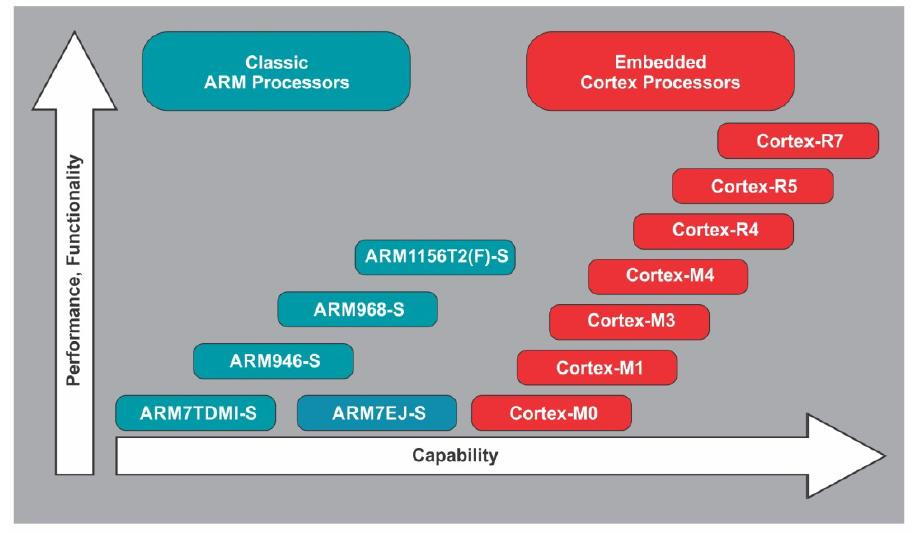
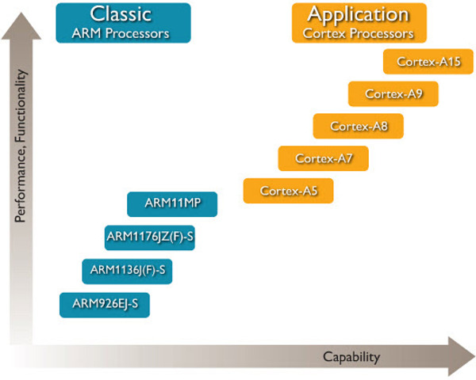
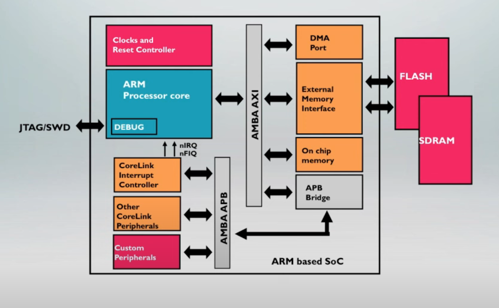
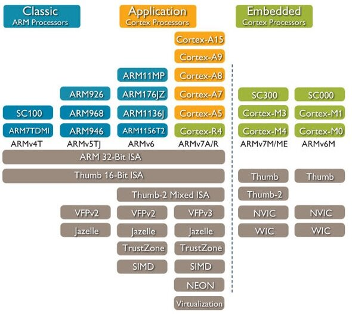

# ARM Architecture Tutorial

ARM Architecture Fundamentals Overview: [link](https://www.youtube.com/watch?v=7LqPJGnBPMM)

The above video is outdate, but really gives a good starting point or idea, Along side refer the [Arm Architecture Reference Manual for Application processor](https://developer.arm.com/documentation/ddi0487/lb/?lang=en)

1st Major Success of ARM is ARM7TDMI-S which is adopted in the mobile phone

Embedded Processor Roadmap  
1. Embedded Corted Processors (Cortex-M0, M0+, M1, M3, M4, R4, R5, R6), where R* is for ver time precise Processors
2. Classic Processors (ARM7TDMI-S ARM7Ej-s ARM946E-S ARM968E-S ARM1156T2(F)-S)

Application processor Roadmap

### ARM architecture Basics
#### Inside ARM SoC

For the detailed explanation of each in this [Reference Link](https://www.embedded.com/designing-with-arm-cortex-m-based-system-on-chips-socs-part-i-the-basics/)  

**Development of the ARM Architecture**  
The below image shows the Architecture supported in the respective processor version.  
Ex.: ARMv4T, ARMv5TJ, ARMv6, ARMv7A/R, ARMv7M/ME, ARMv6M all are the Architecture of the arm  

Note: the above image is in 2013, Now there are 2 new Architecture ARMv8 and ARMv9

#### **ARM Architecture v7 profiles**  
1. Application profile (ARMv7-A)
    1. Memory management support (MMU)
    2. Highest performance at low power
    3. Influenced by multi-tasking OS system requirements
    4. TrustZone for a safe, extensible system
    5. Optional Large Physical Address and Virtualization extensions
2. Real-time profile (ARMv7-R)
    1. Protected memory (MPU)
    2. Low latency and predictability 'real-time' needs
    3. Tightly Coupled Memories for fast, deterministic access
3. Microcontroller profile (ARMv7-M, ARMv6-M)
    1. Lowest gate count entry point
    2. Deterministic and predictable behavior a key priority
    3. Deeply embedded use

#### Basic Info of ARM v7 
1. Word = 32bits
2. Halfword = 16bits
3. doubleword = 64bits
4. Quadword = 128bits
5. byte = 8bits

Most ARM Cores implement two instruction sets (as of 2013 need to confirm, since i know aarch64)
1. 32-bit ARM instruction
2. 16/32-bit Thumb instruction set 

Cortex-M* controller support only Thumb instruction set

#### Arm Processor Modes
Sources Link: [ARM Source](https://developer.arm.com/documentation/ddi0406/b/System-Level-Architecture/The-System-Level-Programmers--Model/ARM-processor-modes-and-core-registers/ARM-processor-modes), [Great Explanation Source](https://roboticelectronics.in/arm-operating-modes/)

| Processor mode [1] |  | Mode encoding [2] | Privilege | Description |
|---|---|---|---|---|
| User | usr | 10000 | Unprivileged | Suitable for most application code. |
| FIQ | fiq | 10001 | Privileged | Entered as a result of a fast interrupt. [3] |
| IRQ | irq | 10010 | Privileged | Entered as a result of a normal interrupt. |
| Supervisor | svc | 10011 | Privileged | Suitable for running most kernel code. Entered on Reset, and on execution of a Supervisor Call (SVC) instruction. |
| Monitor [4] | mon | 10110 | Privileged | A Secure mode that enables change between Secure and Non-secure states, and can also be used to handle any of FIQs, IRQs and external aborts. [3] Entered on execution of a Secure Monitor Call (SMC) instruction. |
| Abort | abt | 10111 | Privileged | Entered as a result of a Data Abort exception or Prefetch Abort exception. [3] |
| Undefined | und | 11011 | Privileged | Entered as a result of an instruction-related error. |
| System | sys | 11111 | Privileged | Suitable for application code that requires privileged access. |

$^{[1]}$ Processor mode names and abbreviations.  
$^{[2]}$ CPSR.M. All other values are reserved. When the Security Extensions are not implemented the Monitor mode encoding, 0b10110, is reserved.  
$^{[3]}$ Bits in the Secure Configuration Register can be set so that one or more of FIQs, IRQs and external aborts are handled in Monitor mode, see c1, Secure Configuration Register (SCR).  
$^{[4]}$ Only supported when the Security Extensions are implemented.

For some modes register changes, refer [this](https://roboticelectronics.in/arm-operating-modes/)
Note: The above mode is only for the ARM-A and ARM-R series processors. ARM-M series processor has only two modes, Thread mode and Handler mode.

#### Instruction set supported in ARM
1. ARM Instruction set 
2. Thumb Instruction set  (Most compiler produce the Thumb instruction) 
// Other 
3. Vector Floating Point (VFP) Instruction 
4. NEON Instruction (for SIMD data processing)

