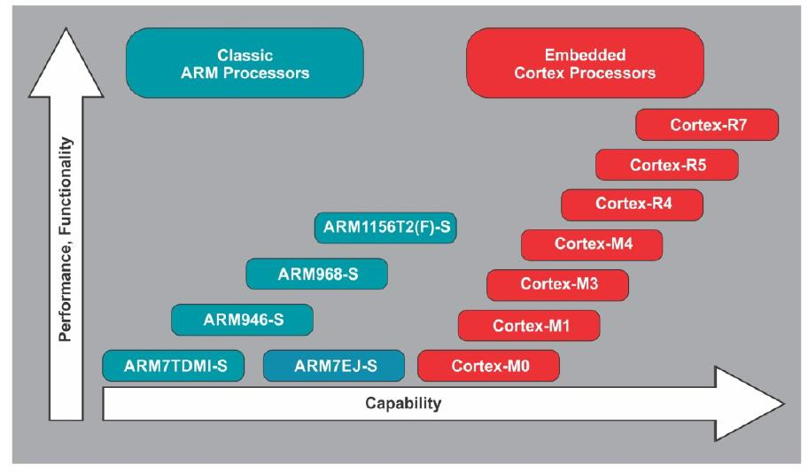
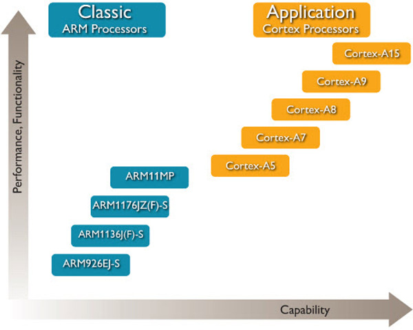
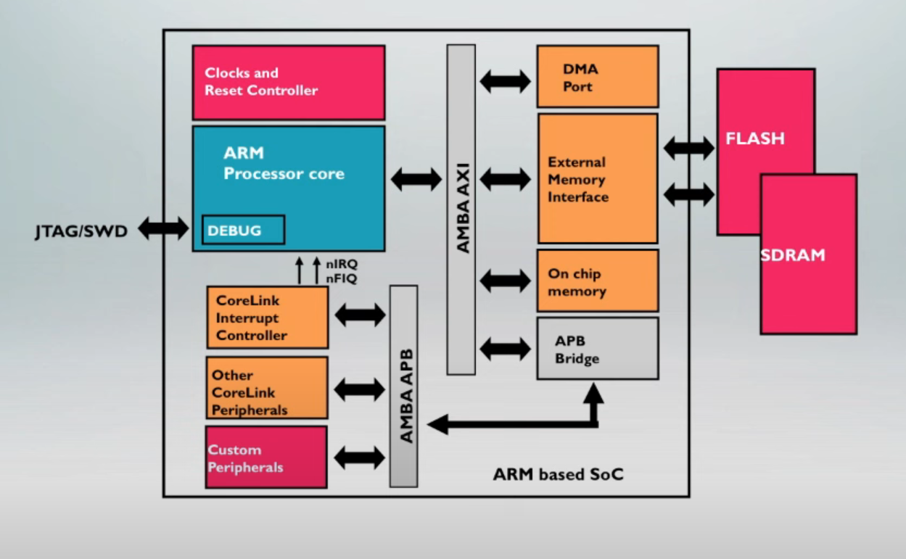

# ARM Architecture Tutorial

ARM Architecture Fundamentals Overview: [link](https://www.youtube.com/watch?v=7LqPJGnBPMM)

1st Major Success of ARM is ARM7TDMI-S which is adopted in the mobile phone

Embedded Processor Roadmap  
1. Embedded Corted Processors (Cortex-M0, M0+, M1, M3, M4, R4, R5, R6), where R* is for ver time precise Processors
2. Classic Processors (ARM7TDMI-S ARM7Ej-s ARM946E-S ARM968E-S ARM1156T2(F)-S)

Application processor Roadmap

### Inside ARM SoC

[Reference Link](https://www.embedded.com/designing-with-arm-cortex-m-based-system-on-chips-socs-part-i-the-basics/)

