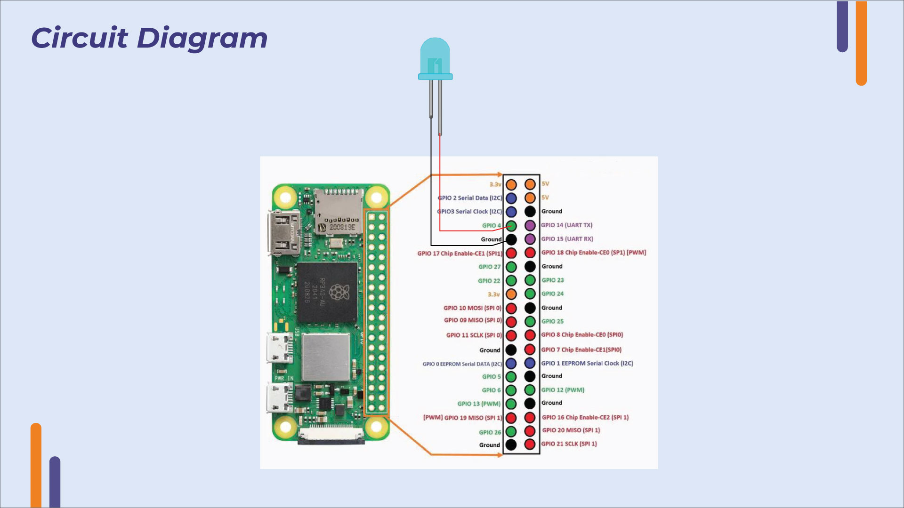

# Embedded linux in Raspberrypi
https://github.com/arm-university/Operating-Systems-Foundations-with-Linux-on-the-Raspberry-Pi (Seems to be a greate resource)

[Kit Link](https://github.com/arm-university/Embedded-Linux-Education-Kit/tree/main/Raspberry_Pi/contents)

# TRM for the Raspberrypi zero 2w

https://forums.raspberrypi.com/viewtopic.php?f=72&t=72260
https://www.raspberrypi.org/app/uploads/2012/02/BCM2835-ARM-Peripherals.pdf




# building
kernel building for raspberrypi doc [link](https://www.raspberrypi.com/documentation/computers/linux_kernel.html)

``` bash
cd linux
KERNEL=kernel8
arch=arm64
make ARCH=arm64 CROSS_COMPILE=aarch64-linux-gnu- bcm2711_defconfig
CONFIG_LOCALVERSION="-v7l-MY_CUSTOM_KERNEL"
make -j6 Image.gz modules dtbs
make ARCH=arm64 CROSS_COMPILE=aarch64-linux-gnu- Image modules dtbs
```

## Tools And command
**Connecting to wifi**  
```bash
sudo wpa_supplicant -c /etc/wpa_supplicant.conf -i wlan0 &
```

**Command to create device file from the userspace**
```~~
sudo mknod testdev b 179 
```

[more details](https://hopeness.medium.com/master-the-linux-mknod-command-a-comprehensive-guide-1c150a546aa8)

**ttyprintk**

using the `/dev/ttyprintk` we can send the message to the dmesg as driver

you can test it like this:
echo "test message" | sudo tee /dev/ttyprintk

Then check the logs:  
```sh 
sudo dmesg | tail -n 10
```

You should find an entry called test message
