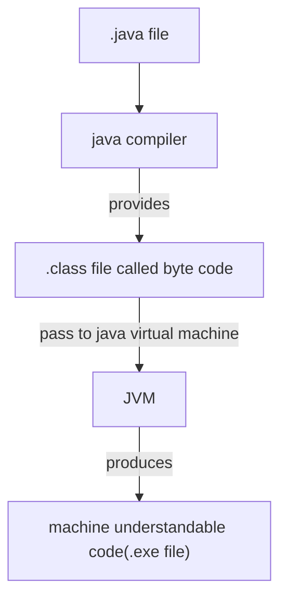

# **Java**

## **Basics of JAVA**
Extension: .java (ex: helloWorld.java)



- Java support cross platform operating system.


### **Difference Between JDK, JRE & JVM**
 Java Development kit (JDK) | Java Runtime Environment (JRE) | Java Virtual Machine (JVM)
 -|-|-
 A group of softwares, which is required to compile and develop as well as executes java program and application | It used for user's to run application, means it used for the execution only | It is a virtual machine to run java program, JRE consist of Library files, Byte Code verifier and Class Loaders
---
```mermaid
---
title: JRE Diagram
---
flowchart TD
id[JVM]---|+|id1[Library files]
id---|+|id3[ByteCode Verifier]---|+|id4[Class Loaders]
 ```
---
```mermaid
---
title: JDK Diagram
---
flowchart TD
id[JRE]---|+|id1[Development tools]
id---|+|id3[java Compiler]
 ```

### **Installation of Java**
- [System Requirements](https://www.java.com/en/download/help/sysreq.html)
- [Installating java on Windows](https://www.java.com/en/download/help/windows_manual_download.html)

### **Running Program in JDK**
NOTE: Naviate to the parent folder of your program in the CMD.
```java
> javac helloworld.java
```
It produces the classname.class file, you can see the output from .class file using the below command
```java
> java classname
```
- When you run the program program execution will start from main method
- It will execute code one by one
### Simple Programs
#### **Print the string**
```java
class greet
{
    public static void main(String args[])
    {
        System.out.println("Hello World");
    }
}
```
#### **Scan the element in Java and add two numbers**
```java
import java.util.Scanner;

public class demo
{
    public static void main(String[] args){
        Scanner scan=new Scanner(System.in);
        System.out.println("Enter 2 numbers");
        int a=scan.nextInt();
        int b=scan.nextInt();
        int c=a+b;
        System.out.println("Addition of the number is "+c);
    }
}
```
#### **Java Prgram to perform arithmetic operation on two numbers**

```java
import java.util.Scanner;

class Arithmatic
{
    public static void main(String[] args){
        Scanner scan=new Scanner(System.in);
        System.out.println("Enter 2 numbers");
        int a=scan.nextInt();
        int b=scan.nextInt();
        System.out.println("Addition of the number is "+(a+b));
        System.out.println("subration of the number is "+(a-b));
        System.out.println("multiplication of the number is "+(a*b));
        System.out.println("Division of the number is "+(a/b));
    }
}
```
output:
```output
Enter 2 numbers
6 6
Addition of the number is 12    
subration of the number is 0    
multiplication of the number is 36
Division of the number is 1     
```

### **Control Structure**
#### **If-Else**
```java
import java.util.Scanner;

class demo{
    public static void main(String[] args){
        Scanner scan=new Scanner(System.in);
        System.out.println("Enter 1:");
        int a=scan.nextInt();
        if(a==1)
        {
            System.out.println("You Pressed 1");
        }
        else
        {
            System.out.println("You are not pressed 1");
        }
    }
}
```
Output:

case 1:
```output
Enter 1:
1
You Pressed 1
```
case 2:
```output
Enter 1:
2
You are not pressed 1
```

#### **if-else if-else**
```java
//Here in the below if not use angular backet for if, because if there there is one statement in if condition, it is not compulsory to put angular bracket, if there is two statement then angular backet is compulsory.
if(num==1)
    System.out.println("1 pressed ");
else if(num==2)
{
    System.out.println("2 pressed ");
    System.out.println("try to press 1");
}
else if(num>=3 && num<10)
    System.out.println("you pressed the number between 3 and 10");
else
    System.out.println("you should press number less than 10")

### **Primitive Data Types in Java**
1. Integer Data type
     Data Type | Size | Range | Emample
     -|-|-|-
     byte| 1byte | $\frac{2^8}{2}$ to $\frac{2^8}{2}-1$ | byte age=35;
     short | 2bytes | $\frac{2^{2*8}}{2}$ to $\frac{2^{2*8}}{2}-1 $ | short year=2023;
     int | 4bytes |  $\frac{2^{4*8}}{2}$ to $\frac{2^{4*8}}{2}-1 $ | int sal=365000;
     long | 8 bytes |$\frac{2^{8*8}}{2}$ to $\frac{2^{8*8}}{2}-1 $ | long pop=99999999999999l; //note `small L` in last.
2. Decimal Data type
    Data Type | Size |Example
     -|-|-
    float | 4 bytes | float g=9.8f;
    double |8 bytes | double pi=3.14159265359;
3. character
    Data Type | Size | Example
     -|-|-
     char | 2bytes | char gen = 'M';
4. Boolean
    Data Type | Size | Example
     -|-|-
     Boolean | 1bit | boolean isMarried=false;
<br />

#### **Typecasting**
implicit typecasting
```java
int salary=365000;
double dupSalary=salary; //this is known as type casting
```
explicit typecasting
```java
double pi=3.14;
int dupPi = (int)pi;
 //if not put (int), it shows error because size of double is more than int
