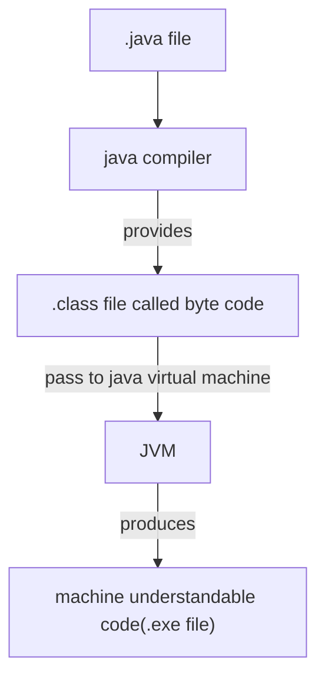
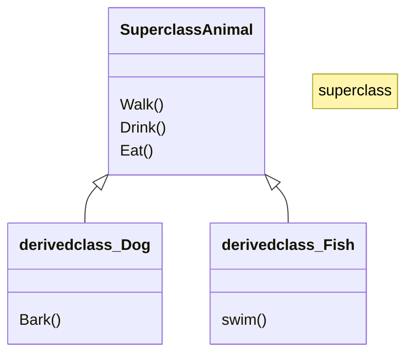
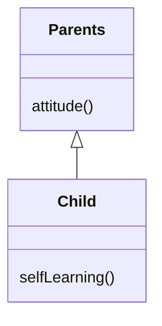
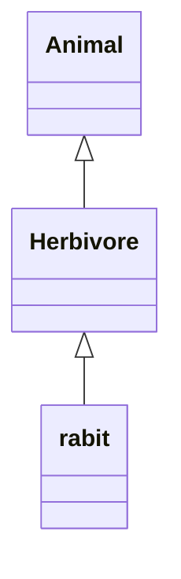
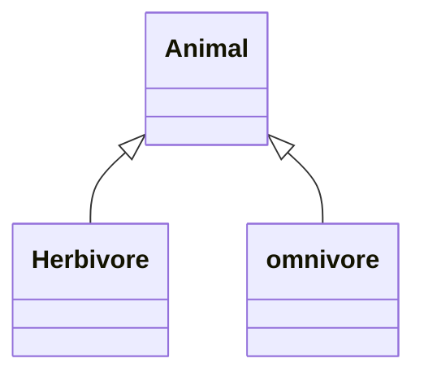
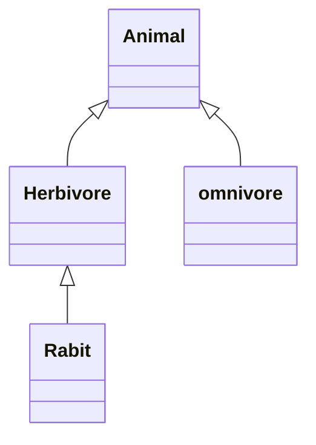
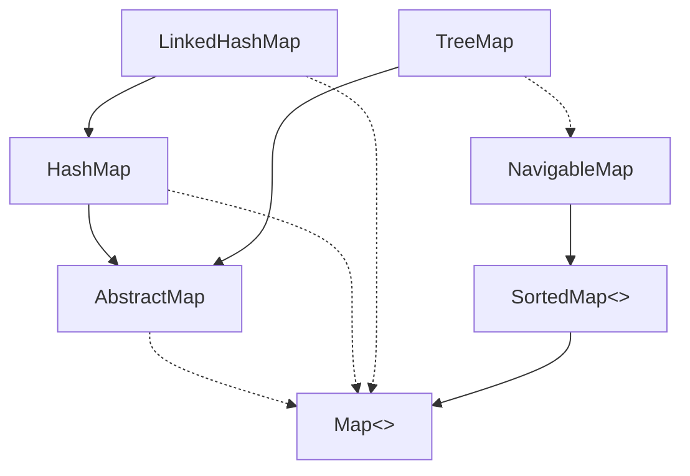

# **Java**

## **Basics of JAVA**
Extension: .java (ex: helloWorld.java)



- Java support cross platform operating system.


### **Difference Between JDK, JRE & JVM**
 Java Development kit (JDK) | Java Runtime Environment (JRE) | Java Virtual Machine (JVM)
 -|-|-
 A group of softwares, which is required to compile and develop as well as executes java program and application | It used for user's to run application, means it used for the execution only | It is a virtual machine to run java program, JRE consist of Library files, Byte Code verifier and Class Loaders
---
```mermaid
---
title: JRE Diagram
---
flowchart TD
id[JVM]---|+|id1[Library files]
id---|+|id3[ByteCode Verifier]---|+|id4[Class Loaders]
 ```
---
```mermaid
---
title: JDK Diagram
---
flowchart TD
id[JRE]---|+|id1[Development tools]
id---|+|id3[java Compiler]
 ```

### **Installation of Java**
- [System Requirements](https://www.java.com/en/download/help/sysreq.html)
- [Installating java on Windows](https://www.java.com/en/download/help/windows_manual_download.html)

### **Running Program in JDK**
NOTE: Naviate to the parent folder of your program in the CMD.
```java
> javac helloworld.java
```
It produces the classname.class file, you can see the output from .class file using the below command
```java
> java classname
```
- When you run the program program execution will start from main method
- It will execute code one by one
### Simple Programs
#### **Print the string**
```java
class greet
{
    public static void main(String args[])
    {
        System.out.println("Hello World");
    }
}
```
#### **Scan the element in Java and add two numbers**
```java
import java.util.Scanner;

public class demo
{
    public static void main(String[] args){
        Scanner scan=new Scanner(System.in);
        System.out. println("Enter 2 numbers");
        int a=scan.nextInt();
        int b=scan.nextInt();
        int c=a+b;
        System.out.println("Addition of the number is "+c);
    }
}
```
#### **Java Prgram to perform arithmetic operation on two numbers**

```java
import java.util.Scanner;

class Arithmatic
{
    public static void main(String[] args){
        Scanner scan=new Scanner(System.in);
        System.out.println("Enter 2 numbers");
        int a=scan.nextInt();
        int b=scan.nextInt();
        System.out.println("Addition of the number is "+(a+b));
        System.out.println("subration of the number is "+(a-b));
        System.out.println("multiplication of the number is "+(a*b));
        System.out.println("Division of the number is "+(a/b));
    }
}
```
output:
```output
Enter 2 numbers
6 6
Addition of the number is 12    
subration of the number is 0    
multiplication of the number is 36
Division of the number is 1     
```

### **Control Structure**
#### **If-Else**
```java
import java.util.Scanner;

class demo{
    public static void main(String[] args){
        Scanner scan=new Scanner(System.in);
        System.out.println("Enter 1:");
        int a=scan.nextInt();
        if(a==1)
        {
            System.out.println("You Pressed 1");
        }
        else
        {
            System.out.println("You are not pressed 1");
        }
    }
}
```
Output:

case 1:
```output
Enter 1:
1
You Pressed 1
```
case 2:
```output
Enter 1:
2
You are not pressed 1
```

#### **if-else if-else**
```java
//Here in the below if not use angular backet for if, because if there there is one statement in if condition, it is not compulsory to put angular bracket, if there is two statement then angular backet is compulsory.
if(num==1)
    System.out.println("1 pressed ");
else if(num==2)
{
    System.out.println("2 pressed ");
    System.out.println("try to press 1");
}
else if(num>=3 && num<10)
    System.out.println("you pressed the number between 3 and 10");
else
    System.out.println("you should press number less than 10");
```

#### **Switch - Case**
It works same as the if-else if-else  
ex:
```java
import java.util.Scanner;
class Main
{
public static void main(String args[])
    {
        Scanner sc=new Scanner(System.in);
        int a=sc.nextInt();
        switch(a)
        {
            case 1:
                System.out.println("pressed 1");
                break; //if break is not suppose a=1, then it print all the cases from, to avoid this we use break.
            case 2:
                System.out.println("pressed 2");
                break;
            case 3:
                System.out.println("pressed 3");
                
                System.out.println("hello1");
                break;
            default:
                System.out.println(" press 1 or 2 or 3");
        }
    }
}
```

### **Primitive Data Types in Java**
1. Integer Data type
     Data Type | Size | Range | Example
     -|-|-|-
     byte| 1byte | $\frac{2^8}{2}$ to $\frac{2^8}{2}-1$ | byte age=35;
     short | 2bytes | $\frac{2^{2*8}}{2}$ to $\frac{2^{2*8}}{2}-1 $ | short year=2023;
     int | 4bytes |  $\frac{2^{4*8}}{2}$ to $\frac{2^{4*8}}{2}-1 $ | int sal=365000;
     long | 8 bytes |$\frac{2^{8*8}}{2}$ to $\frac{2^{8*8}}{2}-1 $ | long pop=99999999999999l; //note `small L` in last.

2. Decimal Data type
    Data Type | Size |Example
     -|-|-
    float | 4 bytes | float g=9.8f;
    double |8 bytes | double pi=3.14159265359;

3. character
    Data Type | Size | Example
     -|-|-
     char | 2bytes | char gen = 'M';

4. Boolean
    Data Type | Size | Example
     -|-|-
     Boolean | 1bit | boolean isMarried=false;


#### **Typecasting**
implicit typecasting
```java
int salary=365000;
double dupSalary=salary; //this is known as type casting
```
explicit typecasting
```java
double pi=3.14;
int dupPi = (int)pi;
 //if not put (int), it shows error because size of double is more than int
```
#### **dividing 2 integer**
Suppose you want to divide two number and try to store it in double, you write code as below
```java
int a=16;
double b=a/3; //b=5.0
```
The above code is wrong it store 5.0 in b. if we need to get a accurate decimal value, the numerator or denominator must be an float number
```java
int a=16;
double b=a/3.0; //b=5.3333333333
```
#### **Scanner in Java**
```java
import java.util.Scanner;
class scan_java
{
    public static void main(String args[])
    {
        Scanner scan=new Scanner(System.in);
        int a=scan.nextInt(); //get integer
        byte b= scan.nextByte(); //get byte
        float c=scan.nextFloat(); //get float number
        String d=scan.nextLine(); //get the string
        char e=scan.next().charAt(0); //get the character
        long f=scan.nextLong(); //get the long value
        double g=scan.nextDouble(); //get the double value
    }
}
```

<div style="background-color:#AB7B7B; color:white; padding: 20px;">
<b>Note:</b> If you scan string, after the scan of integer, you need to use Scan.nextLine(); function before using String name=Scan.nextLine();

<details><summary>Example</summary>

```java
Scanner scan = new Scanner(System.in);
int age = scan.nextInt();
scan.nextLine(); // If we scan string after the integer we need to use this
int name = scan.nextLine();
```

</details>
</div>

### **Looping in java**
loops available in java
- for
- do
- while

**for**  
syntax
```java
for(initialization; condition; increment/decrement)
{
    statement;
}
```
```java
int a=10;  
for(int b=1;b<=10;b++)
{
    System.out.println("Hi"); //Prints hello 5 times
}
```
```output
Hi
Hi
Hi
Hi
Hi
Hi
Hi
Hi
Hi
Hi
```

**while**\
syntax:
```java
initialization;
while(condition)
{
    statement;
    increment/decrement;
}
```

**do-while**
```java
// The difference between while and do-while is that while checks the condition first and executes the code, but the do-while executes the statements inside do and then checks the condition.
initialization;
do{
    statements;
    increment/decrement;
}while(condition);
```
**Note:** `Break;` is the keyword used to take the control out of the loop


<details>
<summary>  
<b>Nested loop</b>
</summary>

```java
for(int i=0; i<5; i++)
{
    for(int j=0; j<=i; j++)
    {
        System.out.print(j+" ");
    }
    System.out.print('\n');
}
```
Output:
```output
0 
0 1 
0 1 2 
0 1 2 3 
0 1 2 3 4 
```
</details>

**Labeled for loop**
When the break statement encountered with the name of the label of loop, it take control out of that loop.-----
```java
outer: for(int i=0; i<3;i++) //outer is the label
{
    System.out.println(i);
    inner: for(int j=0; j<3;j++) // inner is the label
    {
        System.out.println("Kodenest");
        break outer;
    }
}
```output
1
kodnest
```
### **Object Oriented Programming**
- It is used to solve real-world problems
- object is the real world entity like pen, car, person, animal... etc
- Class name should always start with Capital Letter
```Java
//class program
class Car
{
    String brand; //state or property
    String color; //state or property
    int price; //state or property
    void accelerate() //behavior or action performed or methods
    {
        System.out.println("A car accelerates");
    }
}
class CarApp
{
    public static void main(String args[])
    {
        Car c=new Car(); //c is the object of car class.
        c.brand="maruthi";
        c.color="red";
        c.price=1200000;
        System.out.println(c.brand);
        System.out.println(c.color);
        System.out.println(c.price);
        c.accelerate();
    }
}
```
Output:
```output
maruthi
red
1200000
A car accelerates
```

#### **Constructor**
- Constructor is the one first get executed when you create an objet for an class.
- Name of the constructor is always same as the name of the class.
- We can use the constructor to initialize the variable, when an object is create.
```java
class Teacher
{
    String name;
    String sub;
    int sal;
    void teach()
    {
        System.out.println("A teacher teaches");
    }
    Teacher(String name, String sub, int sal)
    {
        this.name=name;
        this.sub=sub;
        this.sal=sal;
    }
}
class TeacherApp
{
    static void main(String[] args)
    {
        Teacher t1=new Teacher("saranya","aptitude",50000);
        System.out.println(t1.name+" "+t1.sub+" "+t1.sal);
    }
}
```
```output
saranya aptitude 50000
```

#### **Encapsulation**
- Provide a security
- keyword `private` is used to provide encapsulation, Private method or variable cannot be access outside the class
```java
class Priv
{
    private int c=1;
    private int d=1;
}
public class Main
{
    public static void main(String[] args)
    {
        Priv a=new Priv();
        System.out.println(a.c+a.d);
    }
}
```
output:
```java
Main.java:13: error: c has private access in Priv
        System.out.println(a.c+a.d);
                            ^
Main.java:13: error: d has private access in Priv
        System.out.println(a.c+a.d);
                                ^
2 errors
```

#### **Inheritance**
- Derived class can inherit the characteristics of the main class


```java
class Animal
{
    void eat()
    {
        System.out.println("eat");
    }   
    void drink()
    {
        System.out.println("Drink");
    }
}
class Dog extends Animal
{
    void bark()
    {
        System.out.println("Bark");
    }
}
class Fish extends Animal
{
    void swim()
    {
        System.out.println("swim");
    }
}
class Main
{
    public static void main(String[] args)
    {
        Dog a=new Dog();
        a.bark();
        a.eat();
        Fish b=new Fish();
        b.drink();
        b.swim();
    }
}
```
Output:
```
Bark
eat
Drink
swim
```
**Types of Inheritance**
- Single level Inheritance
- Multilevel Inheritance
- Hierarchal Inheritance
- Hybrid Inheritance
Note: Multiple and Cyclic Inheritance is not allowed
**Single Level Inheritance**

**Multi level Inheritance**

**Hierarchal Inheritance**

**Hybrid Inheritance**

Combination of other inheritance

**Types of Methods during Inheritance**
- Overriding Method

```java
class Player
{
    void exercise()
    {
        System.out.println("exercise");
    }
    void play()
    {
        System.out.println("Play any game");
    }
}
class Cricket extends Player{
    void play()
    {
        System.out.println("Play Cricket");
    }
}
class Football extends Player
{
    void play()
    {
        System.out.println("Play a foot ball");
    }
}
class Main
{
    public static void main(String args[])
    {
        Cricket a=new Cricket();
        a.play();
        a.exercise();
        Player b=new Player();
        b.play();
        b.exercise();
        Football c=new Football();
        c.play();
        c.exercise();
    }
}
```
output
```
Play Cricket
exercise
Play any game
exercise
Play a foot ball
exercise
```

**Polymorphism**
```java
class Shape
{
    void area()
    {
        System.out.println("Area");
    }
}
class Square extends Shape
{
    void area()
    {
        System.out.println("Area of the 1cm length square will be 1*4="+4);
    }
}
class Circle extends Shape
{
    void area()
    {
        System.out.println("Area of the 1cm radius circle will be 2*pi*r=2*3.14*1="+6.28);
    }
}
public class Main
{
	public static void main(String[] args) {
        Shape s=new Shape();
		Square a=new Square();
		Circle b=new Circle();
        s=a;
        s.area();
        s=b;
        s.area();
	}
}
```
output
```
Area of the 1cm length square will be 1*4=4
Area of the 1cm radius circle will be 2*pi*r=2*3.14*1=6.28
```

**Abstraction**

Abstract is used to hiding the unnecessary function.

if any one method is declared as abstract in the class, then the class also should be declared as abstract
```java
abstract class Shape
{
    abstract void area();
}
class Square extends Shape
{
    void area()
    {
        System.out.println("Area of the 1cm length square will be 1*4="+4);
    }
}
class Circle extends Shape
{
    void area()
    {
        System.out.println("Area of the 1cm radius circle will be 2*pi*r=2*3.14*1="+6.28);
    }
}
public class Main
{
	public static void main(String[] args) {
        Shape s;
		Square a=new Square();
		Circle b=new Circle();
        s=a;
        s.area();
        s=b;
        s.area();
	}
}
```
output
```
Area of the 1cm length square will be 1*4=4
Area of the 1cm radius circle will be 2*pi*r=2*3.14*1=6.28
```

**Interface**

in interface the function are default abstract and public
```java
interface Shape
{
    void area();
}
class Square implements Shape
{
    public void area() //Public is need to be there for overriding the interface function
    {
        System.out.println("Area of the 1cm length square will be 1*4="+4);
    }
}
class Circle implements Shape
{
    public void area()
    {
        System.out.println("Area of the 1cm radius circle will be 2*pi*r=2*3.14*1="+6.28);
    }
}
public class Main
{
	public static void main(String[] args) {
        Shape s;
		Square a=new Square();
		Circle b=new Circle();
        s=a;
        s.area();
        s=b;
        s.area();
	}
}
```
output
```
Area of the 1cm length square will be 1*4=4
Area of the 1cm radius circle will be 2*pi*r=2*3.14*1=6.28
```

**Difference between abstract class and interface**
Abstract Class | Interface
-|-
Executable | Executable
it is mostly like normal class| Variable inside interface will be public static and final default
it is mostly like normal class | Method inside the interface will be public abstract void default
Similar to interface, we cannot create the object | we cannot create the object of interface it will show error ex: interfaceexample ref= new interfaceexample(); it will show error, to avoid this we need to use interfaceexample ref;
it can have reference variable ex: classname ref; | it can have reference variable ex: interfacename ref;

**Static block**
Static block will executed before the main function
```java
public class Main
{
    public static void main(String[] args){
        System.out.println("Inside Main function");
    }
    static{
        System.out.println("Inside static function");
    }
}
```
output
```
Inside static function
Inside Main function
```

### **Array**
- An array is a collection of items of same data type stored at contiguous memory locations. It makes easy to access the element.
- An index of the array always start from zero (0).

Example of declaration of array in java
```java
int marks[]=new int[5]; //declaration of array
marks[0]=99; //initializing the array
marks[1]=95; //initializing the array
marks[2]=96; //initializing the array
marks[3]=90; //initializing the array
marks[4]=79; //initializing the array
System.out.println(marks[0]+","+marks[1]+","+marks[2]+","+marks[3]+","+marks[4]+","+); //Printing the values in array.
```
Functions in array
```java
array_name.length // it gives the size of array

```
Other ways of declaring array
```java
int arr[] = new int[5];
int[] arr = new int[5];
int arr[] = {1,2,3,4,5};// array creation by intialization;
```
**2D Array**
```java
String name[][]=new String[2][2];
name[0][0]="hin";
name[0][1]="abu";
name[1][0]="33hin";
name[1][1]="aeebu";
System.out.println(name[0][0]+','+name[1][1]+','+name[0][1]+','+name[1][0]+'\n'+name.length+'\n'+name[0].length);
```output
hin,aeebu,abu,33hin
2
2
```
**Drawbacks of Array**
- it only store the homogeneous data (data of same data type)
- it size remains fixed.
- it always work in continuous memory.

**Strings**
String the group of characters encloded with double quote.
ex:  
```java
String a = "Hello"; //Hello is the string that stored in a variable 'a'
```
Different ways of initializing string
```java
String s1=new String("Java");
char ch[]={'p','y','t','o','n'}; //Creating string using char.
String a= "Hello";//It store the string in string pool, but other 2 are not stored in string pool.
```
Difference between storing the string in string pool and not in the string pool is that, string pool does not allow the duplicate string.
```java
String s1=new String("java");// not stored in string pool
String s2=new String("java");// not stored in string pool
String s3 = "Python";//Stored in string pool
String s4="Python";//stored in string pool

/* As the duplicates are not allowed in string pool,s4 points to the s3 memory address.
lets check that the s1 and s2 are different and s3 and s4 are same*/

System.out.println(s1==s2);
System.out.println(s3==s4);
```
Output
```Output
false
true
```
**Built-in methods of string**
```java
String str="Kodnest tech pvt ltd";
str.toUpperCase(); // convert to capital letter string
str.toLowerCase(); // Convert to lower case
str.subString(8,12); // it is used to get sub string, ex: it produce output of "tech", produce the string form index 8 to 11.
str.subString(8); // it print all the character from the index 8, output: tech pvt ltd;
str.length(); // return size of the string
str.contains("t"); //checks whether the given string or character preset in the string
char ch[]=str.toCharArray(); //convert string to char
String s[]=str.split(" "); // it covert the string to string array by the position of the given character, here space. output: s={"kodnes","tech","pvt","ltd"};
String str2=Str.concat(" Software"); // it combaines the two string, output: kodnest tech pvt ltd software
String Str3=str+" software"; // you can use this to combine two string as concat();
char ch=str.charAt(5); // It returns the character at index 5.
```
**Immutable String**
Value of the string variable cannot be modified.
```java
String s= new String("Java");
s.concat("python");
System.out.println(S);
System.out.println("After the assignment of s=s.concat(\"python\")");
s=s.concat("python");
System.out.println(s);
```
Output:
```output
String s= new String("Java");
s.concat("python");
System.out.println(S);
System.out.println("After the assignment of s=s.concat(\"python\""));
s=s.concat("python");
System.out.println(s);
```
You can see it does not print Javapython instead it print Java, because it immutable

### **Methods(function) in java**
#### **Types of Methods or function**
- No return type without arguments
- No return type but has arguments
- It has both return type and arguments
- Has Return type but not has arguments

**No return type without arguments**
```java
void method_name()
{
    //statements
}
```
**No return type but has arguments**
```java
// <datatype> denotes the data types such as int, char,... etc based on the requirements
void method_name(<datatype> arg1, <datatype> arg2, ...)
{
    //statements
}
```

**It has both return type and arguments**
```java
// <datatype> denotes the data types such as int, char,... etc based on the requirements
<datatype> method_name(<datatype> arg1, <datatype> arg2, ...)
{
    //statements
    return variable;
}
```
**Has Return type but not has arguments**
```java
// <datatype> denotes the data types such as int, char,... etc based on the requirements
<datatype> method_name()
{
    //statements
    return variable;
}
```

#### **Memory management of methods in java**
- Functions/methods are stored in stack(ex: main, ... user defined function)
- class objects are stored in heap (ex: Student name=new Student(); objects are stored in heap)

#### **Method overloading**
Method overloading refers to the process of having more than one methods having the same function name, but there should be difference in the number of parameter or atleast data type of the one parameter among the methods or function
 ```java
 class Sum{
    void add(int a, int b)
    {
        System.out.println(a+b);
    }
    void add(int a, int b, int c)
    {
        System.out.println(a+b+c);
    }
    void add(double a, int b)
    {
        System.out.println(a+b);
    }
    void add(int a, double b)
    {
        System.out.println(a+b);
    }
 }
 class SumApp
 {
    public static void(string arg[])
    {
        Sum s=new Sum();
        s.add(10,5);
        s.add(1,2,3);
        s.add(10.5,9);
        s.add(6,17.3);
    }
 }
 ```
 Output:
 ```
 15
 6
 19.5
 23.3
 ```

**String of args in main**
```java
public class stringargs
{
    public static void main(String args[])
    {
        System.out.println(args[0]);
        System.out.println(args[0]);
    }
}
```
output:
```bash
PS D:\New folder\Learnings\java\Java programs> java stringargs Hello world
Hello
world
PS D:\New folder\Learnings\java\Java programs>
```
Below this code also works same
```java
public class stringargs
{
    public static void main(String... args)
    {
        System.out.println(args[0]);
        System.out.println(args[0]);
    }
}
```
**Exception Handling in java**
Dividing the number with zero raise the exception in the programming
```java
public class Exception
{
    public static void main(String[] args)
    {
        System.out.println("program starts");
        int div = 10/0;
        System.out.println("ans:"+div);
    }
}
```
output:
```
PS D:\New folder\Learnings\java\Java programs> java Exception.java
program starts
Exception in thread "main" java.lang.ArithmeticException: / by zero
        at Exception.main(Exception.java:6)
```

The Below program show the try catch block for handling the exception
```java
public class Exception
{
    public static void main(String[] args)
    {
        System.out.println("program starts");
        try{
            int div = 10/0;
            System.out.println("ans:"+div);
        }
        catch(java.lang.Exception e)
        {
            System.out.println("Exception Handled");
            e.printStackTrace();
        }
        System.out.println("Program ends");
    }
}
```
output
```
program starts
Exception Handled
java.lang.ArithmeticException: / by zero
        at Exception.main(Exception.java:7)
        at java.base/jdk.internal.reflect.NativeMethodAccessorImpl.invoke0(Native Method)
        at java.base/jdk.internal.reflect.NativeMethodAccessorImpl.invoke(NativeMethodAccessorImpl.java:77)
        at java.base/jdk.internal.reflect.DelegatingMethodAccessorImpl.invoke(DelegatingMethodAccessorImpl.java:43)
        at java.base/java.lang.reflect.Method.invoke(Method.java:568)    
        at jdk.compiler/com.sun.tools.javac.launcher.Main.execute(Main.java:419)
        at jdk.compiler/com.sun.tools.javac.launcher.Main.run(Main.java:192)
        at jdk.compiler/com.sun.tools.javac.launcher.Main.main(Main.java:132)
    program ends
```

**use of throw, throws and finally**
```java
public class Exception
{
    public static void main(String[] args)
    {
        try{
            Divide d = new Divide();
            d.divi();
        }
        catch(java.lang.Exception e)
        {
            System.out.println("Main function: Exception Handeled");
        }
    }
}

class Divide
{
    void divi()
    {
        System.out.println("program starts");
        try{
            int div = 10/0;
            System.out.println("ans:"+div);
        }
        catch(java.lang.Exception e)
        {
            System.out.println("Exception Handled");
            throw e;
        }
        System.out.println("Program ends");
    }
}
```
output
```
PS D:\New folder\Learnings\java\Java programs> java Exception.java
program starts
Exception Handled
Main function: Exception Handeled
```
In this you can see that program ends is not printted. because thow return the control to the partent function. to avoid that we need to use finally

```java
public class Exception
{
    public static void main(String[] args)
    {
        try{
            Divide d = new Divide();
            d.divi();
        }
        catch(java.lang.Exception e)
        {
            System.out.println("Main function: Exception Handeled");
        }
    }
}

class Divide
{
    void divi()
    {
        System.out.println("program starts");
        try{
            int div = 10/0;
            System.out.println("ans:"+div);
        }
        catch(java.lang.Exception e)
        {
            System.out.println("Exception Handled");
            throw e;
        }
        finally{
            System.out.println("program end");
        }
    }
}
```
output
```
program starts
Exception Handled
program end
Main function: Exception Handeled
```

**throws**

if you use throws in the method then the partent function must need to have an try catch blocks, else it show the compile time error.

```java
public class Exception
{
    public static void main(String[] args)
    {
        try{
            Divide d = new Divide();
            d.divi();
        }
        catch(java.lang.Exception e)
        {
            System.out.println("Main function: Exception Handeled");
        }
    }
}

class Divide
{
    void divi() throws java.lang.Exception
    {
        System.out.println("program starts");
        try{
            int div = 10/0;
            System.out.println("ans:"+div);
        }
        catch(java.lang.Exception e)
        {
            System.out.println("Exception Handled");
            throw e;
        }
        finally{
            System.out.println("program end");
        }
    }
}
```
**Different Types of Exception**
* ArrayIndexOutOfBoundException (if you create a array of size 5 but you try to access the 6th element it shows this exception)
* NegativeArraySizeException (If you create a array with negative size)
* NullPointerException (If you try to print the size of null string)
* ArithmeticException (Divide by zero)
* InputMismatchException (if you give input as string for integer variable)

### **Frameworks**
- Collection Framework
    - Set
    - Queue
    - list

**ArrayList**

Array | ArrayList
-|-
Size cannot be modified | size can be modified
Store only the data's of the same data type | Store the data of different datatype in the single ArrayList

```java
// need to import java.util.ArrayList;
ArrayList al=new ArrayList();
al.add(10);
al.add("hello");
al.add(1,"world");
//output: [10, world, hello]
a1.set(0,5);
//output: [5, world, hello]

ArrayList h=new ArrayList();
h.add(1);
h.add("vanakam");
h.addAll(al);
//output of h: [1, vanakam, 5, world, hello]
//need toimport java.util.Collections;
Collections.sort(h);
```
Sorting it only sort the homogeneous data type
```java
ArrayList al=new ArrayList();
al.add(10);
al.add(3);
al.add(1,2);
al.set(0,5);
al.add(1);
al.add(6);
Collections.sort(al);
System.out.println(al);
//output: [1, 2, 3, 5, 6]
```

**Iterator**

```java
// consider al is an ArrayList having the value [1,2,3,4,5,6]
Iterator itr=al.iterator();

// itr.hasNext(); it returns true if the next element is present else it return flase if there are no more element after the current element

while(itr.hasNext())
{
    System.out.print(itr.next()+" "); //itr.next(); moves the iterator to the next position and return the data in that position
}

// output: 1 2 3 4 5 6
```

**Linked List**
Linked list are able to utilize the scatters memory present on RAM

- This linkedList in java can store the data's of diffetent types too...
```java
LinkedList l = new LinkedList();
l.add(1);
l.add(2);
l.add(3);
l.add(4);
l.add(0);
System.out.println(l);
//output: [1,2,3,4,0]
l.add("hello");
//output: [1,2,3,4,0,hello]
```
Methonds
```java
l.contains(2); //return true if the linked list contains 2 else return fase;
l.peek(); //returns the first element (here it returns 1)
l.poll(); //returns the first element and also remove it from the linked list  (here it returns 1 and delete 1 from linked list)
```

**Array Deque**

We can add the element in the both sides

```java
//need to import java.util.ArrayDeque;
ArrayDeque ad = new ArrayDeque();
ad.add(10);
ad.add("virath");
ad.addFirst("first");
ad.addLast("last");
//value of ad: [first, 10, virath, last]
```

**priority Queue**
it gives the preference to small value(note it does not store from ascending order), store only the homogeneous data
- Priority queue is used whenever we want the priority element or the smallest element at the top in such cases priority queue is used.
- whenever numbers are passed to the priority queue it will bring smallest numbers at the top.
- whenever strings are passed to the priority queue it will choose the priority based on dictionary format (whichever comes first) and place it on the top.

```java
//need to import java.util.PriorityQueue;
PriorityQueue pq = new PriorityQueue();
pq.add(50);
pq.add(40);
pq.add(20);
pq.add(10);
pq.add(8);
System.out.println(pq);
//values in pq: [8,10,40,50,20]
PriorityQueue pq1 = new PriorityQueue();
pq1.add("B");
pq1.add("D");
pq1.add("A");
//values in pq1: [A,D,B]
```

**TreeSet**
It store the data in the ascending order, it store homogeneous tupe
```java
TreeSet hgt = new TreeSet();
hgt.add(4);
hgt.add(8);
hgt.add(1);
// hgt: [1,4,8];

TreeSet hgt1 = new TreeSet();
hgt1.add("C");
hgt1.add("B");
hgt1.add("A");
//hgt1:[A,B,C]
//TreeSet only store homogeneous data
```

**Hashing**

Refer online

HashSet and Linked Hashset

```java
//import java.util.HashSet();
HashSet hs = new HashSet();
hs.add(13);
hs.add(45);
hs.add(76);
hs.add(8);
hs.add(944);
// hs:[944,8,76,13,45] //it not maintain the order
LinkedHashSet hs1 = new LinkedHashSet();
hs1.add(13);
hs1.add(45);
hs1.add(76);
hs1.add(8);
hs1.add(944);
// hs1:[13,45,76,8,944] //it maintained the order

HashSet a= new HashSet();
a.add(908);
a.add(534);
a.add(954);
hs1.addAll(a);
//hs1:[13,45,76,8,944,908,534,945]
hs1.removeAll(a);
// hs1:[13,45,76,8,944]
```

**Comparing Collection based classes**
|Collection| allow/deny duplicate | Preserve the insertion order
-|-|-
ArrayList | allow | yes
ArrayDeque | allow | yes
LinkedList | allow | yes
PriorityQueue | allow | No
TreeSet | not allow | No
HashSet | not allow | No
LinkedHashSet | not allow | yes

**Maps**


* dotted arrow represent the implementation between interference, classes (inheritance using interface)
* Line arrow represent the extension of the classes (inheritance using class)

**TreeMap**
- TreeMap stores the values as key value pair. It sort the values based upon the keys
```java
TreeMap map=new TreeMap();
map.put(771,"deep");
map.put(171,"Kushal");
map.put(501,"saurav");
map.put(873,"kushal");
map.put(111,"ayush");

System.out.println(map);
//map:{111=ayush, 171=kushal, 501=saurav, 771=deep, 873=kushal}
```

**HashMap**
- HashMap, underline data structure is hashing algorithm. It does not preserve the order of insertion

```java
HashMap map = new HashMap();
map.put(771,"deep");
map.put(171,"Kushal");
map.put(501,"saurav");
map.put(873,"kushal");
map.put(111,"ayush");
//map: {771=deep, 501=saurav, 873=kushal, 171=kushal, 111=ayush} //it stores the data based on the hash algorithmn
```

**LinkedHashMap**
- LinkedHashMap, THe order of insertion is preserved.
```java
LinkedHashMap map = new LinkedHashMap();
map.put(771,"deep");
map.put(171,"Kushal");
map.put(501,"saurav");
map.put(873,"kushal");
map.put(111,"ayush");
// map: {771=deep, 171=Kushal, 501=saurav, 873=kushal, 111=ayush
// preserve the order of insertion
```

**Generics**

```java
TreeSet<Integer> ts = new TreeSet<Integer>(); //Here <Integer> is the is the Generic

// If we add other data type values other than Integer it will show error
```

**Autoboxing**

Process of converting data of the primitive type into object of respective wrapper class

```java
ArrayList al=new ArrayList();
al.add(55); //al.add(new Integer(55));
al.add(false); //al.add(new Boolean(false));
// etc...
```

### **JDBC** (Java Database Connectivity)

It connects the java application with DBMS software

Requirements
- Driver (act as translator)
- Interface Connection (act as a Bridge)
- Spaceship (JDBC statement)

**Steps for JDBC**
1. Import the sql package
1. Load the Driver
1. Establish Connection
1. Create Statement
1. Get ResultSet

**Establishing Connection**
```java
package com.jdbcDemo;

import java.sql.*;
public class ConnectionDemo{
	public static void main(String args[])throws Exception {
		
		String driver = "oracle.jdbc.driver.OracleDriver";
		String url="jdbc:oracle:thin:@localhost:1521:xe";
		String user="system";
		String pass="####";
		Class.forName(driver);
		Connection con = DriverManager.getConnection(url,user,pass);
		System.out.println("Connection Successfull");
	}
}
```