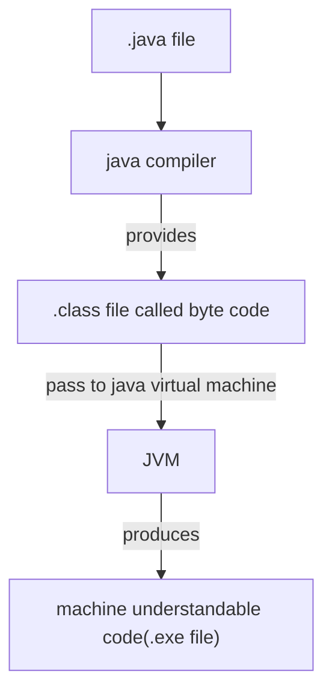

# **Java**

## Basics of JAVA
Extension: .java (ex: helloWorld.java)



- Java support cross platform operating system.

### **Print the string**
```java
public class demo{
    public static void main(String[] args){
        System.out.println("Hello World!");
    }
}
```
### **Scan the element in Java and add two numbers**
```java
import java.util.Scanner;

public class demo(){
    public static void main(String[] args){
        Scanner scan=new Scanner(System.in);
        System.out.println("Enter 2 numbers");
        int a=scan.nextInt();
        int b=scan.nextInt();
        int c=a+b;
        System.out.println("Addition of the number is "+c);
    }
}
```

