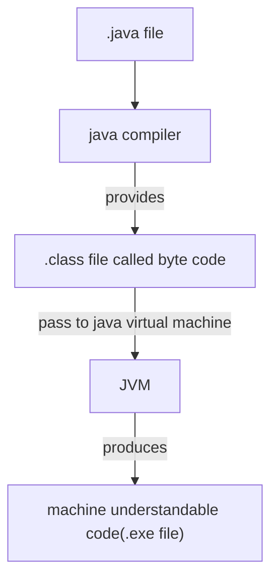

# **Java**

## Basics of JAVA
Extension: .java (ex: helloWorld.java)



- Java support cross platform operating system.

### **Print the string**
```java
public class demo{
    public static void main(String[] args){
        System.out.println("Hello World!");
    }
}
```
### **Scan the element in Java and add two numbers**
```java
import java.util.Scanner;

public class demo(){
    public static void main(String[] args){
        Scanner scan=new Scanner(System.in);
        System.out.println("Enter 2 numbers");
        int a=scan.nextInt();
        int b=scan.nextInt();
        int c=a+b;
        System.out.println("Addition of the number is "+c);
    }
}
```

### **Difference Between JDK, JRE & JVM**
 Java Development kit (JDK) | Java Runtime Environment (JRE) | Java Virtual Machine (JVM)
 -|-|-
 A group of softwares, which is required to compile and develop as well as executes java program and application | It used for user's to run application, means it used for the execution only | It is a virtual machine to run java program, JRE consist of Library files, Byte Code verifier and Class Loaders
---
```mermaid
---
title: JRE Diagram
---
flowchart TD
id[JVM]---|+|id1[Library files]
id---|+|id3[ByteCode Verifier]---|+|id4[Class Loaders]
 ```
---
```mermaid
---
title: JDK Diagram
---
flowchart TD
id[JRE]---|+|id1[Development tools]
id---|+|id3[java Compiler]
 ```