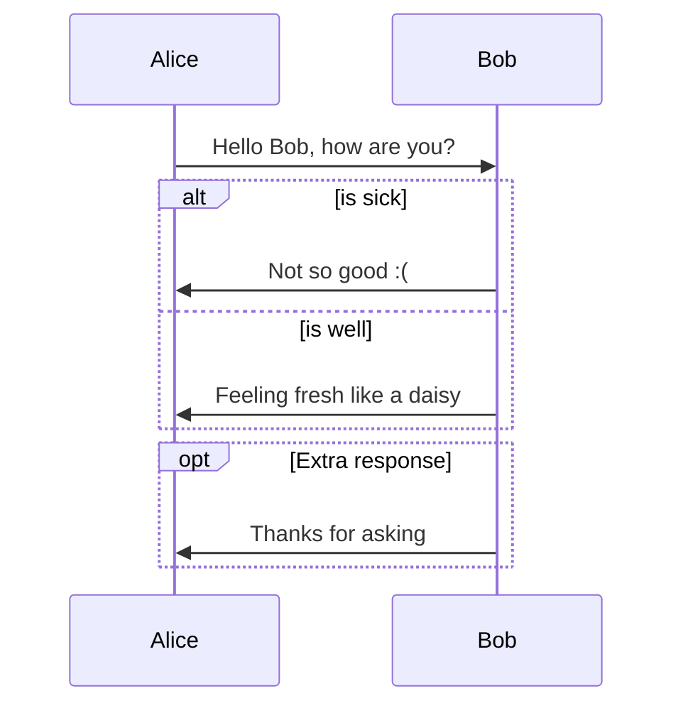

# **Java**

## Basics of JAVA
Extension: .java (ex: helloWorld.java)

```sequence
java->hello:hai
```

```sequence
Alice->Bob: Hello Bob, how are you?
Note right of Bob: Bob thinks
Bob-->Alice: I am good thanks!
```

