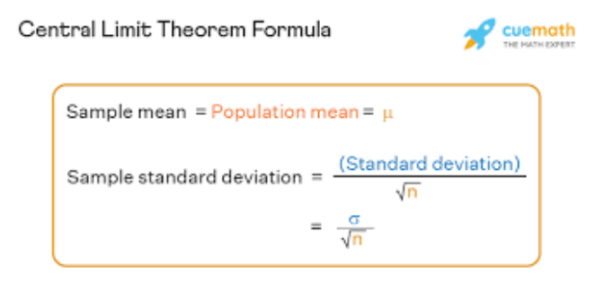
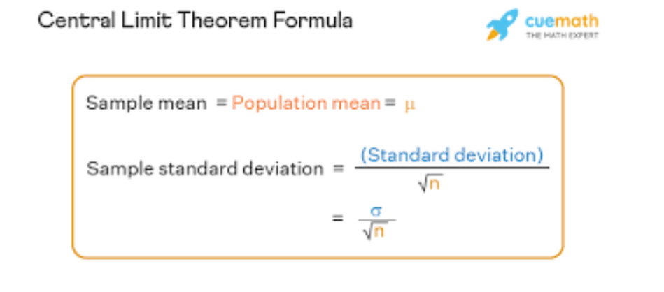
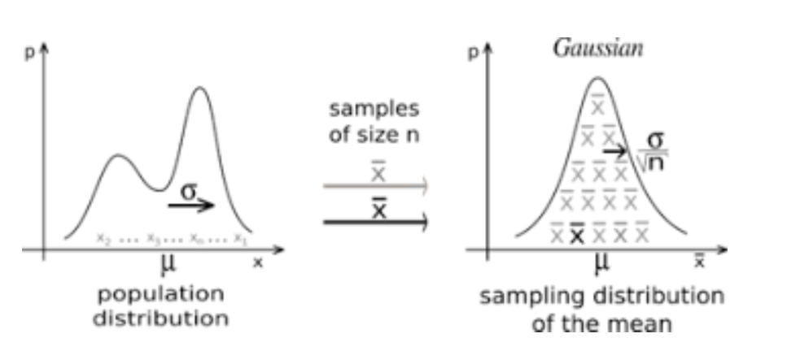
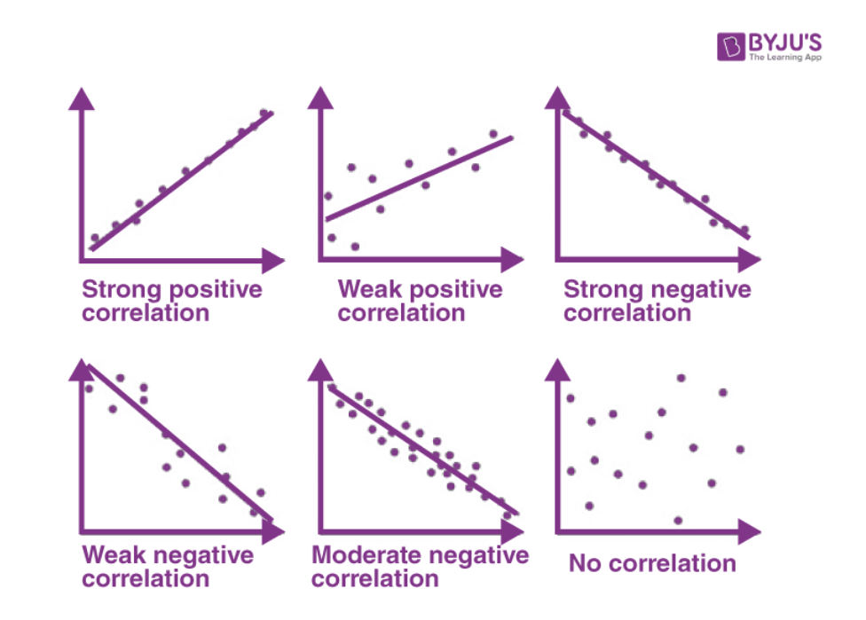
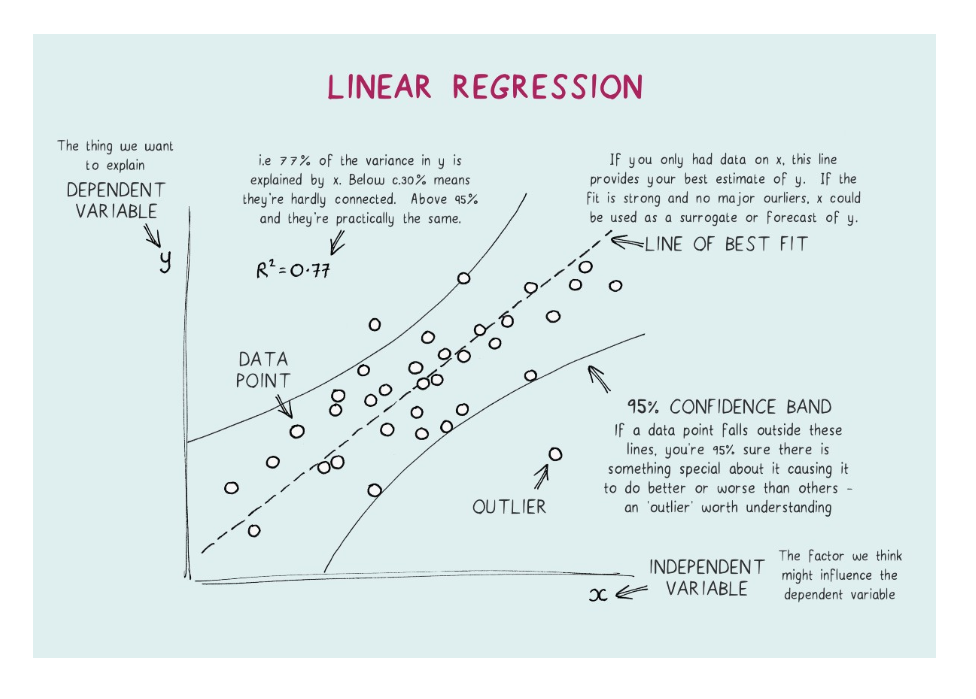
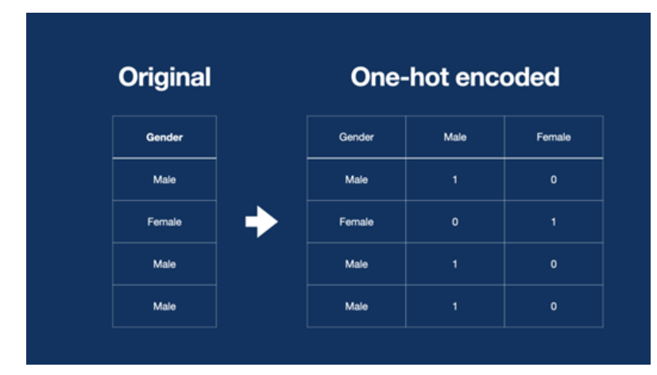
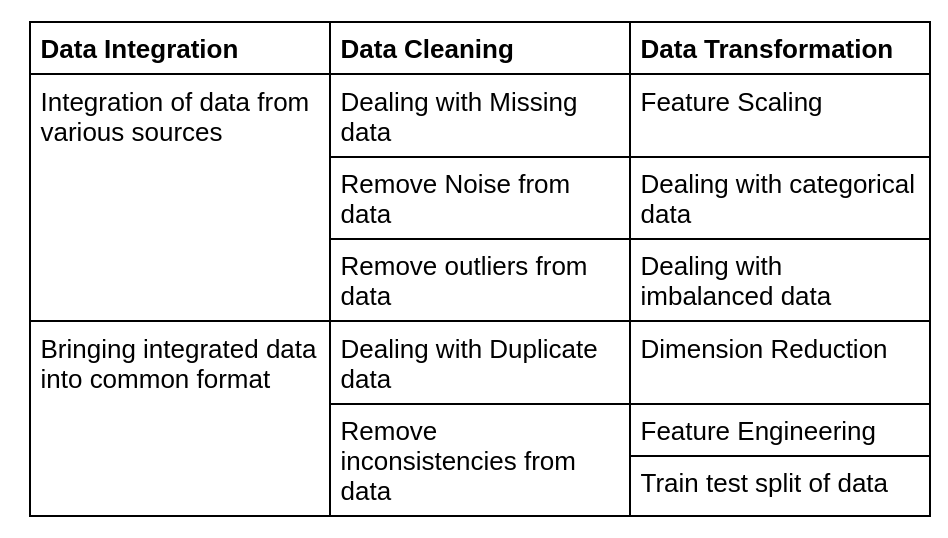
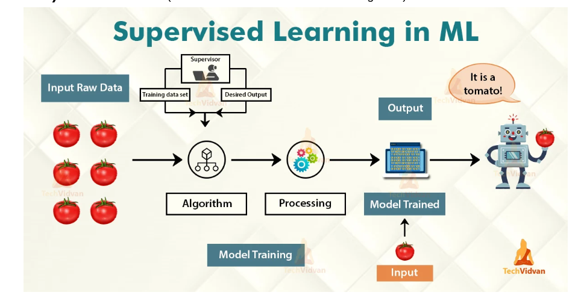

# IBM Applied data science notes

Learned python
Numpy
Pandas
Matplotlib
Seaboarn

## Mathematics and statistics

## Statistics

1. Measures of central tendency
    1. Mean
    1. Median
    1. mode
1. Measures of dispersion
    1. Variance
    1. Standard deviation
    1. range
1. Skewness
1. Kutosis

### Mean(Average)
mean=sum.of.all.values/no.of.values

### Meadian
Middle value of the given dataset (Note: before find the median sort the given dataset in ascending order)

### Mode
Most occured value in the given dataset(ex:51peoples likes apple, 56 people like orange)

### Range
Max value- Min Value

### Skewness
Skewness is a measure of symmetry or more precisely, the lack of symmetry. A distribution or dataset is symmetry it looks the same to the left and right of the centre point.

### Kurtosis
Kurtosis is a measure of ther the data are heavy-tailed or light-tailed relative to a normal distribution

### Interquartile range(IQR)

### Population and sample

### Variance
It is a measure of how far a set of numbers is spread out from their average value

### Standard Deviation
It is measure of the amount of variation or dispersion of a set of values

### Python Hands on

### Descriptive statistics

### Scaling
Process of bringing all the values of the columns into similar range
This means that you are transforming your data so that it fits within a specific scale, like 0-100 or 0-1. You want to scale dat when you are using methods based on measures of how far apart data points, like kNN, K-means and Hierarchical clustering, gradient descent based algorithms
Normalization, standardization are the two standard scaling method we use.

### Normalization and standardization
Normalization is a scaling technique in which values are shifted and rescaled so that they end up ranging between 0 and 1. It is also know as Min-Max scaling
Stndardization is another scaling technique where the values are centered around the mean with a unit standard deviation. THis means that the mean of the attribute becomes zero and the resultant distribution has a unit standard deviation.

Normalization formula X1=(x-min)/(max-min)

### Probability Distribution
Noramal(gaussian distribution)
Exponential Distribution
Lognormal
Uniform
Etc..

### Normal Distribution

### Z-soce
A Z-Score is a numerical measurement that describe a value’s relationship to the mean of a group of values, Z-Score is measured in terms fo standard deviations from the mean. IOf a Z-score is 0, it indicates that the data point’s score is identical to the mean score
Z-Score is used to normalise the data it means, it will transform the non-normal distribution data into normally distributed data

### Central limit theorem
The central limit theorem states that whenever a random sample of size n is taken  from any distribution with mean and variance, then the sample mean will be approximately normally distributed with mean and variance. The larger the value of the sample size, the better the approximation to the normal.

### Hypothesis testing

### Correlation

### Regression

### One  Hot Encoding

### Calculus
Calculus  plays an integral role in understanding the internal workings of machine learning algorithm, such as the gradient descent algorithm that minimizes an error function based on the comutation of the rate of change.

The concept of the rate of change in calculus can also be exploited to minimise more complex objective functions that are not necessarily complex in shape

The calculation of the partial derivative another important concept in calculus permits us to work with functions that take multiple inputs.

### Gradient Descent Algorithm 
(https://towardsdatascience.com/gradient-descent-algorithm-a-deep-dive-cf04e8115f21)

### Data-Preprocessing / Data cleaning / Data munching / Data wrangling

### Steps in pre-processing data

Data Integration
Data Cleaning
Data Transformation
Integration of data from various sources
Dealing with Missing data
Feature Scaling
Remove Noise from data
Dealing with categorical data
Remove outliers from data
Dealing with imbalanced data
Bringing integrated data into common format
Dealing with Duplicate data
Dimension Reduction
Remove inconsistencies from data
Feature Engineering
Train test split of data

## Data Splitting
(we need to split the data into train(80% of data) and test(20% of data)

### Regression:

### Machine learning types:
There are three types Supervised, unsupervised, reinforcement Machine learning

### Supervised ML:
If we have the output variable in the particular data, it is known as supervised ML.

### Unsupervised ML:
If we have the historical data but we dont have the output variable in the data, it is known as unsupervised ML.

### Reinforcement ML:
It automatically learned by its own experience. 

# Supervised Machine Learning:
1. Regression(use this when 1. output variable is continuous)
Classification(use when the data is discrete or categorical)

1. Regression

Types:
Simple Linear Regression
Multiple Linear Regression
Polynomial Regression 
(https://www.javatpoint.com/machine-learning-polynomial-regression) 
L1 & L2 (Lasso and Ridge Regression)

### Classification
Types:
Decision Tree
Random forest
SVM (Support Vector Machine)
Naive bayes
KNN (K-Nearest Neighour) 

Note: In classification we use logistic regression derived from linear regression

## Model Evalution for Regression and classification
### For Regression
	R2_score
	Mean_squared_error
	Root_mean_squared_error

### For Classification
	Accuracy Score
	Confusion Matrix
	AUG-ROG curve 

### Handeling the unbalanced data
Consider in output in classification suppose we have 80% yes and 20% no in the output it is an unbalanced data.
### Methods to solve the unbalanced data	
Under sampling
Over sampling
Ensemble sampling
SMOTE (Synthetic Minority Over Sampling)
### Hyper-Parameter optimization
Methods for searching the best parameter
->Grid Search cv
->Randomize Search cv

## Unsupervised Learning
→ Clustering

