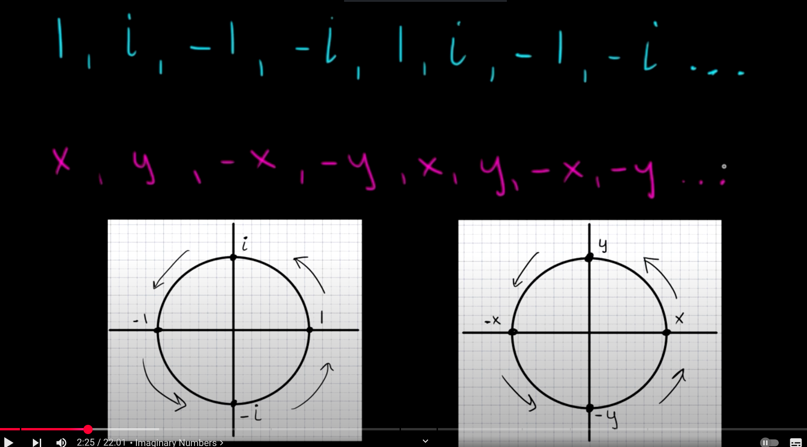
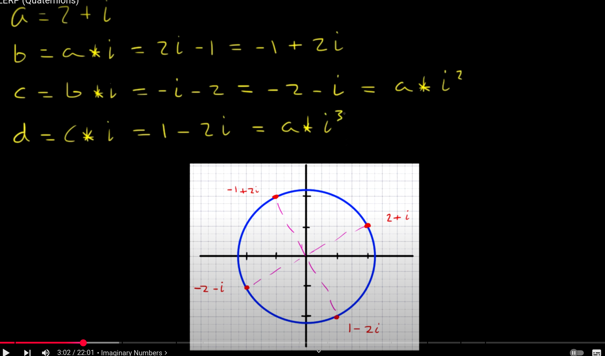
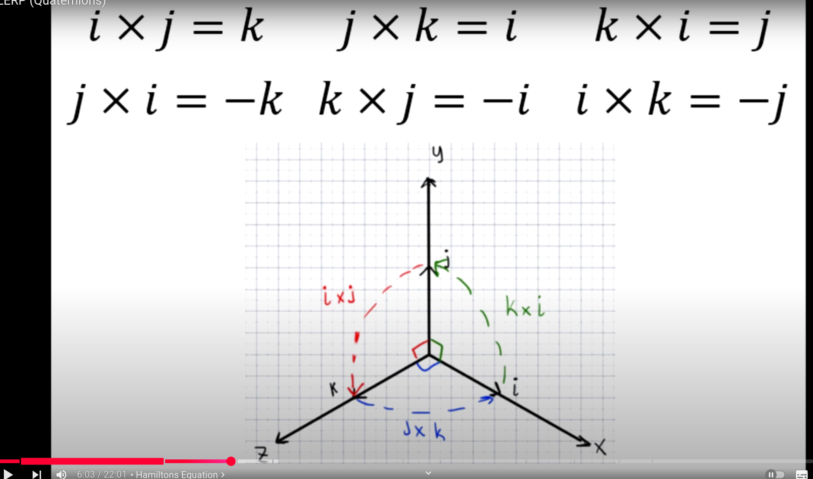
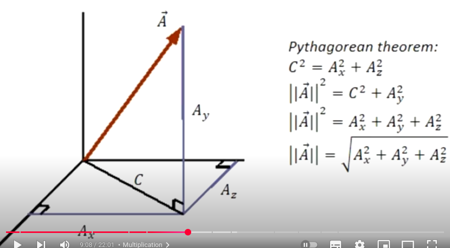
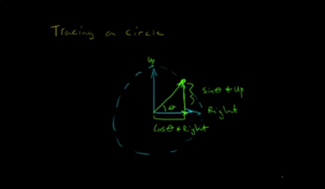

# Quaternion
https://www.youtube.com/watch?v=BXajpAy5-UI ( SLERP-Quaternions )

$$i^0 = 1, i^1 = i, i^3 = -i, i^4 = 1,...$$

$$ i = \sqrt{-1}$$

you can see in the above  example rotation of 90* each time multiplied by i

for 3D

since multiplication on ij is not know ( i.e., 3 + 2i + 3j ) form is not usefull.

Hamilton suggested 
$$ i^2+j^2+k^2 = ijk = -1$$

ij=k, jk=i, ki=j  
ji=-k, kj=-i, ik=-j 

Final equation

$$ a+bi+cj+dk $$

**Ordered Pair** is a pair of elements a, b having the property that (a,b)=(u,v) if and only if a=u, b=v

using ordered pair we can represent quaternion as
[a, bi+cj+dk]

$$\vec{v}=<b,c,d>$$

$$[a,\vec{v}]$$

**addition and subraction**  
$
q_1 = [a_1, \vec{v_1}]
$
,
$
q_2 = [a_2, \vec{v_2}]
$

$$
q_1 + q_2 = [a_1 + a_2, \vec{v_1} + \vec{v_2}]
$$

$$
q_1 - q_2 = [a_1 - a_2, \vec{v_1} - \vec{v_2}]
$$

**Multiplication**

$$
q_1 = a_1 + b_1i + c_1j + d_1k \hspace{1cm} q_2 = a_2 + b_2i + c_2j + d_2k
$$

$$
q_1 * q_2 = (a_1 + b_1i + c_1j + d_1k) * (a_2 + b_2i + c_2j + d_2k)
$$

$$
= a_1a_2 + a_1b_2i + a_1c_2j + a_1d_2k + b_1ia_2 + b_1ib_2i + b_1ic_2j + b_1id_2k + c_1ja_2 + c_1jb_2i + c_1jc_2j + c_1jd_2k + d_1ka_2 + d_1kb_2i + d_1kc_2j + d_1kd_2k
$$

$$
= a_1a_2 + a_1b_2i + b_1a_2i + a_1c_2j + c_1a_2j + a_1d_2k + d_1a_2k + b_1b_2i^2 + c_1c_2j^2 + d_1d_2k^2 + b_1c_2ij + b_1d_2ik + c_1b_2ji + c_1d_2jk + d_1b_2ki + d_1c_2kj
$$

$$
= a_1a_2 + a_1b_2i + b_1a_2i + a_1c_2j + c_1a_2j + a_1d_2k + d_1a_2k - b_1b_2 - c_1c_2 - d_1d_2 + b_1c_2k - b_1d_2j - c_1b_2k + c_1d_2i + d_1b_2j - d_1c_2i
$$

$$
=a_1a_2 - (b_1b_2 + c_1c_2 + d_1d_2) + (a_1b_2i + a_1c_2j + a_1d_2k) + (b_1a_2i + c_1a_2j + d_1a_2k) + (c_1d_2i - d_1c_2i + d_1b_2j - b_1d_2j + b_1c_2k - c_1b_2k)
$$

$$
=a_1a_2 - (b_1b_2 + c_1c_2 + d_1d_2) + (a_1b_2i + a_1c_2j + a_1d_2k) + (b_1a_2i + c_1a_2j + d_1a_2k) + (c_1d_2i - d_1c_2i + d_1b_2j - b_1d_2j + b_1c_2k - c_1b_2k)
$$

$$
q_1 = [a_1, \vec{v_1}] \hspace{2cm} q_2 = [a_2, \vec{v_2}]
$$

$$
q_1 * q_2 = [a_1a_2 - \vec{v_1} \cdot \vec{v_2}, a_1\vec{v_2} + a_2\vec{v_1} + \vec{v_1} \times \vec{v_2}]
$$

**quaternion conjugate**  
$$
q = [a, \vec{v}] \hspace{2cm} q^* = [a, -\vec{v}]
$$

$$
q * q^* = [aa + \vec{v} \cdot \vec{v}, -a\vec{v} + a\vec{v} + \vec{v} \times -\vec{v}]
$$

$$
q * q^* = \left[a^2 + ||\vec{v}||^2, <0, 0, 0>\right]
$$

conjugate helps us to find the quaternion inverse  
$$
q = [a, \vec{v}] \hspace{2cm} q^* = [a, -\vec{v}] \hspace{2cm}
$$ 
$$||q||^2 = a^2 + ||\vec{v}||^2 \hspace{2cm} q^{-1} = \frac{q^*}{||q||^2}
$$

$$
q^{-1} = \left[\frac{a}{a^2 + ||\vec{v}||^2}, \frac{-\vec{v}}{a^2 + ||\vec{v}||^2}\right]
$$

multiplying quaterion with inverse
$$
q * q^{-1} = [1, <0, 0, 0>]
$$

#### **quaternion types**

**Pure quaternion** $$q=[0,\vec{v}]$$  

**unit quaternion**
$$
\vec{v} = <0.5, 0, 0> \hspace{2cm} ||\vec{v}|| = 0.5
$$

$$
q = \left[\frac{\sqrt{3}}{2}, \vec{v}\right] \hspace{2cm} ||q|| = 1
$$
where $||q|| = √(a² + ||\vec{v}||²)$, $||\vec{v}|| = √(v₁² + v₂² + v₃²)$

-----------

Quaternion Representation:

$$ q = [\cos(\theta), \sin(\theta) \hat{v}] $$

Quaternion Norm (Magnitude):

$$ ||q||^2 = \cos^2(\theta) + \sin^2(\theta) ||\hat{v}||^2 $$

Since $\hat{v}$ is a unit vector, $||\hat{v}|| = 1$, so:

$$ ||q||^2 = \cos^2(\theta) + \sin^2(\theta) $$

Using the trigonometric identity $\cos^2(\theta) + \sin^2(\theta) = 1$:

$$ ||q||^2 = 1 $$

Therefore, the norm of a rotation quaternion is:

$$ ||q|| = \sqrt{1} = 1 $$

-----
quaternion rotation

**Given:**

*   Unit vector (rotation axis): $\hat{n} = \langle \frac{\sqrt{2}}{2}, 0, \frac{\sqrt{2}}{2} \rangle$
*   Vector to be rotated: $\vec{v} = \langle 2, 0, 0 \rangle$
*   Rotation angle: $\theta = 45^\circ$

**Result of rotation using Rodrigues rotation formula:**

*   Rotated vector: $\vec{v}' = \langle 1.70710683, 1, 0.292893261 \rangle$

**Using quaternionn**
$$
q_1 = [Cosθ, nSinθ] \hspace{2cm} q_2 = [0, \vec{v}]
$$

$$
q_1 * q_2 = [-Sinθ * \hat{n} \cdot \vec{v}, Cosθ * \vec{v} + Sinθ * \hat{n} \times \vec{v}]
$$

$$
-Sinθ * \hat{n} \cdot \vec{v} = -1 \hspace{2cm} Cosθ * \vec{v} + Sinθ * \hat{n} \times \vec{v} = <1.41421354, 1, 0>
$$
you can see the answer is wrong compared to the rodrigues formula, we need to multiply with quaternion inverse to get corect rotation, becuase quaternion is in 4d

$$
θ = 45°/2 \hspace{1cm} q_1 = [Cosθ, Sinθ\hat{n}] \hspace{1cm} q_1^{-1} = [Cosθ, -Sinθ\hat{n}] \hspace{1cm} q_2 = [0, \vec{v}]
$$

$$
q_1 * q_2 * q_1^{-1} = [0, <1.70710683, 1, 0.29289323>]
$$

## Rodrigues rotation formula
(axiz-angle rotation)

### Tracing a circle
video: https://www.youtube.com/watch?v=OKr0YCj0BW4 

example converting vectors into coordinates (cibi) [link](https://www.dummies.com/article/academics-the-arts/science/physics/how-to-find-a-vectors-components-148779/)

To convert this vector into the coordinate way of looking at vectors, you have to use the trigonometry shown in the figure. The x coordinate equals v cos theta, and the y coordinate equals v sin theta:

vx = v cos theta
vy = v sin theta

in cicle $x^2+y^2=r$, 

{x(t),y(t)}={rcosθ,rsinθ}

[need to add formula...]
