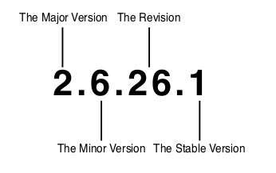

# Linux Kernel Development 3rd Edition Robert Love
<sub>Notes</sub>

# Introduction to UNIX
- Linux is inspiered from unix, ( unix is the operating system created by Dennis Ritchie ( creator of C ) and Ken Tompson ),
 - Unix grew out of Multics ( a failed multiuser os developed by bell leboratories.)
 - 1969 Bell Lab programmer sketched out a filesystems design that ultimately evolved to unix.
 - In 1971, unix was ported to PD-11
 - In 1973, OS rewritten in C
 - Unix Version 6 was widely used out side Bell Lab
 - Unix was Distributed with source code, led to further development.

# Introduction of Linux
- Linux was developed by Linus Torvalds in 1991 ( os for intel 80386 )


**Linux version**
  
The even number of Minor version, tells it is stable, and vise versa for odd number.   


**Installing and building the linux kernel**

**Kernel Space and User Space**
* The kernel has access to neither the C library nor the standard C headers.
* The kernel is coded in GNU C.
* The kernel lacks the memory protection afforded to user-space.
* The kernel cannot easily execute floating-point operations.
* The kernel has a small per-process fixed-size stack.
* Because the kernel has asynchronous interrupts, is preemptive, and supports SMP, synchronization and concurrency are major concerns within the kernel.
* Portability is important.
* When a user-space application attempts an illegal memory access, the kernel can trap the error, send the SIGSEGV signal, and kill the process. If the kernel attempts an illegal memory access, however, the results are less controlled.
* kernel memory is not pageable.Therefore, every byte of memory you consume is one less byte of available physical memory. Keep that in mind the next time you need to add one more feature to the kernel! 
* The kernel stack is neither large nor dynamic; it is small and fixed in size.The exact size of the kernel’s stack varies by architecture. On x86, the stack size is configurable at compile-time and can be either 4KB or 8KB.


**Branch Annotation**  
The gcc C compiler has a built-in directive that optimizes conditional branches as either very likely taken or very unlikely taken.The compiler uses the directive to appropriately optimize the branch.The kernel wraps the directive in easy-to-use macros, likely() and unlikely().  

```c
//For example, consider an if statement such as the following:  
if (error) {  
/* ... */  
}  
//To mark this branch as very unlikely taken (that is, likely not taken):  
/* we predict 'error' is nearly always zero ... */   
if (unlikely(error)) {  
/* ... */  
}  
//Conversely, to mark a branch as very likely taken:  
/* we predict 'success' is nearly always nonzero ... */  
if (likely(success)) {  
/* ... */  
}  

/*
You should only use these directives when the branch direction is overwhelmingly known a priori or when you want to optimize a specific case at the cost of the other case.
This is an important point:These directives result in a performance boost when the branch is correctly marked, but a performance loss when the branch is mismarked.A
common usage, as shown in these examples, for unlikely() and likely() is error con- ditions.As you might expect, unlikely() finds much more use in the kernel because if
statements tend to indicate a special case. 
*/
```

# Process Management
* A process is a program (object code stored on some media) in the midst of execution.
* Processes, in effect, are the living result of running program code.The kernel needs to manage all these details efficiently and transparently.
* Threads of execution, often shortened to threads, are the objects of activity within the
process.
* Linux does not differentiate Threads and Processes
* Each thread includes a unique program counter, process stack, and set of processor registers.
* single program can also has one or more process running for them


# DOCUMENTAION LIST
1. File `<kernelSource>/Documentation/changes` tell the required tools and version infos
2. Files in `<kernelSource>/Documentation/kbuild` tells the building or makefile guide