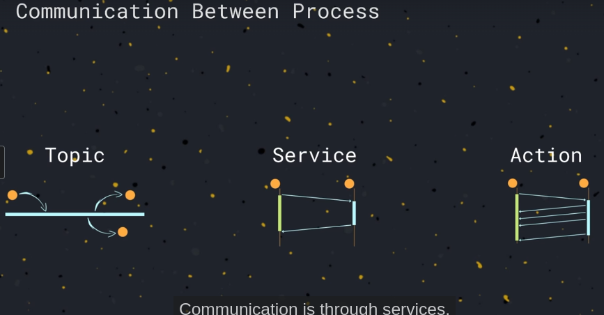
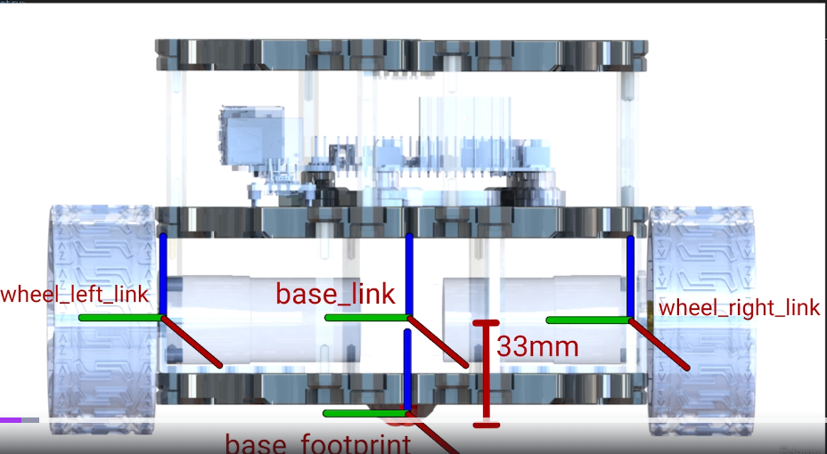
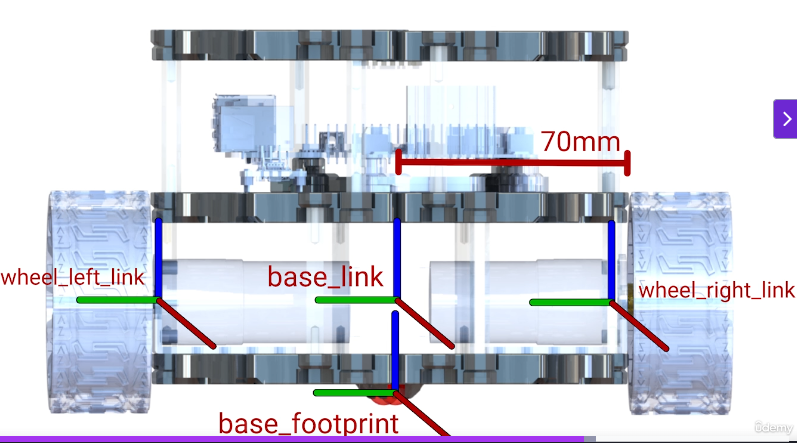
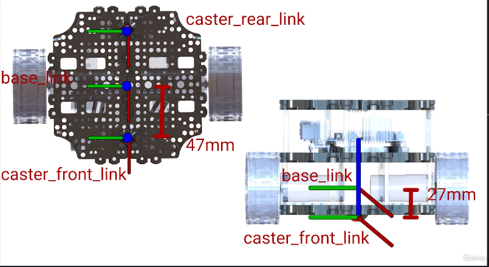

# self Driving and ROS2
course from udemy: https://www.udemy.com/course/self-driving-and-ros-2-learn-by-doing-odometry-control/

Self Driving and ROS 2 Learn By Doing Odometry Control


## Recqiuired installation
installing ros guide: https://docs.ros.org/en/humble/Installation/Ubuntu-Install-Debs.html  
 
### Furthure configuration 
( recommended by the udemy self-driving-and-ros2 course )  
vscode and externsion 
    - C/C++ extension pack, Python, CMake, XML, MXL Tools, ROS
ROS2 Necessary package installation  
```bash
sudo apt install -y \
 ros-humble-ros2-control \
 ros-humble-ros2-controllers \
 ros-humble-xacro \
 ros-humble-ros-gz* \
 ros-humble-*-ros2-control \
 ros-humble-joint-state-publisher-gui \
 ros-humble-turtlesim \
 ros-humble-robot-localization\
 ros-humble-joy \
 ros-humble-joy-teleop \
 ros-humble-tf-transformations \
 python-pip 

```

## Introduction
"Robotics is concerned with the study of those machines that can replace human beings in the execution of a task, as regards both physical activity and decision making"  - Robotics, Sciavicco Siciliano Villani

### What/Why is ROS?

ROS (Robot Operating System) is an open-source middleware framework that provides a collection of tools, libraries, and conventions for building robot applications. It's not an actual operating system, but rather a flexible framework that sits on top of an existing OS (typically Linux) to facilitate robot software development.

Key features of ROS include:
- Distributed computing architecture
- Message passing between processes
- Package management
- Common tools for development and debugging
- Hardware abstraction
- Device drivers
- Libraries for common robotics functionality

### ROS2 Architecture


#### 1. DDS (Data Distribution Service) Layer
- Core communication framework
- Provides reliable, real-time data distribution
- Implements publish/subscribe pattern
- Handles QoS (Quality of Service)

#### 2. RMW (ROS Middleware)
- Interface between ROS2 and DDS
- Abstracts DDS implementation details
- Supports multiple DDS vendors

#### 3. Client Libraries
- rclcpp (C++)
- rclpy (Python)
- Provide APIs for node creation and communication

#### 4. Core Components
- Nodes: Modular processes that perform specific tasks
- Topics: Named buses for message exchange
- Services: Request/response communication
- Actions: Long-running tasks with feedback
- Parameters: Runtime configuration values

#### 5. Tools Layer
- Launch system
- Command line tools
- Visualization (RViz2)
- Debugging tools (rqt)


### Inter-Process Communication in ROS

**ROS (Robot Operating System)** provides a robust framework for building complex robotic systems. Effective communication between different nodes (processes) is crucial for coordinating tasks and sharing information. Here's a brief overview of the primary communication mechanisms in ROS:

**1. Topics**

* **Concept:** Asynchronous, publish-subscribe mechanism. Publishers broadcast messages on a specific topic, while subscribers receive messages from that topic.
* **Data Flow:** One-to-many, many-to-many.
* **Use Cases:** 
    * Sensor data streaming (e.g., camera images, lidar scans)
    * Control signals (e.g., motor commands, joint velocities)
    * Status updates (e.g., battery level, robot pose)

**2. Services**

* **Concept:** Synchronous, request-response mechanism. A client sends a request to a service, and the service provides a response.
* **Data Flow:** One-to-one.
* **Use Cases:** 
    * Configuration requests (e.g., setting parameters, changing modes)
    * Complex computations (e.g., path planning, object recognition)
    * Triggering actions (e.g., starting/stopping a motor)

**3. Actions**

* **Concept:** Asynchronous, goal-oriented mechanism. Clients send goals to an action server, which executes the goal and provides feedback and results.
* **Data Flow:** One-to-one.
* **Use Cases:** 
    * Long-running tasks (e.g., navigation, manipulation)
    * Tasks with feedback (e.g., progress updates, status information)
    * Tasks with cancellation support

**Key Considerations:**

* **Topic Choice:** Choose descriptive topic names (e.g., `/camera/image_raw`, `/cmd_vel`).
* **Message Definition:** Define the data structure of messages using ROS message definition files (.msg).
* **Quality of Service (QoS):** Configure QoS parameters (e.g., durability, history depth) to optimize performance and reliability.
* **Error Handling:** Implement appropriate error handling mechanisms for robust communication.

**In Summary:**

* **Topics:** Ideal for streaming data and broadcasting information.
* **Services:** Suitable for one-time requests and responses.
* **Actions:** Well-suited for complex, long-running tasks with feedback and cancellation support.

By effectively utilizing these communication mechanisms, you can create modular, scalable, and robust robotic systems in ROS.



### Package Management

ROS (Robot Operating System) utilizes a hierarchical system for organizing and managing software components known as packages. A package is the fundamental unit of software distribution and build within the ROS ecosystem.

Key Concepts:

Workspace: A collection of one or more ROS packages. Workspaces provide a structured environment for developing, building, and installing ROS packages.
Manifest File (package.xml): A crucial file within each package that contains metadata about the package, including its name, version, dependencies, and authors.
Build System (catkin): The primary build system in ROS. It uses CMake to build packages within a workspace, resolving dependencies and generating necessary files.
Dependency Management: ROS effectively handles dependencies between packages. Packages can declare dependencies on other packages, ensuring that all required components are available during build and execution.
Benefits of Package Management:

Modularity: Packages promote modularity by encapsulating specific functionalities, making it easier to maintain and reuse code.
Reusability: Packages can be easily shared and reused across different ROS projects, fostering collaboration and reducing development time.
Maintainability: The hierarchical structure and dependency management simplify the process of updating and maintaining packages.
Versioning: Packages can be versioned, allowing for tracking changes and ensuring compatibility between different versions of packages.

### Application architecture
Ros2 installation includes packages for robotics development from various sources. We will work in the Ros2 workspace to develop our robot code, with standard packages in the Underlay and new packages in the Overlay. The Overlay can include both new and standard packages, with priority given to Overlay versions. Each package in the workspace will contain scripts for robot functionalities and configuration/startup files for nodes.

```bash
mkdir -p bumper_bot/src

cd bumper_bot 
colcon build

cd src

# create python package
ros2 pkg create --build-type ament_python bumperbot_py_examples

# create c++ package
ros2 pkg create --build-type ament_cmake bumperbot_cpp_examples

colcon build

# if you face any error regarding catkin-pkg, run the following command, try agian building
# pip install catkin-pkg

```


**Python simple publishere**
[Go to this file](/selfDringing_and_ros2/ros_code/bumperBot_ws/src/bumperbot_py_examples/bumperbot_py_examples/simple_publizher.py)

add the file in the [setup.py](/selfDringing_and_ros2/ros_code/bumperBot_ws/src/bumperbot_py_examples/setup.py)

setup.py
```py
....
'console_scripts': [
            "simple_publisher = bumperbot_py_examples.simple_publizher:main"
        ],
    },
....
```

add dependencies in the [package.xml](/selfDringing_and_ros2/ros_code/bumperBot_ws/src/bumperbot_py_examples/package.xml)

after that

```bash
cd bumperbot_ws
colcon build # to build the changes

#open new terminal and source the bumperbot_ws
source bumperbot_ws/install/setup.bash
ros2 run bumperbot_py_examples simple_publisher # this will start the node

#again open the new terminal 
ros2 topic list # list the topics that are active (it will list /chatter topic which was created by the simple_publisher)
ros2 topic info /chatter # giver information
ros2 topic echo /chatter # prints the communication happens in the topic
ros2 topic hs /chatter --verbose # this command calculates the frequency of the communication happening in topic

```

CPP Simple Publisher

code is in [here](/selfDringing_and_ros2/ros_code/bumperBot_ws/src/bumperbot_cpp_examples/src/simple_publisher.cpp)

put it in src of the bumperbot_cpp_examples


modify the CMakeLists.txt under bumperbot_cpp_examples

add the below line in the [CMakeLists.txt](/selfDringing_and_ros2/ros_code/bumperBot_ws/src/bumperbot_cpp_examples/CMakeLists.txt)
```bash
...
find_package(rclcpp REQUIRED)
find_package(std_msgs REQUIRED)

add_executable(simple_publisher src/simple_publisher.cpp)
ament_target_dependencies(simple_publisher rclcpp std_msgs)

install(TARGETS
  simple_publisher
  DESTINATION lib/${PROJECT_NAME}
)
...
```

add dependencies in [package.xml](/selfDringing_and_ros2/ros_code/bumperBot_ws/src/bumperbot_py_examples/package.xml)

```xml
...
  <depend>rclcpp</depend>
  <depend>std_msgs</depend>
...
```

use the same comands as bumperbot-py-expamples to test

**Simple PY Subscriber**

python file: [simple_subscriber.py](/selfDringing_and_ros2/ros_code/bumperBot_ws/src/bumperbot_py_examples/bumperbot_py_examples/simple_subscriber.py)

changes in setup.py

```py
    entry_points={
        'console_scripts': [
            "simple_publisher = bumperbot_py_examples.simple_publizher:main",
            "simple_subscriber= bumperbot_py_examples.simple_subscriber:main", # new line
        ],
    },
```
```bash
colcon build # for building
ros2 run bumperbot_py_examples simple_subscriber # start listerner

#in new terminal try ros in build publisher
ros2 topic pub /chatter std_msgs/msg/String 'data: "hello world"' # this will keep saying hello world in that channel

# or u can you bumperbot cpp or py example publisher
ros2 run bumperbot_py_examples simple_publisher
```

**CPP simple subscriber**  
[simple_subscriber.cpp](/selfDringing_and_ros2/ros_code/bumperBot_ws/src/bumperbot_cpp_examples/src/simple_subscriber.cpp)

include the simple_subsciber in the [CMakeLists.txt](/selfDringing_and_ros2/ros_code/bumperBot_ws/src/bumperbot_cpp_examples/CMakeLists.txt) similar to the publisher

## LOCOMOTION
 Locomotion: Movement or ability to move

 Locomotion is methods such as wheels or legs or drone method are choose by the application. Each method has a unique advantages in there own kind of way.

 
 In this course we are learning Wheeled locomotion in that they were 3 type.

 differential drive, ackerman drive, omnidirectional drive
 

 state space ( x, y, theta ); //where theta is the angle or orientation of the vechicle

Understanding why wheeled locomotion is efficient in some environment and not in some other.

**Friction effect**
It will looses more enery in soft surface, and increase the weight on the boat ( since more points is touching the ground ). based on weight trie shape changes and due to that work done will reduce

**Robot Description**  
1. we can simulate the robot before building the real world, we can even simulate the friction effect... etc

### Simulation

1. Ros2 uses **URDF ( Unified Robot Description Format )** to model our robot. (we can represet the structure and components of the robots through xml tags)

example tags:::

```xml
<robot> <!--first tag-->
<link>
<name></name>
<visual></visual>
<collision></collision>
<intertial></intertial>
</link>

<joint>
</joint>
</robot>   
```

#### creating the URDF model example node

create package
```bash
cd /to/bumperbot_ws/src
ros2 pkg create --build-type ament_cmake bumperbot_description

#now build
cd /to/bumperbot_ws/
colcon build

#create necessary folders
cd /to/bumperbot_ws/src/bumperbot_description/
mkdir urdf meshes

#imports the meshes  (stl files are copied here ) selfDringing_and_ros2/ros_code/bumperBot_ws/src/bumperbot_description/meshes

```

put the below code in the /to/bumperbot_ws/src/bumperbot_description/urdf/bumperbot.urdf.xacro

```xml
<?xml version="1.0"?>

<robot xmlns:xacro="http://www.ros.org/wiki/xacro" name="bumperbot">

  <link name="base_footprint"/>

  <link name="base_link">
    <visual>
      <origin rpy="0 0 0" xyz="0 0 0"/>
      <geometry>
        <mesh filename="package://bumperbot_description/meshes/base_link.STL"/>
      </geometry>
    </visual>
  </link>

  <joint name="base_joint" type="fixed">
    <parent link="base_footprint"/>
    <child link="base_link"/>
    <origin rpy="0 0 0" xyz="0 0 0.033"/>
  </joint>

</robot>
```




in CMakeLists.txt of bumperbot_description add below line

```cmake
install(
  DIRECTORY meshes urdf
  DESTINATION share/${PROJECT_NAME}
)
```

to display our model,

install ros-humble-urdf-tutorial

```bash
sudo apt install ros-humble-urdf-tutorial

# to launch the 3d model

ros2 launch urdf_tutorial display.launch.py model:=/media/hari/Studies/github_clone/Learnings/selfDringing_and_ros2/ros_code/bumperBot_ws/src/bumperbot_description/urdf/bumperbot.urdf.xacro

# if the above shows error on RenderingAPI Exception use below command
export QT_QPA_PLATFORM=xcb
```

**RViz2**

It alows us to visualize the some ros messages that are published in the ros topic.

It has plugin fory example  
1. used to visualize the map of the building ( robot to navigate )
2. visulaize data from sensor such as laser, scanner, (that measure distance)
3. visualize the image... etc

**NAV2** ( Path planning, obstacle avoidance and etc...)

**PARAMETER EXAMPLE**
selfDringing_and_ros2/ros_code/bumperBot_ws/src/bumperbot_cpp_examples/src/simple_parameter.cpp

```bash
selfDringing_and_ros2/ros_code/bumperBot_ws/src/bumperbot_cpp_examples/CMakeLists.txtCMake

find_package(rcl_interfaces REQUIRED)
...

add_executable(simple_parameter src/simple_parameter.cpp)
ament_target_dependencies(simple_parameter rclcpp rcl_interfaces)

install(TARGETS
  simple_publisher
  simple_subscriber
  simple_parameter
  DESTINATION lib/${PROJECT_NAME}
)
```

selfDringing_and_ros2/ros_code/bumperBot_ws/src/bumperbot_cpp_examples/package.xml
```xml
...
  <depend>rclcpp</depend>
  <depend>std_msgs</depend>
  <depend>rcl_interfaces</depend>
....
```

python  
selfDringing_and_ros2/ros_code/bumperBot_ws/src/bumperbot_py_examples/bumperbot_py_examples/simple_parameter.py

```python setup.py
    entry_points={
        'console_scripts': [
            "simple_publisher = bumperbot_py_examples.simple_publizher:main",
            "simple_subscriber= bumperbot_py_examples.simple_subscriber:main",
            "simple_parameter= bumperbot_py_examples.simple_parameter:main",
        ],
    },
```

selfDringing_and_ros2/ros_code/bumperBot_ws/src/bumperbot_py_examples/package.xml
```xml
....
  <depend>rcl_interfaces</depend>
....
```

to run the parameter example
```bash
s$ ource intall/setup.bash
$ ros2 run bumperbot_cpp_examples simple_parameter

# in other terminal
$ ros2 param list

### output 
/simple_parameter:
  qos_overrides./parameter_events.publisher.depth
  qos_overrides./parameter_events.publisher.durability
  qos_overrides./parameter_events.publisher.history
  qos_overrides./parameter_events.publisher.reliability
  simple_int_param
  simple_string_param
  use_sim_time

# now run
$ ros2 param get /simple_parameter simple_int_param 
Integer value is: 28 #output

# to set the other value close the previouse run session run the below command
$ ros2 run bumperbot_cpp_examples simple_parameter --ros-args -p simple_int_param:=10
# now if you run get you will get 10
$ ros2 param get /simple_parameter simple_int_param 
Integer value is: 10

# you can also set like thi 
$ ros2 param set /simple_parameter simple_string_param "hi ros2"
Set parameter successful  ## output

# the above will result the below message in the ros2 run ... terminal
[INFO] [1742027109.514520920] [simple_parameter]: Param simple_string_param changed! New value is hi ros2

```

there are other ros param features also


```bash
#other way to move the urdf model ( execute all the 3 commands in seperate terminal after sourncing install/setup.bash)
$ ros2 run robot_state_publisher robot_state_publisher --ros-args -p robot_description:="$(xacro src/bumperbot_description/urdf/bumperbot.urdf.xacro)"

$ ros2 run joint_state_publisher_gui joint_state_publisher_gui 

$ros2 run rviz2 rviz2

# after this in gui change fixed frame to base_footprint
#add TF
#add RobotModel
# in RobotModel change description topic to /robot_description